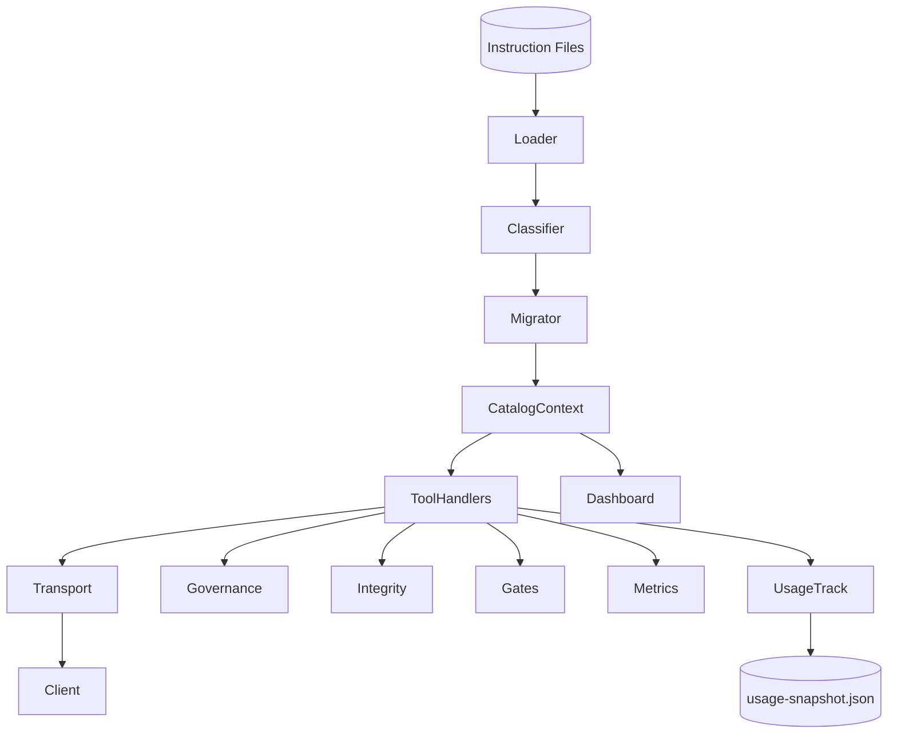
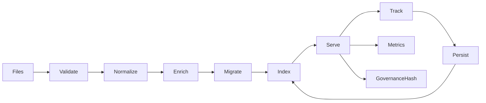

# ARCHITECTURE

Updated for 0.9.x (dispatcher consolidation, governance projection + hash, integrity verification, usage persistence, schema migration hook).

## High-Level Components

Simplified Mermaid (avoids subgraph + complex labels for GitHub compatibility):



ASCII Fallback:

```text
 Instruction Files -> Loader -> Classification -> Migration -> CatalogContext Cache
       |                                                          |
       v                                                          v
    usage-snapshot.json <--- usage/track <--- Tools ---> metrics / governance / integrity / gates / diff / prompt
                                      |
                                      v
                                   Transport -> Client (MCP)
```

## Data Lifecycle



ASCII Fallback:

```text
Files -> Validate -> Normalize -> Enrich -> Migrate -> Index -> Serve -> Track -> Persist
                                        |                 |           |
                                        |                 |           +-> Metrics Snapshot
                                        |                 +-> Governance Hash
                                        +-> (if schema bump) rewrite schemaVersion
```

## Component Descriptions

| Component | Responsibility | Notes |
|-----------|----------------|-------|
| Instruction Files | Author-managed JSON entries | Enriched placeholders persisted lazily (owner, review dates, schemaVersion) |
| CatalogLoader | Read + schema validate + minimal defaults | Computes catalog hash (id:sourceHash) |
| Classification | Normalize (trim, dedupe, scope derivation), risk, priority tier | Derives semantic summary + review cadence |
| Migration | Ensure `schemaVersion` matches current constant | Rewrites file if version upgraded |
| CatalogContext | Caching, mtime + signature invalidation, enrichment persistence | Supports INSTRUCTIONS_ALWAYS_RELOAD, .catalog-version file |
| Governance Projection | Deterministic subset for governance hash | Fields: id,title,version,owner,priorityTier,nextReviewDue,semanticSummarySha256,changeLogLength |
| Tool Registry | Central schemas + stable flags + dynamic listing (`meta/tools`) | Exposes machine-consumable tool metadata |
| Tool Handlers | JSON-RPC implementation (instructions/*, governanceHash, usage, integrity, gates, metrics) | Write tools gated by MCP_ENABLE_MUTATION |
| MCP SDK Transport | Standard MCP over stdio | Emits `server/ready`, handles capabilities |
| Usage Tracking | usage/track increments with firstSeenTs + debounced persistence | Optional gating via INDEX_FEATURES='usage' |
| Metrics Snapshot | Aggregate per-method counts + feature counters | Lightweight in-memory aggregation |
| Integrity Verify | Recompute vs stored sourceHash | Detects tampering or stale placeholders |
| Gates Evaluate | Evaluate gating rules from `instructions/gates.json` | Summarizes pass/fail severities |
| Dashboard | Optional read-only visualization & /tools.json | Enabled via CLI flags |
| (Future) Optimizer | Hotset selection / ranking | Not yet implemented |

## Data Flow Summary

1. Loader enumerates `instructions/*.json`, applies Ajv validation (draft-07) and minimal bootstrap defaults.
2. Classification normalizes + derives governance fields (version/status/owner/priorityTier/review dates/semantic summary) & risk score.
3. Migration hook updates schemaVersion if older (current version: 1).
4. Catalog hash (id:sourceHash) and governance hash (projection set) computed.
5. Entries cached (map + sorted list); enrichment persistence pass rewrites placeholders once.
6. Tools served: diff / list / governanceHash / integrity / gates / prompt review / usage / metrics.
7. usage/track increments counts; first increment forces immediate flush; subsequent increments debounced.
8. metrics/snapshot reflects cumulative method invocation stats + feature counters.
9. gates/evaluate and integrity/verify provide governance & integrity control loops.

## Hashing & Integrity Layers

| Layer | Purpose | Input | Output |
|-------|---------|-------|--------|
| sourceHash | Per-entry body immutability check | Trimmed body | sha256 hex (64) |
| catalog hash | Fast structural change detection | Sorted `id:sourceHash` list | sha256 hex |
| governance hash | Governance metadata drift detection | Sorted governance projections | sha256 hex |
| integrity/verify | Detect body tamper vs stored sourceHash | Recompute each entry | Issues list |

`governanceHash` ignores body churn; use with catalog hash for layered drift diagnostics.

## Diff Evolution

Current: structured incremental diff (added / updated / removed) when client supplies hash + known set.

Future: extend to include governance-only delta classification and optional streaming for very large catalogs.

## Prompt Governance

`prompt/review` consumes versioned `docs/PROMPT-CRITERIA.json` patterns:

- Pattern rules (regex) produce issues on match (policy violations).
- MustContain rules produce issues on absence (missing required guidance).

Results summarize counts, highest severity enabling fast gating flows.

## Error Handling Philosophy

- Loader isolates schema & logical validation errors per file; faulty files skipped with error list preserved.
- Handlers return `{ notFound:true }` patterns over errors for absence cases.
- JSON-RPC errors standardized (-32601 unknown method, -32602 validation, -32603 internal).

## Security & Governance

- Read-only by default; all mutations gated via `MCP_ENABLE_MUTATION`.
- Feature gating via `INDEX_FEATURES` (e.g. usage) guarded by `feature/status` introspection.
- Governance projection enables reproducible policy diffing; hash reproducibility flag `GOV_HASH_TRAILING_NEWLINE` optional.
- Prompt review regexes curated to avoid catastrophic patterns; lengths capped.
- Integrity verification & diff support tamper detection.

## Observability

- `metrics/snapshot` returns per-method counts, feature counters, env feature list.
- Optional verbose/mutation logging to stderr (MCP_LOG_VERBOSE / MCP_LOG_MUTATION).
- Future: latency buckets & structured JSON logs beyond stderr text.

## Scaling Notes

- Single process in-memory suitable through O(10k) entries (<50ms list/search target P95).
- Potential future: shard by id prefix, or memory-map large catalogs.
- Governance hash projection size is linear, but cheap (small JSON per entry).

## Caching & Invalidation

- Directory meta signature (file name + mtime + size) + latest mtime used to detect changes.
- `.catalog-version` file touched on each mutation for robust cross-process invalidation.
- `INSTRUCTIONS_ALWAYS_RELOAD=1` disables caching (test/debug determinism).
- Enrichment persistence rewrites placeholder fields once; subsequent loads stable.

## Feature & Mutation Gating

| Env Var | Purpose |
|---------|---------|
| MCP_ENABLE_MUTATION | Enable mutation tools (import/add/remove/groom, usage/flush) |
| INDEX_FEATURES=usage | Activate usage tracking feature counters & persistence |
| MCP_LOG_VERBOSE / MCP_LOG_MUTATION | Diagnostic logging scopes |
| GOV_HASH_TRAILING_NEWLINE=1 | Optional governance hash newline sentinel |

## Usage Persistence Flow

1. usage/track increments: sets firstSeenTs if absent, updates lastUsedAt, increments count.
2. First usage forces immediate flush to `data/usage-snapshot.json`.
3. Subsequent usages debounced (500ms) unless process exits (beforeExit/SIGINT/SIGTERM flush).
4. On startup, snapshot merged into in-memory entries.

## Governance & Migration

- Governance projection & `instructions/governanceHash` enable metadata-only drift detection.
- Schema version constant centralizes on-disk version; migration hook rewrites outdated files.
- MIGRATION guide details reproducibility & verification steps.

## Related Documents

- Tools: `docs/TOOLS.md`
- Migration & Verification: `docs/MIGRATION.md`
- Versioning Policy: `docs/VERSIONING.md`
- Prompt Criteria: `docs/PROMPT-CRITERIA.json`
- Change Log: `CHANGELOG.md`
