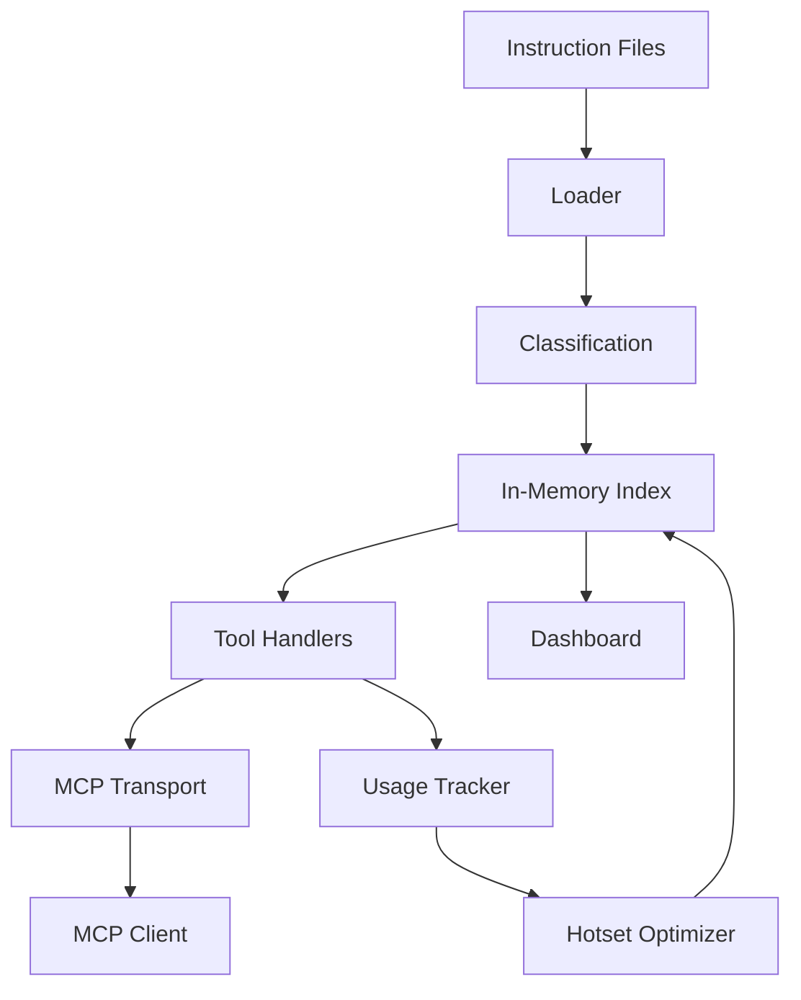
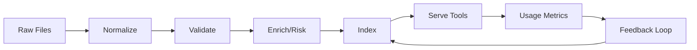

# ARCHITECTURE

## High-Level Components

```mermaid
graph TD
  Catalog[Instruction Files] --> Loader[Loader]
  Loader --> Classifier[Classification]
  Classifier --> Index[In-Memory Index]
  Index --> Tools[Tool Handlers]
  Tools --> Transport[MCP Transport]
  Transport --> Client[MCP Client]
  Index --> Dashboard[Dashboard]
  Tools --> Usage[Usage Tracker]
  Usage --> Optimizer[Hotset Optimizer]
  Optimizer --> Index
```

## Data Lifecycle

```mermaid
graph LR
  A[Raw Files] --> B[Normalize]
  B --> C[Validate]
  C --> D[Enrich/Risk]
  D --> E[Index]
  E --> F[Serve Tools]
  F --> G[Usage Metrics]
  G --> H[Feedback Loop]
  H --> E
```
