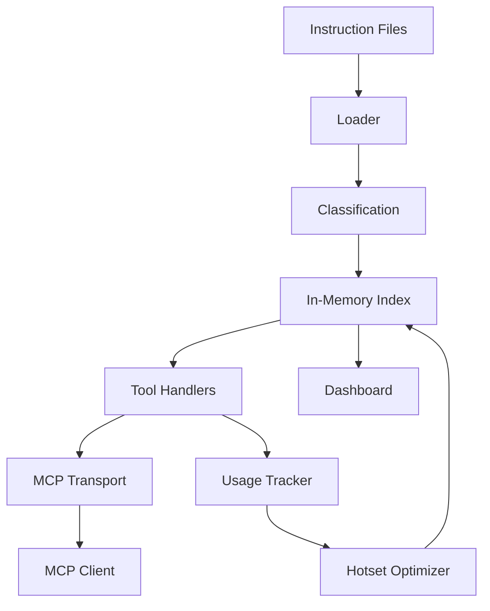
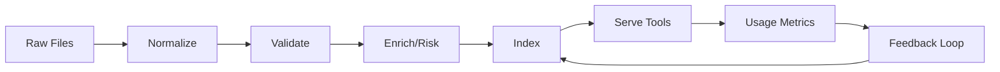

# ARCHITECTURE

## High-Level Components

## Data Lifecycle

## Component Descriptions

| Component | Responsibility | Notes |
|-----------|----------------|-------|
| Instruction Files | Author-managed JSON (future: YAML) instruction entries | Validated against `schemas/instruction.schema.json` at load time |
| Loader | Reads directory, parses JSON, validates schema, normalizes entries | Produces aggregate hash across entries for integrity/diff |
| Classification | Normalization (title/body trim, category dedupe), risk scoring, hash | Risk score heuristic: priority inverse + requirement weight |
| In-Memory Index | Maps id -> entry; list array for iteration/search | Lazy initialized on first tool call |
| Tool Handlers | JSON-RPC method implementations (list/get/search/diff, prompt/review) | Register via `registerHandler` exported by transport |
| MCP Transport | Thin JSON-RPC 2.0 loop over stdio | Emits `server/ready` notification on start |
| Usage Tracker (planned) | Record usage counts & recency, derive hotset | To feed optimization & ranking |
| Optimizer (planned) | Maintain prioritized subset for fast access | May use LRU + frequency decay |
| Dashboard (planned) | Human UI for viewing catalog & metrics | Read-only first, then controlled mutations |

## Data Flow Summary

1. Files discovered in `./instructions` directory.
2. Each file parsed -> validated (Ajv) -> normalized -> risk scored.
3. Aggregate hash computed (stable ordering) for sync/diff.
4. Entries stored in index structures (array + map).
5. Tool requests resolve against index; `instructions/diff` compares client hash.
6. Prompt governance tools evaluate prompts against criteria (separate JSON).
7. (Planned) Usage events update counters feeding optimizer & metrics.

## Integrity Strategy (Planned Enhancements)

- Per-entry `sourceHash` already recorded (sha256 of body).
- Introduce integrity verification tool producing drift report comparing stored hash vs recomputed.
- Maintain catalog manifest (hash list) to enable minimal diff (added/updated/removed sets).

## Diff Evolution

Current: naive full resend when hash mismatch.

Target: structured diff object with arrays: `added`, `updated`, `removed`, each referencing compact metadata (id, contentHash, updatedAt).

## Prompt Governance

`prompt/review` consumes `docs/PROMPT-CRITERIA.json` (versioned) and runs:

- Pattern rules (regex global match first token) -> issue when matched.
- MustContain rules -> issue when absent.

Severity aggregation returns highest severity & counts for quick gating.

## Error Handling Philosophy

- Fail fast on loader validation errors (prevent partial inconsistent index).
- Tool handlers return minimal structured objects; no throwing for notFound conditions.
- Transport centralizes JSON parsing errors & unknown method handling.

## Security Considerations

- Read-only design reduces attack surface pre-auth implementation.
- Regex patterns constrained; avoid catastrophic backtracking.
- Pre-commit hook enforces type safety, linting, tests, and basic secret scanning.

## Observability (Planned)

- Lightweight metrics snapshot tool returning counters: request counts per method, latency buckets.
- Structured log lines (JSON) optional flag.

## Scaling Notes

- Single-process in-memory index adequate up to ~10k entries (target <50ms list/search P95).
- Future: sharded loader or lazy segment loading if catalog grows >50k.

## Roadmap Linkage

- Phases 3-5 deliver integrity + usage foundations enabling optimized diff & ranking.
- Governance (prompt review, future gates) enforces consistency & security over time.

## Related Documents

- TOOLS: see `docs/TOOLS.md` for detailed JSON-RPC method contracts.
- Versioning: see `docs/VERSIONING.md` for release workflow & stability policy.
- Changelog: see `CHANGELOG.md` for historical changes.
