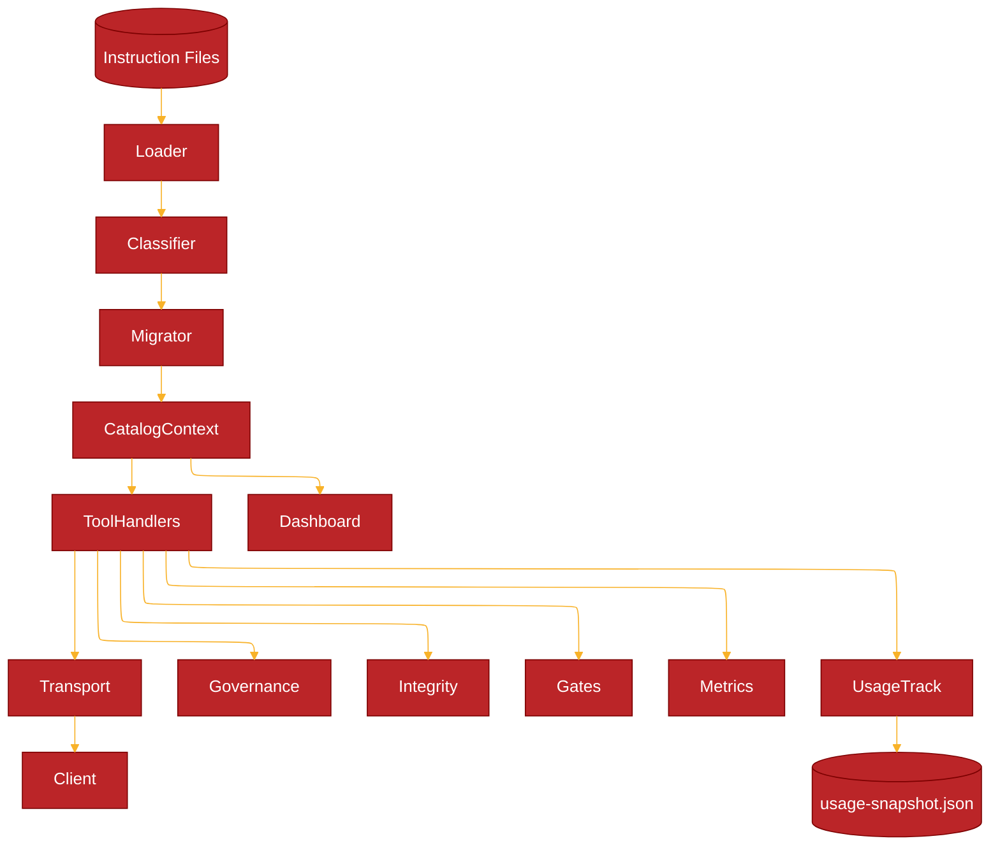
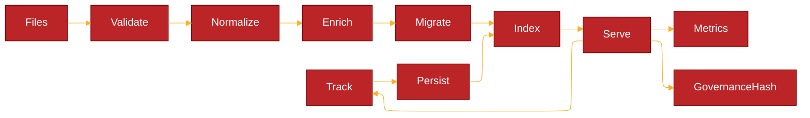
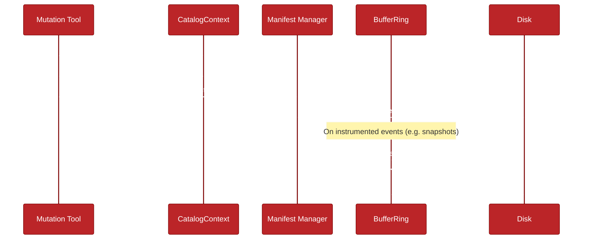
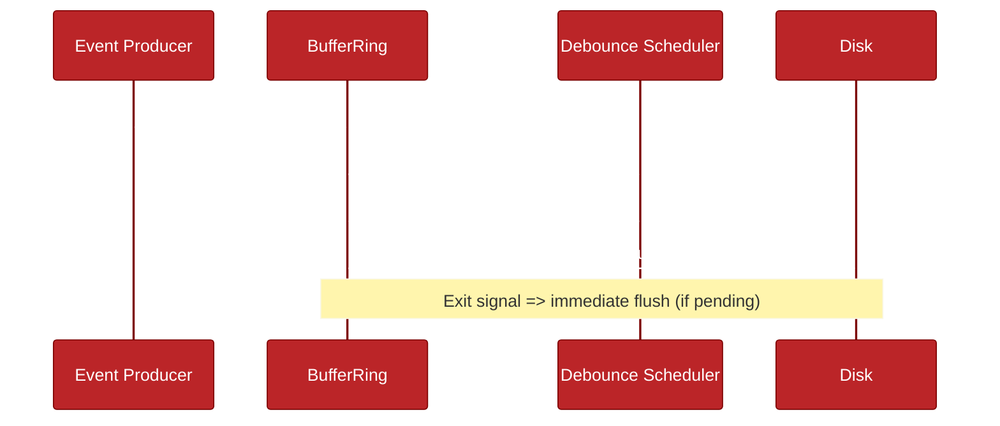
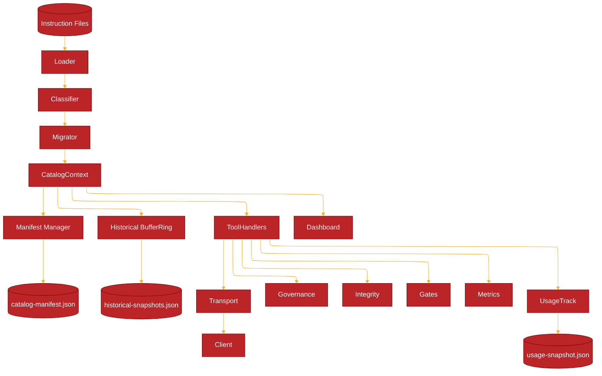

# ARCHITECTURE

Updated for 1.4.1 (adds: opportunistic in‑memory materialization eliminating add→get reload race, unified manifest write helper + observability counters, refined dashboard asset override for stale cache busting, persistent structured tracing (label + JSON lines w/ rotation), feedback/emit subsystem, dispatcher consolidation, governance projection + hash, integrity verification, usage persistence, schema‑aided add failure contract, baseline & declaration guards).

## High-Level Components

Simplified Mermaid (avoids subgraph + complex labels for GitHub compatibility):



ASCII Fallback:

```text
 Instruction Files -> Loader -> Classification -> Migration -> CatalogContext Cache
       |                                                          |
       v                                                          v
    usage-snapshot.json <--- usage/track <--- Tools ---> metrics / governance / integrity / gates / diff / prompt
                                      |
                                      v
                                   Transport -> Client (MCP)
```

## Data Lifecycle



ASCII Fallback:

```text
Files -> Validate -> Normalize -> Enrich -> Migrate -> Index -> Serve -> Track -> Persist
                                        |                 |           |
                                        |                 |           +-> Metrics Snapshot
                                        |                 +-> Governance Hash
                                        +-> (if schema bump) rewrite schemaVersion
```

## Component Descriptions

| Component | Responsibility | Notes |
|-----------|----------------|-------|
| Instruction Files | Author-managed JSON entries | Enriched placeholders persisted lazily (owner, review dates, schemaVersion) |
| CatalogLoader | Read + schema validate + minimal defaults | Computes catalog hash (id:sourceHash) |
| Classification | Normalize (trim, dedupe, scope derivation), risk, priority tier | Derives semantic summary + review cadence |
| Migration | Ensure `schemaVersion` matches current constant | Rewrites file if version upgraded |
| CatalogContext | Caching, mtime + signature invalidation, enrichment persistence, opportunistic materialization | Uses `.catalog-version` for cross‑process invalidation; in‑memory write path avoids reload race |
| Governance Projection | Deterministic subset for governance hash | Fields: id,title,version,owner,priorityTier,nextReviewDue,semanticSummarySha256,changeLogLength |
| Tool Registry | Central schemas + stable flags + dynamic listing (`meta/tools`) | Exposes machine-consumable tool metadata |
| Tool Handlers | JSON-RPC implementation (instructions/*, feedback/*, governanceHash, usage, integrity, gates, metrics) | Write tools gated by MCP_ENABLE_MUTATION |
| MCP SDK Transport | Standard MCP over stdio | Emits `server/ready`, handles capabilities |
| Usage Tracking | usage/track increments with firstSeenTs + debounced persistence | Optional gating via INDEX_FEATURES='usage' |
| Feedback / Emit System | feedback/submit,list,get,update,stats,health tools | Persistent JSON store + audit & security logging |
| Metrics Snapshot | Aggregate per-method counts + feature counters | Lightweight in-memory aggregation |
| Integrity Verify | Recompute vs stored sourceHash | Detects tampering or stale placeholders |
| Gates Evaluate | Evaluate gating rules from `instructions/gates.json` | Summarizes pass/fail severities |
| Dashboard | Optional read-only visualization & /tools.json | Enabled via CLI flags |
| (Future) Optimizer | Hotset selection / ranking | Not yet implemented |

## Data Flow Summary

1. Loader enumerates `instructions/*.json`, applies Ajv validation (draft-07) and minimal bootstrap defaults.
2. Classification normalizes + derives governance fields (version/status/owner/priorityTier/review dates/semantic summary) & risk score.
3. Migration hook updates schemaVersion if older (current schemaVersion: 2 per instruction.schema.json).
4. Catalog hash (id:sourceHash) and governance hash (projection set) computed.
5. Entries cached (map + sorted list); enrichment persistence pass rewrites placeholders once.
6. Tools served: diff / list / governanceHash / integrity / gates / prompt review / usage / metrics.
7. usage/track increments counts; first increment forces immediate flush; subsequent increments debounced.
8. metrics/snapshot reflects cumulative method invocation stats + feature counters.
9. gates/evaluate and integrity/verify provide governance & integrity control loops.

## Hashing & Integrity Layers

| Layer | Purpose | Input | Output |
|-------|---------|-------|--------|
| sourceHash | Per-entry body immutability check | Trimmed body | sha256 hex (64) |
| catalog hash | Fast structural change detection | Sorted `id:sourceHash` list | sha256 hex |
| governance hash | Governance metadata drift detection | Sorted governance projections | sha256 hex |
| integrity/verify | Detect body tamper vs stored sourceHash | Recompute each entry | Issues list |

`governanceHash` ignores body churn; use with catalog hash for layered drift diagnostics.

## Diff Evolution

Current: structured incremental diff (added / updated / removed) when client supplies hash + known set.

Future: extend to include governance-only delta classification and optional streaming for very large catalogs.

## Prompt Governance

`prompt/review` consumes versioned `docs/PROMPT-CRITERIA.json` patterns:

- Pattern rules (regex) produce issues on match (policy violations).
- MustContain rules produce issues on absence (missing required guidance).

Results summarize counts, highest severity enabling fast gating flows.

## Error Handling Philosophy

- Loader isolates schema & logical validation errors per file; faulty files skipped with error list preserved.
- Handlers return `{ notFound:true }` patterns over errors for absence cases.
- JSON-RPC errors standardized (-32601 unknown method, -32602 validation, -32603 internal).
- `instructions/add` shape failures embed authoritative input schema (schema‑aided remediation) when id / body / entry wrapper gaps detected (1.1.0+).

## Security & Governance

- Read-only by default; all mutations gated via `MCP_ENABLE_MUTATION`.
- Feature gating via `INDEX_FEATURES` (e.g. usage) guarded by `feature/status` introspection.
- Governance projection enables reproducible policy diffing; hash reproducibility flag `GOV_HASH_TRAILING_NEWLINE` optional.
- Prompt review regexes curated to avoid catastrophic patterns; lengths capped.
- Integrity verification & diff support tamper detection.

## Observability

- `metrics/snapshot` returns per-method counts, feature counters, env feature list.
- Optional verbose/mutation logging to stderr (MCP_LOG_VERBOSE / MCP_LOG_MUTATION).
- Structured tracing (1.1.2+): each line `[trace:category[:sub]] { json }` persisted to rotating JSONL (env controlled categories via `MCP_TRACE_CATEGORIES`).
- Future: latency buckets & richer trace event taxonomy.

## Scaling Notes

- Single process in-memory suitable through O(10k) entries (<50ms list/search target P95).
- Potential future: shard by id prefix, or memory-map large catalogs.
- Governance hash projection size is linear, but cheap (small JSON per entry).

## Caching & Invalidation

- Directory meta signature (file name + mtime + size) + latest mtime used to detect changes.
- `.catalog-version` file touched on each mutation for robust cross-process invalidation.
- `INSTRUCTIONS_ALWAYS_RELOAD=1` disables caching (test/debug determinism).
- Enrichment persistence rewrites placeholder fields once; subsequent loads stable.

## Feature & Mutation Gating

| Env Var | Purpose |
|---------|---------|
| MCP_ENABLE_MUTATION | Enable mutation tools (import/add/remove/groom, usage/flush) |
| INDEX_FEATURES=usage | Activate usage tracking feature counters & persistence |
| MCP_LOG_VERBOSE / MCP_LOG_MUTATION | Diagnostic logging scopes |
| GOV_HASH_TRAILING_NEWLINE=1 | Optional governance hash newline sentinel |

## Usage Persistence Flow

1. usage/track increments: sets firstSeenTs if absent, updates lastUsedAt, increments count.
2. First usage forces immediate flush to `data/usage-snapshot.json`.
3. Subsequent usages debounced (500ms) unless process exits (beforeExit/SIGINT/SIGTERM flush).
4. On startup, snapshot merged into in-memory entries.

## Governance & Migration

- Governance projection & `instructions/governanceHash` enable metadata-only drift detection.
- Schema version constant centralizes on-disk version; migration hook rewrites outdated files.
- MIGRATION guide details reproducibility & verification steps.

## Related Documents

- Tools: `docs/TOOLS.md`
- Migration & Verification: `docs/MIGRATION.md`
- Versioning Policy: `docs/VERSIONING.md`
- Prompt Criteria: `docs/PROMPT-CRITERIA.json`
- Change Log: `CHANGELOG.md`

## Dashboard Asset Refresh & Cache Strategy (1.4.x)

The admin dashboard now separates structural HTML (admin.html) from functional modules (admin.*.js) and styling (admin.css). During the extraction we observed a UX issue: after upgrading the markup for the Instruction Catalog (chip‑based meta layout + dual ring card accent) some browsers kept rendering the pre‑extraction stacked layout. Root cause analysis:

1. Legacy inline implementation of `renderInstructionList` was previously embedded in `admin.html`.
2. New implementation lives in `js/admin.instructions.js` (deferred). If a cached older JS file (or the inline legacy function) remained dominant, stale DOM would persist.
3. No cache‑busting headers or query fingerprints were present; long‑lived browser tabs reused cached resources.

Mitigation implemented:

- External script now force‑overrides any legacy `window.renderInstructionList` and triggers a zero‑delay re‑render when `window.allInstructions` already populated.
- Style / structure changes are contained entirely in external assets so future visual upgrades do not require editing `admin.html` unless adding new sections.

Recommended future hardening (optional, low risk):

- Add build version query param: `<script defer src="js/admin.instructions.js?v=${BUILD_VERSION}"></script>` emitted by a tiny build step that injects package.json version (or short git sha).
- Serve dashboard static assets with `Cache-Control: no-cache` or a short `max-age=60` to balance freshness vs network.
- Integrate a lightweight integrity stamp (e.g. `data-build-hash` attribute on `<html>`) so automated tests can assert the expected asset revision loaded.

Rationale for override approach vs immediate query param injection: minimal surface change; avoids altering copy script or requiring HTML rewrite during patch. Query params can be layered later without breaking existing deployments.

Testing Guidance:

- Open DevTools Network tab, disable cache, reload: chips (`.meta-chip > .chip-label/.chip-value`) should appear.
- Confirm `window.renderInstructionList.toString()` contains `meta-chip` to verify override JS loaded.
- Validation automation can scrape `#instructions-list .meta-chip` count after seeding one instruction to assert modern layout active.

This section documents the adopted pattern so future contributors avoid re‑introducing inline render code that could mask upgraded external modules.

### Reusable Catalog List Styling (1.4.x)

The instruction catalog card styling has been generalized:

- `.catalog-list` wraps any grouped entities (sessions, history, future logs).
- `.catalog-item` mirrors `.instruction-item` (shadow, dual ring hover, gradient accent overlay).
- Shared sub-classes: `.catalog-item-header`, `.catalog-item-name`, `.catalog-item-meta`, `.catalog-item-summary`.
- Instruction-specific classes remain (`.instruction-item*`) for backward compatibility; both point to unified rules.

When adding a new list, apply `class="catalog-list"` to the container and emit `.catalog-item` blocks with optional `.meta-chip` children to inherit full theming automatically.

## Manifest Manager & Historical Snapshot Flows (1.5.x)

Recent additions introduced a lightweight manifest write helper plus a historical snapshot persistence path (BufferRing-based). This section documents the flows, performance considerations, and optimization roadmap to resolve observed startup latency caused by synchronous snapshot rewrites.

### Components (New / Clarified)

| Component | Purpose | Interaction Points |
|-----------|---------|--------------------|
| Manifest Manager | Maintains summarized catalog manifest (id, version markers, counts) for dashboard / backup routines | Triggered after successful mutation (`add`, `import`, `remove`, `groom`, integrity repair) via deferred `attemptManifestUpdate()` unless forced sync by `MCP_MANIFEST_WRITE=1` |
| Historical Snapshot Writer | Persists rolling window of catalog state or activity metrics (BufferRing) | Currently writes full JSON on each `entry-added` when `autoPersist` enabled |
| BufferRing (persistence mode) | Generic circular buffer (logs, metrics, snapshots) | Emits `persisted` events; synchronous atomic file rewrite per add (current) |

### Current (Baseline) Flow



ASCII summary:

```text
Mutation -> CatalogContext -> (defer) ManifestUpdate -> manifest.json
Instrumented Event -> BufferRing.add -> synchronous full rewrite (historical-snapshots.json)
```

### Observed Issue

- Repeated log lines: `BufferRing: Persisted N entries ...` (incrementing each single addition) during startup / dashboard usage.
- Each addition triggers full JSON serialization + fs write + rename, amplifying I/O.
- Large historical windows (500+ entries) cause cumulative startup delay when many early events occur in rapid succession.

### Optimization Goals

| Goal | Target | Rationale |
|------|--------|-----------|
| Reduce synchronous I/O frequency | <= 1 write / 250ms burst | Amortize cost under load |
| Bound persisted window size | Configurable cap (e.g. 300) | Avoid unbounded growth & large JSON writes |
| Lazy initial load | Only read snapshot file on first explicit access | Faster cold startup when feature unused |
| Safe shutdown flush | Guarantee latest buffered entries persisted | Durability without constant writes |
| Integrity preserved | Optional checksum retained | Maintain tamper detection |

### Proposed Configuration Flags

| Env Var | Default | Meaning |
|---------|---------|---------|
| BUFFER_RING_PERSIST_DEBOUNCE_MS | 250 | Debounce window before batch write (0 = immediate / legacy) |
| BUFFER_RING_PERSIST_MIN_ADDS | 5 | Minimum new additions to trigger a pending flush earlier than debounce timeout |
| BUFFER_RING_MAX_PERSIST | 300 | Hard cap of entries serialized (oldest trimmed) |
| BUFFER_RING_LAZY_LOAD=1 | off | Skip loadFromDisk until first consumer `get*()` call |
| BUFFER_RING_EXIT_FLUSH=1 | on | Force final flush on process exit signals / beforeExit |

### Revised Flow (After Optimization)



### Complexity & Tradeoffs

- Debounce introduces at most `BUFFER_RING_PERSIST_DEBOUNCE_MS` durability lag; acceptable for non-critical telemetry / snapshot data.
- Batch trimming (cap) sacrifices very old history; governance baseline unaffected if snapshots are informational.
- Lazy load defers integrity check; on-demand read executes once and caches result.

### Implementation Sketch (High-Level)

```text
class BufferRing {
  private pending = false; private timer?: NodeJS.Timeout; private addsSinceFlush = 0;
  add(entry) { coreAdd(); addsSinceFlush++; if(autoPersist) schedule(); }
  schedule(){ if(!pending){ pending=true; timer=setTimeout(flush, DEBOUNCE_MS);} else if(addsSinceFlush >= MIN_ADDS){ flush(); }
  flush(){ clearTimeout(timer); pending=false; addsSinceFlush=0; saveToDisk(); }
  installExitHooks(){ ['beforeExit','SIGINT','SIGTERM'].forEach(sig=>process.on(sig, ()=> pending && flush())); }
  getAll(){ if(lazy && !loaded) loadOnDemand(); return orderedEntries; }
}
```

### Manifest Diagram Augmentation

Updated high-level component diagram (add Manifest & Historical Snapshot nodes):



### Rollout Plan

1. Introduce env flags + non-breaking internal scheduler (feature guarded; legacy path if flags unset).
2. Add tests for: (a) debounced flush timing, (b) min-add early flush, (c) exit flush, (d) lazy load deferral.
3. Update docs & dashboard config listing with new flags (manifest category or new persistence category).
4. Monitor: measure average snapshot file writes per minute pre vs post optimization (target ≥90% reduction during bursts).
5. Optional: extend to usage snapshot if similar pattern emerges.

### Acceptance Criteria

- Startup without requesting historical snapshots performs zero snapshot file reads.
- Burst of 50 additions within 100ms results in ≤1 disk write.
- Manual SIGINT after pending additions flushes within 100ms.
- Historical snapshot file never exceeds `BUFFER_RING_MAX_PERSIST` entries.

---

This section formalizes current state and optimization pathway; implementation should be tracked under a minor version (e.g. 1.5.x) with CHANGELOG entry referencing these acceptance criteria.
