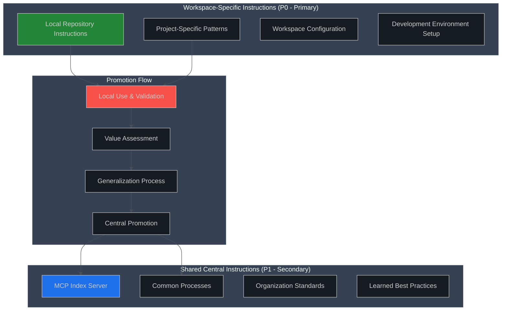
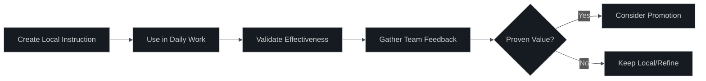

# MCP Index Server Content Guidance

**Version:** 1.0.0  
**Owner:** AI Engineering Team  
**Last Updated:** August 28, 2025  
**Next Review:** November 28, 2025  

---

## 🎯 Purpose

This document provides guidance on what content should and should not be included in the MCP Index Server, and how to structure instruction hierarchies across local repositories and central shared servers.

## 🏗️ Content Architecture

### Primary/Secondary Source Strategy



### Precedence Rules

**Local Repository (Tier 0 - Primary):**

- ALWAYS takes precedence over central server
- Contains workspace-specific, project-specific instructions
- Immediate updates without approval processes
- Full mutation access for local development

**MCP Index Server (Tier 1+ - Secondary):**

- Fallback when local instructions don't exist
- Contains organization-wide, reusable patterns
- Controlled promotion and governance processes
- Typically read-only in production environments

## 📝 Content Classification

### ✅ **Local Repository Instructions (PRIMARY)**

**Workspace-Specific Content:**

- Project setup and configuration procedures
- Repository-specific development patterns
- Local tooling and environment setup
- Project team communication protocols
- Debugging procedures for specific codebases
- Custom scripts and automation specific to the project

**Example Local Instructions:**

```json
{
  "id": "project_setup_vscode",
  "title": "VS Code Setup for This Project",
  "body": "Configure VS Code with project-specific extensions: ESLint config, TypeScript paths, debug configurations...",
  "categories": ["development", "local-setup"],
  "requirement": "mandatory"
}
```

**Temporal/Experimental Content:**

- Work-in-progress procedures being validated
- Experimental patterns under evaluation
- Context-specific workarounds
- Meeting notes and decision records specific to the project

### ✅ **MCP Index Server Instructions (SECONDARY)**

**Organization-Wide Standards:**

- Company coding standards and style guides
- Security policies and compliance procedures
- Common design patterns and architectural principles
- Shared tooling and infrastructure setup
- Cross-team communication protocols

**Proven Best Practices:**

- Validated procedures that work across multiple projects
- Learned lessons from production incidents
- Performance optimization techniques
- Common troubleshooting procedures
- Reusable automation patterns

**Example Central Instructions:**

```json
{
  "id": "security_code_review_checklist",
  "title": "Security Code Review Checklist",
  "body": "Standard security review checklist applicable to all repositories: input validation, authentication, authorization...",
  "categories": ["security", "process", "organization"],
  "requirement": "mandatory"
}
```

**Reference Material:**

- API documentation and integration guides
- External service configuration patterns
- Compliance frameworks and audit procedures
- Emergency response procedures

**MCP-Related Instructions (Workflow Focus):**

```json
{
  "id": "mcp_server_coordination_patterns",
  "title": "MCP Multi-Server Coordination Patterns",
  "body": "Best practices for coordinating operations across multiple MCP servers: error handling, fallback strategies, session management...",
  "categories": ["mcp", "workflow", "architecture"],
  "requirement": "recommended"
}
```

**Appropriate MCP Content:**

- **Workflow patterns**: How to coordinate between multiple servers
- **Error handling**: Graceful degradation when servers unavailable  
- **Security practices**: Authentication and authorization patterns
- **Integration patterns**: How to chain operations across servers
- **Debugging strategies**: Troubleshooting MCP connectivity issues
- **Configuration guidance**: Environment setup and best practices

> **Remember**: Focus on **HOW** to use MCP effectively, not **WHAT** tools exist (protocol handles discovery).

### Templates & Non-Runtime Placeholders

Instruction seed/templates (used for enrichment or scaffolding) must reside under `instructions/_templates/`.

Rules:

- Files in `_templates/` are ignored by the catalog loader (`ignored:template`).
- Tests may copy a template into the root `instructions/` directory to exercise enrichment or migration logic.
- Template files can contain blank governance fields (empty strings) that enrichment tools later populate.
- Never keep persistent placeholder blanks in runtime-loaded files; promote only after enrichment.

Rationale: Keeps catalog completeness metrics focused on actual deployable instructions and prevents placeholder artifacts from masking real validation issues.

### ❌ **Content to Avoid in Central Server**

**MCP Protocol Infrastructure (CRITICAL):**

- **Tool catalogs or tool lists** - Tools are dynamically discovered via MCP protocol
- **Tool schemas or parameter definitions** - These change with server versions
- **Server capability matrices** - Capabilities vary by runtime configuration
- **Tool availability listings** - Tools are session-specific and context-dependent
- **Tool input/output examples** - Use MCP's `get_tool_schema` for current specs

> NEVER embed a static snapshot of tool names, schemas, or capabilities inside instructions. Doing so creates drift risk, undermines dynamic discovery, and forces unnecessary catalog churn when tools evolve.

> **MCP Best Practice**: Let the protocol handle tool discovery. Instructions should focus on **how to use tools effectively**, not **what tools exist**.

**Sensitive Information:**

- API keys, passwords, or credentials
- PII (personally identifiable information)
- Internal network configurations
- Customer-specific data or configurations

**Highly Context-Specific Content:**

- Instructions that only apply to one specific project
- Temporary workarounds for specific bugs
- Personal preferences and individual workflows
- Project-specific debugging information

**Unvalidated Content:**

- Untested procedures or experimental approaches
- Work-in-progress documentation
- Personal notes or incomplete thoughts
- Context-dependent information without clear scope

## � Dynamic Tool Discovery Benefits

MCP's built-in tool discovery mechanism provides significant advantages over static instruction storage:

### **Always Current**

- Tools reflect actual server capabilities at runtime
- No synchronization issues between documentation and reality
- Automatic adaptation to server updates and configuration changes

### **No Maintenance Overhead**

- No need to manually update instruction catalogs when tools change
- No risk of stale or incorrect tool information
- Instructions focus on knowledge, not technical catalogs

### **Runtime Flexibility**

- Adapts to different deployment configurations automatically
- Handles varying authentication states and permissions
- Supports dynamic server availability and network conditions

### **Protocol Compliance**

- Follows MCP specification design principles
- Leverages enterprise-grade capability negotiation
- Maintains clean separation between knowledge and capability discovery

## �🔄 Promotion Workflow

### Step 1: Local Validation



**Validation Criteria:**

- Instruction has been used successfully multiple times
- Multiple team members find it valuable
- Procedure works consistently across different scenarios
- Documentation is clear and complete

### Step 2: Generalization Assessment

**Ask These Questions:**

- Would this instruction be valuable to other teams/projects?
- Can it be generalized without losing effectiveness?
- Does it align with organization standards?
- Is it mature enough for wider adoption?

**Generalization Process:**

```typescript
// Transform project-specific to general
// Before (local):
"Configure the customer-portal TypeScript settings for optimal performance"

// After (central):
"Configure TypeScript for high-performance web applications"
```

### Step 3: Central Promotion

**Promotion Checklist:**

- [ ] Remove project-specific references
- [ ] Add appropriate categories and tags
- [ ] Set correct priority and requirement levels
- [ ] Include rationale and context
- [ ] Review for PII and sensitive information
- [ ] Validate against organization standards

## 🎯 Content Quality Standards

### Writing Guidelines

**For Local Instructions:**

- Focus on immediate, actionable procedures
- Include project-specific context
- Reference local file paths, tools, and configurations
- Use informal, team-appropriate language

**For Central Instructions:**

- Use clear, organization-wide terminology
- Provide sufficient context for any team to understand
- Include rationale and background
- Follow formal documentation standards

### Metadata Guidelines

**Local Instructions:**

```json
{
  "priority": 10-50,
  "audience": "team",
  "requirement": "optional|recommended",
  "categories": ["local", "project-specific"],
  "owner": "team-name"
}
```

**Central Instructions:**

```json
{
  "priority": 1-30,
  "audience": "all",
  "requirement": "mandatory|critical|recommended",
  "categories": ["organization", "process", "standards"],
  "owner": "governance-team"
}
```

## 🔍 Periodic Review Process

### Local Repository Review (Monthly)

**Review Questions:**

1. Which local instructions have proven most valuable?
2. Are there patterns that could benefit other teams?
3. Have any local instructions become obsolete?
4. What new challenges need documentation?

**Action Items:**

- Identify promotion candidates
- Archive outdated instructions
- Update evolving procedures
- Document new local patterns

### Central Server Curation (Quarterly)

**Review Questions:**

1. Are central instructions still relevant and accurate?
2. Which instructions have low usage or adoption?
3. Are there conflicts between local and central guidance?
4. What new organization-wide needs have emerged?

**Action Items:**

- Update or retire outdated central instructions
- Resolve conflicts between local and central guidance
- Identify gaps in central instruction coverage
- Plan new central instruction development

## 🚀 Implementation Strategy

### Getting Started

1. **Audit Current Instructions:**
   - Classify existing instructions as local vs. central
   - Identify promotion candidates
   - Remove inappropriate content

2. **Establish Local-First Workflow:**
   - Document new procedures locally first
   - Use and validate before considering promotion
   - Regular team reviews of local instruction value

3. **Create Promotion Pipeline:**
   - Define clear promotion criteria
   - Establish review and approval process
   - Set up regular promotion cycles

### Success Metrics

- **Local Repository Health:** Regular use of local instructions, team satisfaction
- **Promotion Quality:** Central instructions have wide adoption and positive feedback
- **Content Freshness:** Regular updates and review cycles maintained
- **Coverage Completeness:** Key organizational processes documented centrally

---

**Best Practice:** Start local, prove value, then promote selectively. The MCP Index Server should contain only the most valuable, widely applicable instructions that have been proven through local use.
