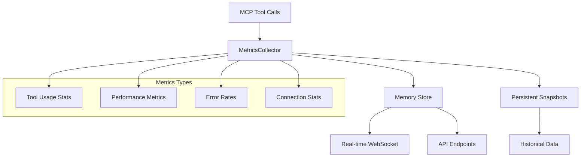
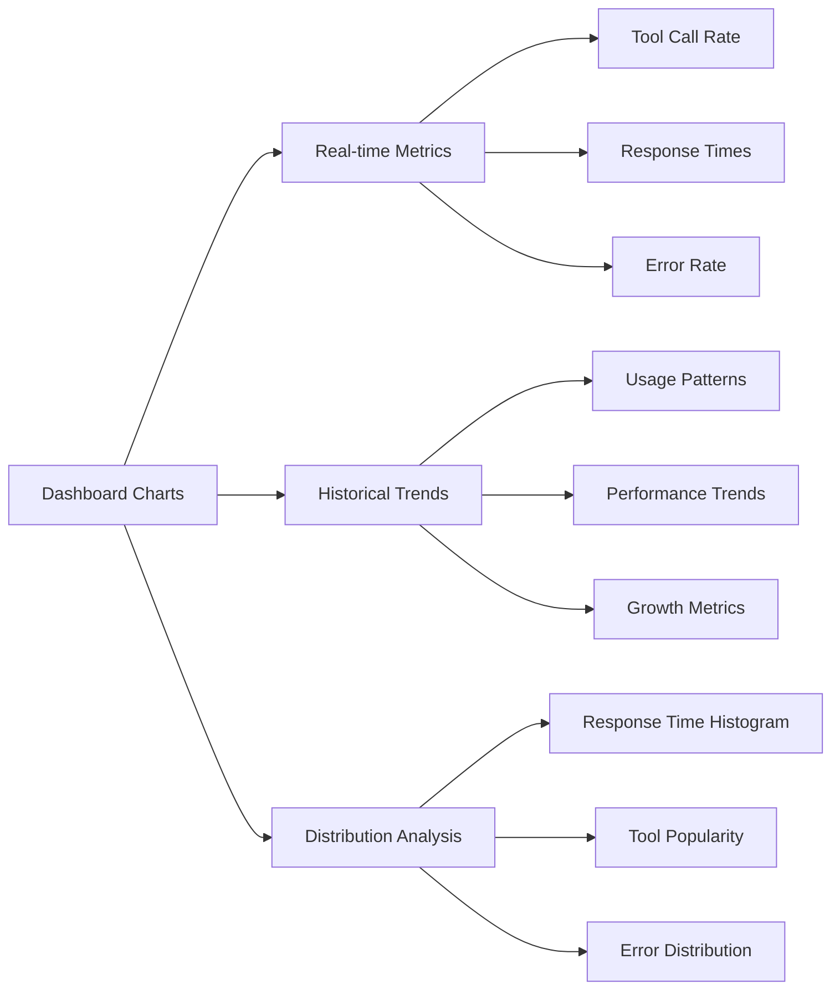
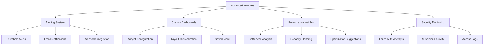
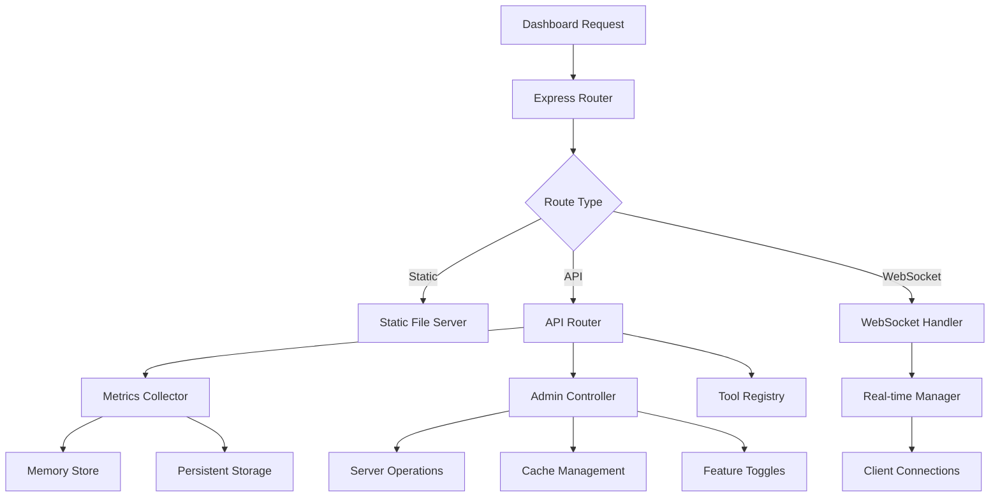
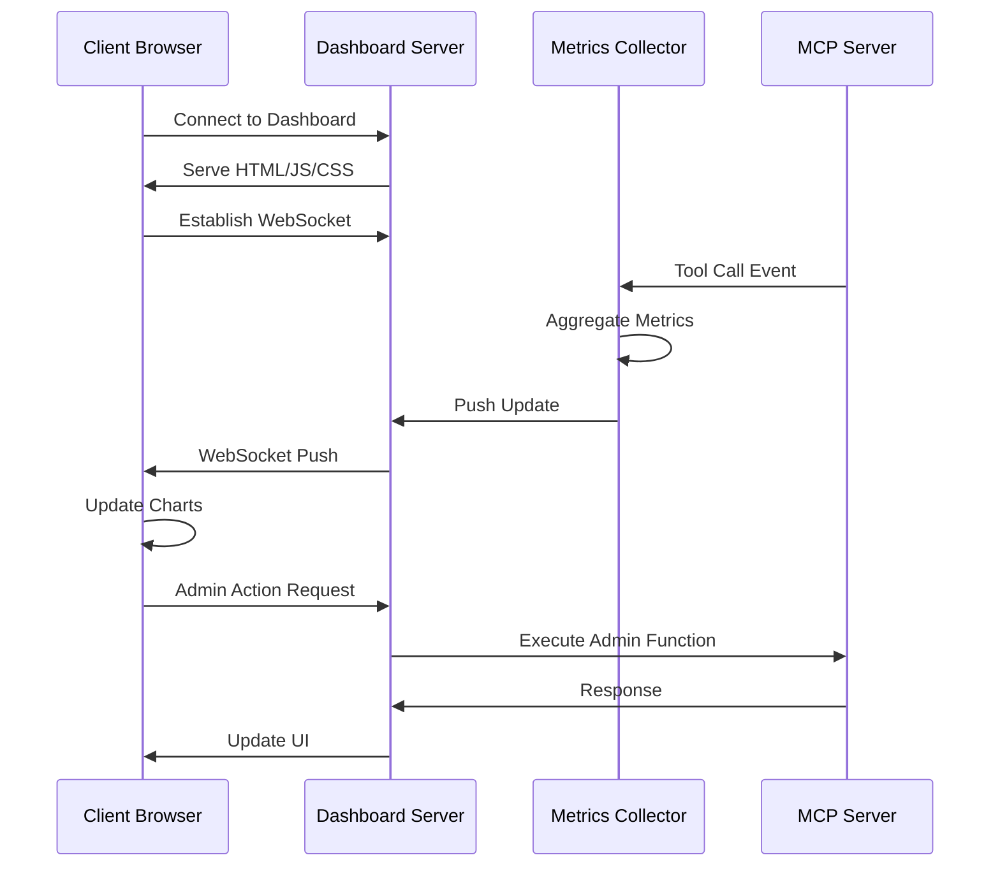

# MCP Index Server Dashboard Development Plan

## Overview

Transform the current basic HTML dashboard into a comprehensive administrative interface with real-time metrics, interactive graphs, admin functions, and modern web UI capabilities.

## Current State Analysis

**Current Basic Dashboard Features:**

- Simple HTML page with server version
- Basic tool listing
- Transport information display
- Read-only monitoring

**Current Limitations:**

- Static HTML with no interactivity
- No real-time data updates
- No metrics visualization
- No administrative functions
- No user experience optimization

## Multi-Phase Development Plan

### Phase 1: Foundation & Architecture (Week 1-2)

#### 1.1 Dashboard Architecture Setup

- **Backend Framework**: Express.js with TypeScript
- **Frontend Framework**: Modern vanilla JavaScript with Web Components
- **Real-time**: WebSocket/Server-Sent Events for live updates
- **Data Storage**: In-memory metrics with optional persistent snapshots

#### 1.2 Core Infrastructure

```typescript
// New file structure:
src/
├── dashboard/
│   ├── server/
│   │   ├── DashboardServer.ts        // Express server setup
│   │   ├── WebSocketManager.ts       // Real-time communication
│   │   ├── MetricsCollector.ts       // Data aggregation
│   │   └── ApiRoutes.ts              // REST API endpoints
│   ├── client/
│   │   ├── index.html                // Main dashboard page
│   │   ├── js/
│   │   │   ├── main.js               // Application entry point
│   │   │   ├── components/           // Web components
│   │   │   └── utils/                // Utilities
│   │   ├── css/
│   │   │   ├── main.css              // Styles
│   │   │   └── themes/               // Color themes
│   │   └── assets/                   // Static assets
│   └── types/
│       └── DashboardTypes.ts         // Shared type definitions
```

#### 1.3 Basic API Endpoints

- `GET /api/status` - Server health and basic info
- `GET /api/tools` - Available MCP tools
- `GET /api/metrics/basic` - Basic server metrics
- `GET /api/config` - Dashboard configuration

### Phase 2: Metrics Collection & Basic UI (Week 3-4)

#### 2.1 Metrics Collection System



#### 2.2 Collected Metrics

- **Tool Usage**: Call frequency, success/error rates, response times
- **System Metrics**: Memory usage, CPU utilization, uptime
- **Connection Metrics**: Active connections, handshake success rates
- **Error Tracking**: Error types, frequencies, recent failures
- **Performance**: Response time distributions, throughput

#### 2.3 Modern Dashboard UI

```ascii
┌─────────────────────────────────────────────────────────────────┐
│ MCP Index Server Dashboard                          [Settings] │
├─────────────────────────────────────────────────────────────────┤
│ Status: ● RUNNING    Version: 1.1.3    Uptime: 2d 14h 32m     │
├─────────────────────────────────────────────────────────────────┤
│                                                                 │
│ ┌─────────────┐ ┌─────────────┐ ┌─────────────┐ ┌─────────────┐ │
│ │ Total Calls │ │   Active    │ │ Success     │ │ Avg Response│ │
│ │   45,231    │ │ Connections │ │   Rate      │ │    Time     │ │
│ │             │ │      8      │ │   99.2%     │ │   142ms     │ │
│ └─────────────┘ └─────────────┘ └─────────────┘ └─────────────┘ │
│                                                                 │
│ ┌─── Tool Usage (Last 24h) ────────────────────────────────────┐ │
│ │ [===Chart Area===]                                          │ │
│ │                                                             │ │
│ │                                                             │ │
│ └─────────────────────────────────────────────────────────────┘ │
│                                                                 │
│ ┌─── Recent Activity ─────┐ ┌─── System Health ───────────────┐ │
│ │ 16:23 instructions/list │ │ Memory: ▓▓▓▓▓░░░░░ 52%        │ │
│ │ 16:22 health/check      │ │ CPU:    ▓▓░░░░░░░░ 18%        │ │
│ │ 16:22 instructions/get  │ │ Disk:   ▓▓░░░░░░░░ 15%        │ │
│ │ 16:21 feedback/submit   │ │                                │ │
│ └─────────────────────────┘ └─────────────────────────────────┘ │
└─────────────────────────────────────────────────────────────────┘
```

### Phase 3: Interactive Graphs & Visualization (Week 5-6)

#### 3.1 Chart Library Integration

- **Library**: Chart.js or D3.js for interactive visualizations
- **Real-time Updates**: Live data streaming via WebSocket
- **Export Capabilities**: PNG/SVG export for reports

#### 3.2 Graph Types & Features



#### 3.3 Interactive Features

- **Time Range Selection**: 1h, 6h, 24h, 7d, 30d
- **Zoom & Pan**: Interactive chart navigation
- **Hover Details**: Contextual information on data points
- **Filtering**: By tool type, client, time period
- **Drill-down**: Click to view detailed metrics

### Phase 4: Administrative Functions (Week 7-8)

#### 4.1 Admin Operations Panel

```ascii
┌─── Administrative Functions ─────────────────────────────────────┐
│                                                                  │
│ ┌─── Server Control ───────┐ ┌─── Cache Management ─────────────┐ │
│ │ ● Start/Stop Services    │ │ ● Clear Instruction Cache       │ │
│ │ ● Reload Configuration   │ │ ● Refresh Catalog              │ │
│ │ ● Graceful Shutdown      │ │ ● Reset Metrics               │ │
│ └──────────────────────────┘ └─────────────────────────────────┘ │
│                                                                  │
│ ┌─── Maintenance ──────────┐ ┌─── Diagnostics ─────────────────┐ │
│ │ ● Run Health Checks      │ │ ● Export Logs                  │ │
│ │ ● Cleanup Temp Files     │ │ ● Generate Debug Report        │ │
│ │ ● Backup Configurations  │ │ ● Test Tool Connectivity       │ │
│ └──────────────────────────┘ └─────────────────────────────────┘ │
│                                                                  │
│ ┌─── User Management ──────┐ ┌─── Feature Flags ───────────────┐ │
│ │ ● Active Sessions        │ │ ● Enable/Disable Mutations     │ │
│ │ ● Connection History     │ │ ● Toggle Verbose Logging       │ │
│ │ ● Rate Limit Status      │ │ ● Debug Mode Control           │ │
│ └──────────────────────────┘ └─────────────────────────────────┘ │
└──────────────────────────────────────────────────────────────────┘
```

#### 4.2 Admin API Endpoints

- `POST /api/admin/server/restart` - Graceful server restart
- `POST /api/admin/cache/clear` - Clear various caches
- `POST /api/admin/maintenance/cleanup` - Run cleanup tasks
- `GET /api/admin/health/full` - Comprehensive health check
- `POST /api/admin/config/reload` - Reload configuration
- `GET /api/admin/logs/export` - Export log files
- `POST /api/admin/features/toggle` - Toggle feature flags

### Phase 5: Advanced Features & Polish (Week 9-10)

#### 5.1 Advanced Dashboard Features



#### 5.2 User Experience Enhancements

- **Dark/Light Themes**: Toggle between themes
- **Responsive Design**: Mobile and tablet support
- **Keyboard Shortcuts**: Power user navigation
- **Accessibility**: WCAG compliance
- **Progressive Web App**: Offline capabilities

#### 5.3 Integration Features

- **Export Capabilities**: JSON, CSV, PDF reports
- **API Documentation**: Embedded Swagger UI
- **Health Monitoring**: Integration with monitoring systems
- **Backup/Restore**: Configuration and data management

## Detailed Mockups

### Main Dashboard Layout

```ascii
┌─────────────────────────────────────────────────────────────────────────────────────┐
│ MCP Index Server Dashboard                 [🌙] [⚙️] [👤] [❓]               │
├─────────────────────────────────────────────────────────────────────────────────────┤
│ 📊 Overview  📈 Metrics  🔧 Admin  📋 Logs  🔍 Tools  ⚡ Real-time            │
├─────────────────────────────────────────────────────────────────────────────────────┤
│                                                                                 │
│ ┌─ System Status ─┐ ┌─ Performance ──┐ ┌─ Activity ─────┐ ┌─ Health ────────┐ │
│ │ Status: ● LIVE  │ │ Req/sec: 1,247 │ │ Tools: 42      │ │ Memory: 68%     │ │
│ │ Uptime: 5d 2h   │ │ Latency: 89ms  │ │ Clients: 12    │ │ CPU: 23%        │ │
│ │ Version: 1.1.3  │ │ Errors: 0.1%   │ │ Errors: 3      │ │ Disk: 45%       │ │
│ └─────────────────┘ └────────────────┘ └────────────────┘ └─────────────────┘ │
│                                                                                 │
│ ┌─ Tool Usage Trends (24h) ──────────────────────────────────────────────────┐ │
│ │     ▁▂▃▅▆█▇▅▃▂▁                 │
│ │   ▁▃▄▆▇█▆▄▂▁                     │
│ │ ▁▂▃▄▅▆▅▄▃▂▁                       │
│ │                                  │
│ │ [━━━━━━━━━━━━━━━━━━━━━━━━━━━━━━━━━━━━━━━━━━━━━━━━━━━━━━━━━━━━━━━━━━━━━━] │ │
│ │ 00:00    06:00    12:00    18:00    24:00                                  │ │
│ └─────────────────────────────────────────────────────────────────────────┘ │
│                                                                                 │
│ ┌─ Recent Activity ────────────────┐ ┌─ Top Tools ─────────────────────────┐ │
│ │ 16:42:18 instructions/list  ✓    │ │ 1. instructions/list    45,231     │ │
│ │ 16:42:17 health/check       ✓    │ │ 2. instructions/get     32,147     │ │
│ │ 16:42:15 instructions/get    ✓    │ │ 3. health/check         28,934     │ │
│ │ 16:42:12 feedback/submit     ✓    │ │ 4. feedback/submit      12,045     │ │
│ │ 16:42:10 diagnostics/trace  ✓    │ │ 5. instructions/search   8,721     │ │
│ │ 16:42:08 instructions/add    ✓    │ │ 6. instructions/add      5,432     │ │
│ │ 16:42:05 usage/stats         ✗    │ │ 7. usage/stats           3,210     │ │
│ │ [Show More...]                    │ │ [View All...]                       │ │
│ └───────────────────────────────────┘ └─────────────────────────────────────┘ │
└─────────────────────────────────────────────────────────────────────────────────────┘
```

### Admin Panel Layout

```ascii
┌─────────────────────────────────────────────────────────────────────────────────────┐
│ Admin Panel                                          Last Action: Cache Cleared │
├─────────────────────────────────────────────────────────────────────────────────────┤
│                                                                                 │
│ ┌─ Server Control ─────────────────┐ ┌─ Maintenance ─────────────────────────┐ │
│ │ [🔄 Restart Server]              │ │ [🧹 Cleanup Temp Files]              │ │
│ │ [⚙️ Reload Config]               │ │ [📦 Backup Config]                   │ │
│ │ [🛑 Graceful Shutdown]           │ │ [🔍 Run Health Check]               │ │
│ │                                  │ │ [📊 Generate Report]                │ │
│ │ Status: Ready for operations     │ │ Last Maintenance: 2h ago             │ │
│ └──────────────────────────────────┘ └───────────────────────────────────────┘ │
│                                                                                 │
│ ┌─ Cache Management ───────────────┐ ┌─ Feature Flags ──────────────────────┐ │
│ │ Instruction Cache: 1,247 entries │ │ ☑️ Mutations Enabled                 │ │
│ │ [🗑️ Clear Instructions]          │ │ ☑️ Verbose Logging                   │ │
│ │                                  │ │ ☐ Debug Mode                         │ │
│ │ Catalog Cache: 42 files          │ │ ☑️ Rate Limiting                     │ │
│ │ [🗑️ Clear Catalog]               │ │ ☐ Maintenance Mode                   │ │
│ │                                  │ │                                      │ │
│ │ Metrics Cache: 24h data          │ │ [💾 Save Changes]                    │ │
│ │ [🗑️ Clear Metrics]               │ │                                      │ │
│ └──────────────────────────────────┘ └───────────────────────────────────────┘ │
│                                                                                 │
│ ┌─ Active Sessions ────────────────────────────────────────────────────────────┐ │
│ │ Client ID        │ Connected    │ Last Activity │ Tools Used │ Status      │ │
│ │ claude-vscode-1  │ 2h 34m ago   │ 12s ago       │ 15         │ ● Active    │ │
│ │ copilot-ext-2    │ 1h 18m ago   │ 2m ago        │ 8          │ ● Active    │ │
│ │ test-client-3    │ 45m ago      │ 15m ago       │ 3          │ ⏸️ Idle     │ │
│ │ [View All Sessions...]                                                      │ │
│ └─────────────────────────────────────────────────────────────────────────────┘ │
└─────────────────────────────────────────────────────────────────────────────────────┘
```

### Real-time Metrics View

```ascii
┌─────────────────────────────────────────────────────────────────────────────────────┐
│ Real-time Metrics                                              🔴 LIVE (0.2s)     │
├─────────────────────────────────────────────────────────────────────────────────────┤
│                                                                                 │
│ ┌─ Request Rate ───────────────────┐ ┌─ Response Time Distribution ───────────┐ │
│ │     ▁▂▃▅▆█▇▅▃▂▁                 │ │ <50ms  ████████████████ 65%           │ │
│ │   ▁▃▄▆▇█▆▄▂▁                     │ │ 50-100 ████████ 23%                  │ │
│ │ ▁▂▃▄▅▆▅▄▃▂▁                       │ │ 100-200 ███ 8%                       │ │
│ │                                  │ │ 200-500 ▌ 3%                         │ │
│ │ Current: 247 req/min             │ │ >500ms  ▌ 1%                         │ │
│ │ Peak: 1,234 req/min (14:32)      │ │                                      │ │
│ │ Average: 180 req/min             │ │ P95: 127ms  P99: 245ms               │ │
│ └──────────────────────────────────┘ └───────────────────────────────────────┘ │
│                                                                                 │
│ ┌─ Tool Call Frequency (Live) ─────────────────────────────────────────────────┐ │
│ │ instructions/list  ████████████████████ 45/min                             │ │
│ │ instructions/get   ██████████████ 32/min                                   │ │
│ │ health/check       ████████ 18/min                                         │ │
│ │ feedback/submit    █████ 12/min                                            │ │
│ │ instructions/add   ███ 7/min                                               │ │
│ │ usage/stats        ██ 4/min                                                │ │
│ │ [Show All Tools...]                                                        │ │
│ └─────────────────────────────────────────────────────────────────────────────┘ │
│                                                                                 │
│ ┌─ Error Rate Tracking ────────────┐ ┌─ System Resources ──────────────────────┐ │
│ │ Current Error Rate: 0.8%         │ │ Memory Usage:                           │ │
│ │ Last 1h: 1.2%                    │ │ ████████████░░░░░░░░ 68% (1.2GB/1.8GB) │ │
│ │ Last 24h: 0.9%                   │ │                                        │ │
│ │                                  │ │ CPU Usage:                             │ │
│ │ Recent Errors:                   │ │ █████░░░░░░░░░░░░░░░ 23%               │ │
│ │ • Timeout (3)                    │ │                                        │ │
│ │ • Invalid request (2)            │ │ Network I/O:                           │ │
│ │ • Rate limit (1)                 │ │ In:  ████ 1.2MB/s                     │ │
│ │                                  │ │ Out: ██ 0.8MB/s                       │ │
│ └──────────────────────────────────┘ └─────────────────────────────────────────┘ │
└─────────────────────────────────────────────────────────────────────────────────────┘
```

## Technical Implementation Details

### Architecture Decisions



### Data Flow



### Security Considerations

1. **Authentication**: Local-only access (127.0.0.1 binding)
2. **Authorization**: Admin functions require additional confirmation
3. **Input Validation**: All admin inputs sanitized and validated
4. **Rate Limiting**: API endpoints protected against abuse
5. **Audit Trail**: All admin actions logged with timestamps

### Performance Targets

- **Page Load**: < 2 seconds initial load
- **Real-time Updates**: < 100ms latency
- **Chart Rendering**: < 500ms for complex visualizations
- **Memory Usage**: < 50MB additional overhead
- **API Response**: < 200ms for most endpoints

## Development Timeline

| Phase | Duration | Key Deliverables | Success Criteria |
|-------|----------|------------------|------------------|
| Phase 1 | 2 weeks | Foundation setup, basic Express server | Dashboard serves, WebSocket connected |
| Phase 2 | 2 weeks | Metrics collection, modern UI | Real-time metrics display |
| Phase 3 | 2 weeks | Interactive charts, visualizations | Charts update live, interactive |
| Phase 4 | 2 weeks | Admin functions, management panel | Admin operations functional |
| Phase 5 | 2 weeks | Polish, advanced features, testing | Production-ready dashboard |

## Success Metrics

1. **Functionality**: All planned features implemented and tested
2. **Performance**: Meets performance targets under load
3. **Usability**: Intuitive interface for administrators
4. **Reliability**: No impact on core MCP server performance
5. **Maintainability**: Clean, documented, testable code

## Risk Mitigation

- **Resource Impact**: Careful memory/CPU monitoring during development
- **Security**: Regular security reviews and penetration testing
- **Browser Compatibility**: Testing across major browsers
- **Accessibility**: WCAG compliance validation
- **Scalability**: Load testing with high metric volumes

## Current State Audit (Continuation)

## Phases (Planned vs Implemented)

| Phase | Scope (Planned) | Implementation Status | Gaps |
|-------|------------------|-----------------------|------|
| 1 | Core metrics, status, REST endpoints, basic HTML | Implemented (metrics, /api/realtime, /api/metrics) | None critical |
| 2 | Basic charts (tool usage, performance), static updates | Endpoints exist (/api/charts/*) but frontend chart functions are stubs | Need Chart.js instantiation & update logic |
| 3 | Interactive controls (time range, export, fullscreen, refresh) + WebSockets | UI controls present; WebSocket integration partially wired; charts not updating | Real-time chart data binding missing |
| 4 | Advanced analytics, alerts, detailed performance, streaming endpoints | Endpoints exist (analytics, alerts, performance/detailed) | UI not rendering these datasets |
| 4.1 | Admin panel (maintenance, sessions, config, stats) | Backend + UI implemented; initialization fixed | Improved error handling & active nav fix added |

## Key Findings

- Backend breadth is ahead of frontend visualization maturity.
- Multiple endpoints unused by any DOM updater functions.
- Real-time widget update IDs partially mismatch early static IDs (success-rate-value vs success-rate-percent). Some values never refresh.
- Chart functions (updateToolUsageChart, updatePerformanceCharts) are placeholders: no Chart objects created.
- Admin panel previously lacked initialization; fixed and hardened.
- Dist patch risk removed by updating source file.

## Immediate Remediation (Implemented in this audit)

- Admin `showSection` refactored (no reliance on global event).
- Hardened `loadOverviewData` with parallel fetch + graceful degradation.

## Next Remediation Actions (Priority)

1. Implement Chart.js initialization (one-time create, subsequent dataset mutation).
2. Normalize metric element IDs or map both legacy and new IDs.
3. Add UI surfaces for: alerts (/api/alerts/active), advanced analytics (/api/analytics/advanced), streaming (/api/streaming/data).
4. Add WebSocket fallback detection & reconnect loop; push deltas into charts.
5. Provide client error banner component with dismiss & diagnostic info.
6. Add lightweight test covering dashboard HTML generation (sanity for ids).

## Proposed Chart Implementation Contract

- Inputs: `{ timestamps:number[], series:{label:string, data:number[]}[] }`.
- Outputs: Chart.js Line chart objects stored in global `charts` map.
- Error Modes: empty data → show placeholder; fetch failure → show red status.

## Edge Cases to Cover

- Empty metrics window (just started server).
- Large time ranges (30d) – downsample to max N points (e.g. 500) client-side.
- WebSocket disconnect / reconnect storms.
- Admin maintenance mode toggled while dashboard open.

## Test Additions

- Unit: parse HTML string ensure required ids exist.
- Integration: mock metricsCollector returning deterministic series; assert endpoint JSON shape consumed by chart prep function.

## Risk Register

| Risk | Impact | Mitigation |
|------|--------|------------|
| Stale dist vs src mismatch | Features regress after rebuild | Always patch source; add build guard test |
| Chart memory growth on repeated init | Performance degradation | Guard initialization; reuse datasets |
| WebSocket silent failure | No real-time updates | Add connection state indicator & retry backoff |
| ID mismatches | Missing metric updates | Central mapping layer with fallback |

## Completion Criteria for “Dashboards Working”

- All Phase 1–3 controls reflected visually & reactive (charts redraw on range change, refresh button updates timestamps).
- Real-time metrics numeric widgets update at scheduled interval (30s) and via WebSocket pushes (when enabled).
- At least one alert displayed when generated via POST /api/alerts/generate.
- Admin panel overview shows uptime advancing and stats updated at refresh interval.

## Tracking

Add a small Vitest suite: `dashboardPhase2Charts.spec.ts` validating chart data processing once implemented.
