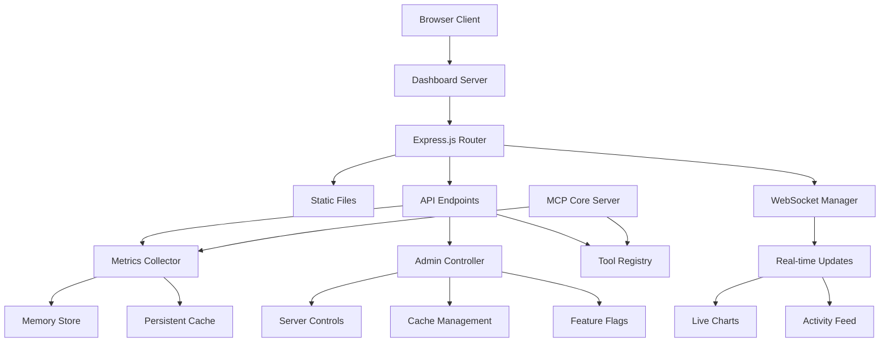
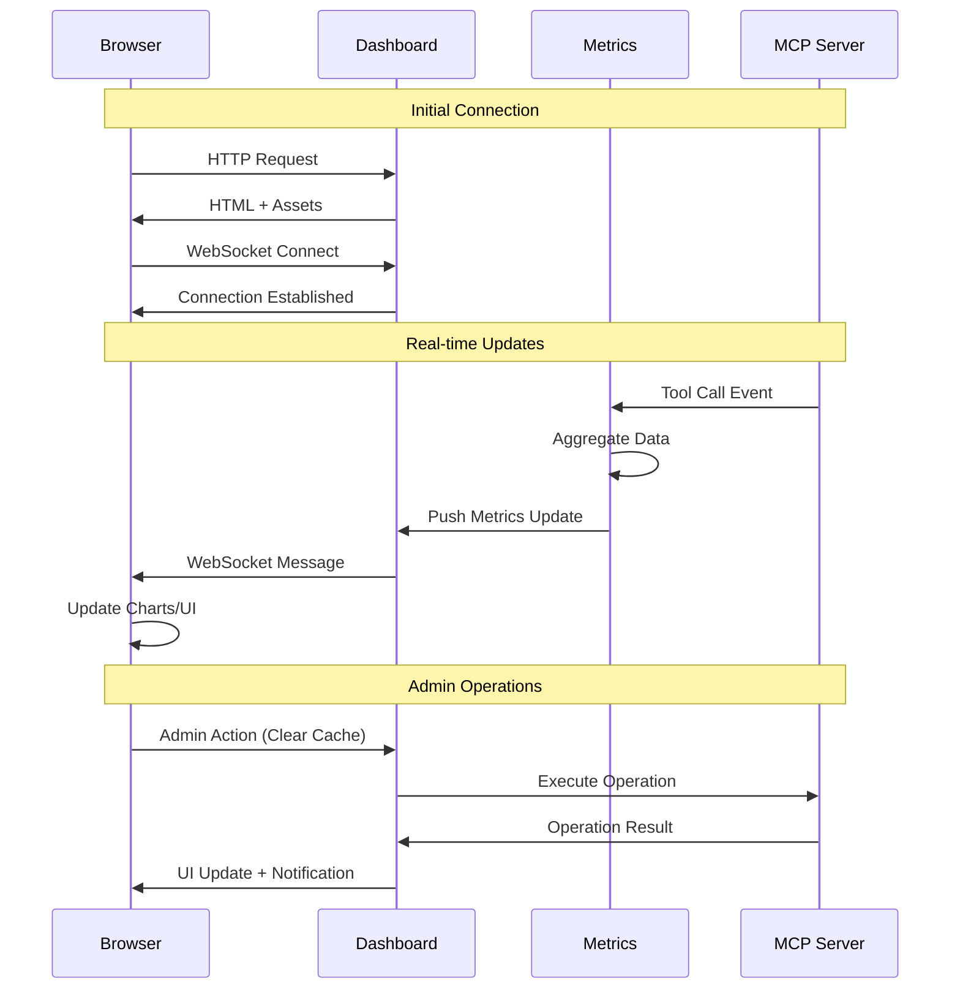

# Dashboard Development Visual Summary

## Current vs Future State

### Current Basic Dashboard

```text
┌─────────────────────────────────────────┐
│ MCP Index Server - Admin Dashboard     │
├─────────────────────────────────────────┤
│ Version: 1.1.3                         │
│                                         │
│ Available Tools:                        │
│ • instructions/list                     │
│ • instructions/get                      │
│ • health/check                          │
│ • feedback/submit                       │
│ • (... 42 total tools)                 │
│                                         │
│ Transport Information:                  │
│ Primary: stdio (JSON-RPC 2.0)          │
│ Secondary: HTTP dashboard               │
└─────────────────────────────────────────┘
```

### Future Advanced Dashboard (Phase 5)
```
┌─────────────────────────────────────────────────────────────────────────────────────┐
│ 🚀 MCP Index Server Dashboard v2.0    [🌙] [⚙️] [📊] [🔔] [👤] [❓]        │
├─────────────────────────────────────────────────────────────────────────────────────┤
│ 📊 Overview │ 📈 Metrics │ 🔧 Admin │ 📋 Logs │ 🔍 Tools │ ⚡ Live │ 📱 Mobile │
├─────────────────────────────────────────────────────────────────────────────────────┤
│ ┌─ Live Status ──┐ ┌─ Performance ─┐ ┌─ Activity ───┐ ┌─ Health Check ─┐   │
│ │ 🟢 ONLINE      │ │ 🚀 1,247 RPS  │ │ 📞 42 Tools   │ │ 💾 RAM: 68%    │   │
│ │ ⏱️ 5d 2h 14m   │ │ ⚡ 89ms avg   │ │ 👥 12 Clients │ │ 🖥️ CPU: 23%    │   │
│ │ 🏷️ v1.1.3      │ │ ❌ 0.1% err   │ │ ⚠️ 3 Errors   │ │ 💿 Disk: 45%   │   │
│ └────────────────┘ └───────────────┘ └───────────────┘ └────────────────┘   │
│                                                                             │
│ ┌─ Interactive Tool Usage Chart (Real-time) ────────────────────────────────┐ │
│ │ 📈 [Live Chart with zoom, pan, filter capabilities]                      │ │
│ │     ████████████████ instructions/list (45K calls)                       │ │
│ │     ███████████ instructions/get (32K calls)                             │ │
│ │     ████████ health/check (29K calls)                                    │ │ 
│ │     ████ feedback/submit (12K calls)                                     │ │
│ │ [📅 1h] [📅 6h] [📅 24h] [📅 7d] [📅 30d] [🔍 Filter] [📤 Export]     │ │
│ └───────────────────────────────────────────────────────────────────────┘ │
│                                                                             │
│ ┌─ Admin Quick Actions ─────┐ ┌─ Live Activity Feed ─────────────────────┐ │
│ │ [🔄 Restart] [⚙️ Config]   │ │ 🔴 LIVE: New requests every 0.2s        │ │
│ │ [🧹 Cleanup] [📊 Report]   │ │ 16:42:18 ✅ instructions/list client-1  │ │
│ │ [🗑️ Clear Cache] [💾 Backup]│ │ 16:42:17 ✅ health/check client-2       │ │
│ │                            │ │ 16:42:15 ✅ instructions/get client-1    │ │
│ │ Feature Flags:             │ │ 16:42:12 ✅ feedback/submit client-3     │ │
│ │ ☑️ Mutations ☑️ Verbose    │ │ 16:42:10 ❌ rate_limit_hit client-4     │ │
│ │ ☐ Debug ☑️ Rate Limiting   │ │ [📜 View All] [🔍 Filter] [⏸️ Pause]    │ │
│ └────────────────────────────┘ └──────────────────────────────────────────┘ │
└─────────────────────────────────────────────────────────────────────────────────────┘
```

## Dashboard Architecture

### System Architecture Diagram


### Data Flow Architecture


## Phase-by-Phase Visual Evolution

### Phase 1: Foundation (Week 1-2)
```
┌─ Basic Express Dashboard ─────────────────┐
│ 📡 Server: Express.js + TypeScript       │
│ 🔌 WebSocket: Basic connection setup     │
│ 📊 API: /api/status, /api/tools          │
│ 🎨 UI: Modern HTML5 + CSS Grid           │
│                                           │
│ Status: ● RUNNING  Version: 1.1.3        │
│ Tools: [Basic List]                       │
│ WebSocket: Connected ✅                   │
└───────────────────────────────────────────┘
```

### Phase 2: Metrics + UI (Week 3-4)
```
┌─ Metrics Dashboard ───────────────────────┐
│ 📈 Live Metrics: CPU, Memory, Requests   │
│ 📊 Basic Charts: Tool usage over time    │
│ 🔄 Auto-refresh: Every 5 seconds         │
│ 🎯 KPIs: Success rate, avg response time │
│                                           │
│ ┌─ Quick Stats ─────────────────────────┐ │
│ │ Requests/min: 247                    │ │
│ │ Success Rate: 99.2%                  │ │
│ │ Avg Response: 89ms                   │ │
│ │ Active Clients: 8                    │ │
│ └──────────────────────────────────────┘ │
└───────────────────────────────────────────┘
```

### Phase 3: Interactive Charts (Week 5-6)
```
┌─ Advanced Visualization ──────────────────┐
│ 📊 Chart.js: Interactive line/bar charts │
│ 🔍 Zoom/Pan: Time range selection        │
│ 🎛️ Filters: By tool, client, time period │
│ 📤 Export: PNG, SVG, CSV data exports    │
│                                           │
│ ┌─ Tool Usage Trends ──────────────────┐ │
│ │     ████████████████                 │ │
│ │   ████████████                       │ │
│ │ ████████                             │ │
│ │ [1h][6h][24h][7d] 🔍Filter 📤Export  │ │
│ └──────────────────────────────────────┘ │
└───────────────────────────────────────────┘
```

### Phase 4: Admin Functions (Week 7-8)
```
┌─ Administrative Control Panel ────────────┐
│ 🔧 Server Control: Restart, Config reload│
│ 🧹 Maintenance: Cache clear, cleanup     │
│ 👥 Session Mgmt: Active clients, history │
│ 🎛️ Feature Flags: Runtime toggles        │
│                                           │
│ ┌─ Quick Actions ──────────────────────┐ │
│ │ [🔄 Restart] [⚙️ Reload] [🧹 Clean]  │ │
│ │ [📊 Report] [💾 Backup] [🔍 Diag]   │ │
│ └──────────────────────────────────────┘ │
│                                           │
│ ┌─ Active Sessions ────────────────────┐ │
│ │ client-1: 2h ago, 15 tools, Active  │ │
│ │ client-2: 1h ago, 8 tools, Active   │ │
│ │ client-3: 45m ago, 3 tools, Idle    │ │
│ └──────────────────────────────────────┘ │
└───────────────────────────────────────────┘
```

### Phase 5: Production Polish (Week 9-10)
```
┌─ Enterprise Dashboard ────────────────────┐
│ 🌙 Dark/Light themes + responsive design │
│ 🔔 Alert system: Thresholds + webhooks   │
│ 📱 PWA: Mobile support + offline mode    │
│ ♿ A11y: WCAG compliance + kbd shortcuts  │
│                                           │
│ ┌─ Alert Center ───────────────────────┐ │
│ │ 🔔 3 Active Alerts                   │ │
│ │ ⚠️ High CPU usage (85%)              │ │
│ │ ⚠️ Error rate spike (2.1%)           │ │
│ │ ℹ️ Low disk space warning            │ │
│ └──────────────────────────────────────┘ │
│                                           │
│ ┌─ Custom Dashboard ───────────────────┐ │
│ │ [+ Add Widget] [⚙️ Layout] [💾 Save] │ │
│ │ Drag & drop widget customization     │ │
│ └──────────────────────────────────────┘ │
└───────────────────────────────────────────┘
```

## Key Technical Components

### Metrics Collection Engine
```typescript
interface MetricsSnapshot {
  timestamp: number;
  server: {
    uptime: number;
    version: string;
    memoryUsage: NodeJS.MemoryUsage;
    cpuUsage: NodeJS.CpuUsage;
  };
  tools: {
    [toolName: string]: {
      callCount: number;
      successRate: number;
      avgResponseTime: number;
      errorTypes: { [error: string]: number };
    };
  };
  connections: {
    active: number;
    total: number;
    avgSessionDuration: number;
  };
  performance: {
    requestsPerMinute: number;
    p95ResponseTime: number;
    p99ResponseTime: number;
    errorRate: number;
  };
}
```

### WebSocket Event Types
```typescript
type DashboardEvent = 
  | { type: 'metrics_update'; data: MetricsSnapshot }
  | { type: 'tool_call'; data: ToolCallEvent }
  | { type: 'client_connect'; data: ClientEvent }
  | { type: 'client_disconnect'; data: ClientEvent }
  | { type: 'error_occurred'; data: ErrorEvent }
  | { type: 'admin_action'; data: AdminActionEvent };
```

### Admin API Endpoints
```typescript
// Server Control
POST /api/admin/server/restart
POST /api/admin/server/shutdown
POST /api/admin/config/reload

// Cache Management  
POST /api/admin/cache/clear/:type
GET  /api/admin/cache/stats

// Maintenance
POST /api/admin/maintenance/cleanup
POST /api/admin/maintenance/backup
GET  /api/admin/maintenance/health

// Feature Management
GET  /api/admin/features
POST /api/admin/features/:flag/toggle

// Monitoring
GET  /api/admin/sessions
GET  /api/admin/logs/:level
POST /api/admin/diagnostics/export
```

## Security & Performance Considerations

### Security Model
- **Local Only**: Binds to 127.0.0.1 by default
- **No Authentication**: Relies on local machine access control
- **Input Validation**: All admin inputs sanitized
- **Audit Trail**: All admin actions logged with timestamps
- **Rate Limiting**: API endpoints protected against abuse

### Performance Targets
- **Memory Overhead**: < 50MB additional usage
- **CPU Impact**: < 5% additional load
- **Page Load**: < 2 seconds initial load
- **Real-time Latency**: < 100ms update propagation
- **Chart Rendering**: < 500ms for complex visualizations

This comprehensive dashboard will transform the basic monitoring interface into a powerful administrative tool while maintaining the core MCP server's performance and reliability.
