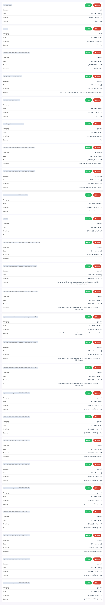

# Admin Dashboard Guide

> Operational UI for monitoring and managing the MCP Index Server. Intended for administrators / maintainers – not general MCP clients. Keep it disabled in production unless actively in use.

## Contents

- Overview
- Enabling the Dashboard
- Core Panels
  - System Health Card
  - Instruction Catalog
  - Instruction Editor
  - Live Log Tail
- Semantic Summaries
- UI Drift Snapshots (Playwright)
- Maintenance & Baseline Refresh
- Troubleshooting

---

## Overview

The dashboard exposes real‑time server metrics, instruction catalog state, and controlled mutation workflows when explicitly enabled. It is intentionally out-of-band from the MCP protocol to avoid polluting the runtime capability surface used by agents.

## Enabling the Dashboard

```bash
# Development (auto build via prestart)
MCP_DASHBOARD=1 npm start

# Specific port
MCP_DASHBOARD=1 DASHBOARD_PORT=3210 npm start

# Direct node invocation (built output)
node dist/server/index.js --dashboard --dashboard-port=3210
```

Access at: `http://localhost:<port>` (default 8787).

Environment variables / CLI flags:

- `MCP_DASHBOARD=1` or `--dashboard` – enable UI
- `DASHBOARD_PORT` or `--dashboard-port` – override port (default 8787)
- `MCP_HTTP_METRICS=1` – (optional) exposes per-route counters shown in health panel (if implemented)

## Core Panels

### System Health Card

Shows process CPU %, memory RSS, uptime, and lightweight spark lines (CPU, memory). Designed for quick anomaly scanning rather than deep profiling.

Snapshot (example):


### Instruction Catalog

Paginated (or streaming) list of instruction metadata including derived `semanticSummary` for quick scanning. Columns typically include id, title, priority, owner, status, riskScore, and truncated semantic summary.

Snapshot (example):



### Instruction Editor

Appears when selecting an instruction for edit or creating a new one (when mutation enabled). Transient validation / load flicker banner intentionally suppressed to reduce noise.

Enable mutation (example):

```bash
MCP_ENABLE_MUTATION=1 MCP_DASHBOARD=1 npm start
```

### Live Log Tail

Provides real-time server log streaming with start/stop controls (buttons styled to match action toolbar). Use for quick correlation during manual tests. Avoid leaving it running indefinitely in production.

## Semantic Summaries

Each instruction row displays a concise semantic summary derived by fallback pipeline:

1. `meta.semanticSummary`
2. `semanticSummary`
3. `description`
4. First non-empty line of `body`

Server truncates to 400 chars (UI may further clamp). This ensures catalog scanning remains performant and visually stable.

## UI Drift Snapshots (Playwright)

Drift detection guards against accidental removal or structural regression of critical UI regions. Narrow region snapshots minimize noise.

Key scripts:

- `npm run pw:baseline` – refresh golden snapshots
- `npm run pw:drift` – compare current render vs baseline

Snapshot directory: `tests/playwright/baseline.spec.ts-snapshots/`

Report output: `playwright-report/` (in CI artifact `playwright-drift-artifacts`).

### Stabilization Checklist Before Accepting Visual Change

1. Confirm intended UI change linked to an issue / PR description.
2. Run `npm run pw:drift` locally – ensure only expected regions differ.
3. Verify no accessibility regressions (landmarks, basic aria attributes) if structural.
4. Refresh baseline (`npm run pw:baseline`) and commit.
5. Observe one nightly cron pass clean before removing any related TODO.

### When to Refresh Baseline

Refresh only when intentional UI changes alter the captured regions (layout/class changes or semantic summary rendering). Do NOT refresh for incidental color/font shifts unless expected.

### Local Refresh Flow

```bash
npm run build
npm run pw:baseline
git add tests/playwright/baseline.spec.ts-snapshots
git commit -m "test: refresh playwright baseline after <reason>"
```

## Maintenance & Operations

| Task | Recommendation |
|------|----------------|
| Port conflicts | Set `DASHBOARD_PORT` explicitly |
| High CPU spikes | Validate they align with indexing / backup tasks |
| Memory growth | Check large instruction bodies or leak via profiling |
| Missing instructions | Confirm on-disk JSON presence & restart with forced reload |

## Troubleshooting

| Symptom | Likely Cause | Action |
|---------|--------------|--------|
| Dashboard 404 | Not enabled | Add `MCP_DASHBOARD=1` / `--dashboard` |
| Empty instruction list | Read path issue or catalog filtering | Check server logs & disk `instructions/` |
| Semantic summaries blank | All fallback fields empty | Add description or first line in body |
| Drift job failing | Legit layout change or stale baseline | Inspect artifact, decide to fix or refresh baseline |
| Log tail no output | Log level or buffering | Ensure server writes to stdout/stderr |

## Security Considerations

- Do not expose dashboard publicly; no auth layer is shipped by default.
- Disable when not actively used (`MCP_DASHBOARD` unset) to reduce surface.
- Snapshot artifacts may include metadata; treat CI artifacts as internal.

---

This guide complements: `CONFIGURATION.md`, `MCP-CONFIGURATION.md`, `TOOLS.md`.
