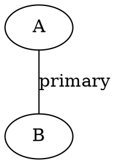

# Instruction Graph (Phase 1)

This document describes the Phase 1 structural instruction graph exposed by the `graph/export` MCP tool.

## Overview

Phase 1 provides a deterministic, structural, undirected graph over the instruction catalog:

- Nodes: one per instruction (`id`, `primaryCategory`, sorted `categories`).
- Edges (undirected):
  - `primary` edges: clique between instructions sharing the same `primaryCategory` (optional via env toggle).
  - `category` edges: pairwise connections between instructions sharing any category (subject to large-category cap).
- Deterministic ordering: nodes sorted lexicographically by id; edges sorted by `(type, source, target)`.
- Caching: identical option set + unchanged catalog hash ⇒ cached result returned (in‑memory).

## Tool

Name: `graph/export`

Input (all optional):

```jsonc
{
  "format": "json" | "dot",              // default json
  "includeEdgeTypes": ["primary"|"category"], // post-build filter
  "maxEdges": 500                         // truncate after deterministic sort
}
```

Output (JSON mode):

```jsonc
{
  "graphSchemaVersion": 1,
  "nodes": [{ "id": "...", "primaryCategory": "...", "categories": ["..."] }],
  "edges": [{ "source": "A", "target": "B", "type": "primary" }],
  "meta": {
    "buildTs": "2025-09-10T00:00:00.000Z",
    "buildMs": 4,
    "nodeCount": 123,
    "edgeCount": 456,
    "graphSchemaVersion": 1,
    "truncated": true,
    "notes": ["skipped pairwise for category 'bigcat' size=1234"]
  }
}
```

DOT mode returns:



## Environment Variables

| Variable | Default | Description |
|----------|---------|-------------|
| `GRAPH_INCLUDE_PRIMARY_EDGES` | `1` (true) | When set to `0`, suppresses `primary` edges. |
| `GRAPH_LARGE_CATEGORY_CAP` | `150` | If a category has more than this many members, **pairwise edges for that category are skipped** and a meta note is recorded. |

## Determinism Guarantees

1. Node ordering is stable for a fixed catalog hash.
2. Edge ordering is stable for fixed catalog + build options regardless of `includeEdgeTypes` filter (filter applied post-build, then resorted).
3. Cache is invalidated explicitly by instruction mutation handlers (e.g. `instructions/add`, `instructions/remove`, import, governance updates, enrichment). No background TTL.
4. `maxEdges` truncation occurs after final deterministic ordering ensuring predictably retained prefix.

## Meta Notes

Large categories exceeding `GRAPH_LARGE_CATEGORY_CAP` produce meta notes of the form:

```text
skipped pairwise for category 'bigcat' size=1234
```

These allow monitoring of coverage gaps for very large clusters without incurring O(N^2) edge cost.

## Testing Coverage (Phase 1)

Implemented tests (`graphExport.spec.ts`):

- Deterministic JSON structure and basic invariants.
- DOT export formatting.
- Edge type filtering (`includeEdgeTypes`).
- Truncation (`maxEdges`).
- Primary edge exclusion via env var.
- Large category cap skip note emission.
- Cache reuse (repeated call stability).
- Cache invalidation after mutation (`instructions/add`).
- Filter + truncation combined determinism.

## Performance Considerations

For very large catalogs, pairwise category edge explosion is mitigated by the large-category cap. Future phases may introduce weighted summaries, degree sampling, or bipartite projections to reduce density.

## Future Phases (Brief)

- Phase 2: Enrichment (weights, counts, degree metrics) & incremental recomputation strategies.
- Phase 3: Analytical surfaces (influence metrics, category cohesion, anomaly detection scaffolds).
- Phase 4: Ecosystem integrations (visual dashboard panel, export pipelines, recommendation hooks).

> See `GRAPH-IMPLEMENTATION-PLAN.md` for the full multi-phase roadmap and acceptance criteria.

## Usage Examples

1. Basic JSON graph:

```bash
tools/call graph/export {}
```

1. DOT for visualization (Graphviz):

```bash
tools/call graph/export { "format": "dot" }
```

1. Category-only edges with hard truncation:

```bash
tools/call graph/export { "includeEdgeTypes":["category"], "maxEdges": 500 }
```

1. Disable primary edges globally:

```bash
GRAPH_INCLUDE_PRIMARY_EDGES=0 tools/call graph/export {}
```

 
## Operational Notes

- Safe to invoke frequently; cached if no mutations.
- Memory footprint: proportional to catalog size + edge count (after cap / truncation). No retained intermediate structures beyond build scope.
- Schema versioning: `graphSchemaVersion` independent from instruction schema version; bump if structural response shape changes.

 
## Limitations (Phase 1)

- No edge weighting or frequency representation.
- No incremental build; full rebuild after each mutation (acceptable for current scale, revisit in Phase 2).
- No category hierarchy inference (flat categories only).

 
## Migration / Backward Compatibility

As this is a new capability, there is no backward compatibility requirement. Clients should inspect `graphSchemaVersion` to adapt to future enhancements.

---
Maintainer Guidance: If adding new edge types or meta fields, extend `graphTypes.ts`, update schema export, add tests validating deterministic ordering, and bump `graphSchemaVersion` only when client contract semantics change.
