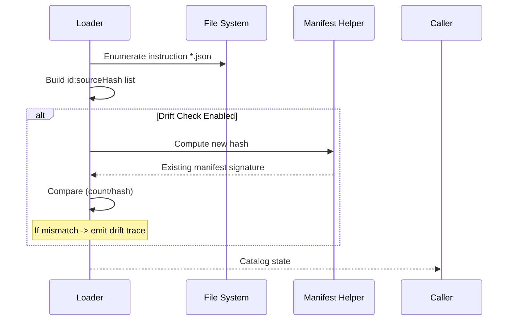

# Catalog Manifest & Materialization Architecture

Version: 1.0 (Introduced 1.4.x)

This document specifies the catalog manifest subsystem, its lifecycle, invariants, fast‑load shortcut, and the opportunistic in‑memory materialization semantics that eliminate historical add→get race windows.

## Purpose

The manifest provides a lightweight persisted snapshot of catalog structural state to:

* Support rapid drift detection without re‑reading all instruction files when unchanged.
* Enable future fastload optimizations (hash/mtime short‑circuit) guarded by `MCP_MANIFEST_FASTLOAD`.
* Supply deterministic debug evidence (entry count + stable ordering) for support.
* Facilitate integrity / governance hash troubleshooting by surfacing count discrepancies early.

## File Format

`snapshots/catalog-manifest.json` (canonical latest copy – path may be overridden in future; presently fixed):

```jsonc
{
  "generatedAt": "2025-09-14T12:30:59.123Z",
  "count": 2085,
  "entries": [
    { "id": "alpha-policy-guideline", "sourceHash": "<sha256>" },
    { "id": "beta-governance-checklist", "sourceHash": "<sha256>" }
    // ... stable lexicographical ordering by id
  ],
  "signature": {
    "idSourceHashHash": "<sha256 of sorted id:sourceHash lines>",
    "schemaVersion": 1
  }
}
```

### Invariants

| Invariant | Rationale |
|-----------|-----------|
| `entries` sorted by `id` | Deterministic diff & binary search potential |
| `count === entries.length` | Sanity check for partial writes |
| `idSourceHashHash` recomputable from entries | Tamper detection & integrity assist |
| Write is atomic (temp + rename) | Crash safety |

## Generation Lifecycle

1. Any successful mutation (add/import/remove/governanceUpdate/groom/enrich) calls a unified helper `attemptManifestUpdate()`.
2. Helper computes projection: `[{id, sourceHash}]` from current in‑memory catalog.
3. Hash of `id:sourceHash` lines computed (sha256) – matches internal catalog hash basis.
4. JSON serialized with stable formatting and written atomically.
5. Metric counters incremented (`manifest:write`, failures → `manifest:writeFailed`).

## Environment Flags

| Flag | Effect | Use Case |
|------|--------|----------|
| `MCP_MANIFEST_WRITE=0` | Skips all writes silently (helper returns early). | Read‑only diagnostics, perf profiling |
| `MCP_MANIFEST_FASTLOAD=1` | (Planned) Trust manifest count+hash to bypass full file scan if signature still matches directory signature. | Faster large catalog startups |

When `MCP_MANIFEST_WRITE=0`, internal memory state & normal operations continue unaffected; only persisted manifest is suppressed.

## Drift Detection Flow



### Drift Categories

| Category | Condition | Example Action |
|----------|-----------|----------------|
| None | count & hash identical | No log beyond normal startup |
| Count Only | count differs, hash differs | Recompute manifest (mutation path) |
| Hash Only | count same, hash differs | Potential body edits / governance hash unaffected |
| Missing Manifest | file absent | Generate after first mutation |
| Disabled | `MCP_MANIFEST_WRITE=0` | Suppress writes; drift still detectable in memory |

## Opportunistic In‑Memory Materialization (Race Elimination)

Prior behavior: Mutations always invalidated catalog, forcing a reload; on Windows a timing gap could allow an immediate follow‑up list/get to miss the just‑added entry.

Current (1.4.1+) behavior:

| Scenario | Path |
|----------|------|
| Catalog already loaded | Direct in-memory update: if id exists update fields; else push to list & map. No dirty mark. |
| Catalog not yet loaded | Falls back to lazy load on first read (unchanged). |

After in‑memory insertion the `.catalog-version` file is touched AND the version token/mtime are synchronized back into `state` to avoid a spurious immediate reload.

Benefits:
 
* Zero window where new id is absent from subsequent operations in same process.
* Reduced disk churn (no reload necessary for each single add).
* Predictable behavior for test harnesses expecting immediate visibility.

## Fastload Shortcut (Planned Design)

When enabled via `MCP_MANIFEST_FASTLOAD=1` and a valid manifest exists:

1. Compute directory signature (file list + mtime + size aggregate hash).
2. If signature unchanged since last run and manifest present:
   * Load manifest JSON → materialize skeleton entries with `id` & `sourceHash` only.
   * Mark state as provisional; lazily hydrate full entries on first access (list/get/search) OR run background hydration.
3. If any validation fails (hash mismatch, manifest parse error) fallback to full load.

This mode is intentionally not yet active to preserve deterministic coverage until benchmark harness validates benefit vs complexity.

## Failure Modes & Handling

| Failure | Handling | Severity |
|---------|----------|----------|
| Write throws (IO) | Increment `manifest:writeFailed`, continue (non-fatal) | Warn |
| Corrupted existing manifest | Logged, regenerated on next mutation | Warn |
| Hash mismatch under fastload (future) | Fallback full load | Info |
| Disabled but file exists and stale | Ignored until re-enabled | Info |

## Testing Strategy

| Test Focus | Assertion |
|------------|----------|
| Disabled Write Mode | No manifest file created/modified during mutations |
| Corruption Repair | Manual file corruption fixed after next mutation |
| Count Drift | Adding N entries increases `count` appropriately |
| Hash Stability | Re-adding identical files does not change hash |
| Opportunistic Add | writeEntry path surfaces new id without reload |

## Future Extensions

* Debounced batch manifest writes under high mutation throughput.
* Compression (gz) for very large catalogs.
* Partial manifest projections (governance-only) for faster governance hash prechecks.
* Background hydration workers for fastload skeleton path.

## Related Documents

* `ARCHITECTURE.md` – High level component & data lifecycle
* `CONFIGURATION.md` – Environment flag descriptions
* `TOOLS.md` – Interface surface (instructions/* actions)
* `MIGRATION.md` – Schema migration impacts (none for manifest introduction)

---
Maintainer Note: Keep this document updated when enabling fastload or altering manifest schema fields.
