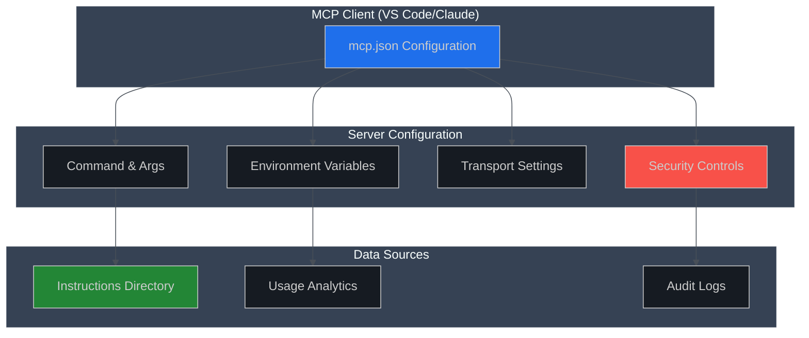

# MCP Index Server Configuration Guide

**Version:** 1.0.0  
**Last Updated:** August 28, 2025  
**Compliance:** MCP Protocol v1.0+

## 📖 Overview

This guide provides comprehensive configuration patterns for the MCP Index Server across different deployment scenarios. All configurations follow enterprise security best practices and MCP protocol standards.

## 🏗️ Configuration Architecture



## 🚀 Quick Start Configurations

### Recommended: Read-Only Production

**Use Case**: Enterprise environments, shared access, audit compliance

```json
{
  "mcpServers": {
    "mcp-index-production": {
      "description": "Production read-only MCP Index Server",
      "command": "node",
      "args": [
        "C:/mcp/mcp-index-server/dist/server/index.js"
      ],
      "transport": "stdio",
      "cwd": "C:/mcp/mcp-index-server",
      "env": {
        "INSTRUCTIONS_DIR": "C:/mcp/instructions",
        "MCP_LOG_VERBOSE": "0"
      },
      "restart": "onExit",
      "tags": ["production", "readonly", "audit-compliant"]
    }
  }
}
```

### Development: Full Mutation Access

**Use Case**: Local development, testing, content management

```json
{
  "mcpServers": {
    "mcp-index-development": {
      "description": "Development MCP Index Server with full access",
      "command": "node", 
      "args": [
        "C:/github/jagilber/mcp-index-server/dist/server/index.js",
        "--dashboard"
      ],
      "transport": "stdio",
      "cwd": "C:/github/jagilber/mcp-index-server",
      "env": {
        "INSTRUCTIONS_DIR": "C:/github/jagilber/mcp-index-server/instructions",
        "MCP_ENABLE_MUTATION": "1",
        "MCP_LOG_VERBOSE": "1",
        "MCP_LOG_MUTATION": "1"
      },
      "restart": "onExit",
      "tags": ["development", "mutation", "debug"]
    }
  }
}
```

### Enterprise: External Data Directory

**Use Case**: Enterprise deployment with separated data and code

```json
{
  "mcpServers": {
    "mcp-index-enterprise": {
      "description": "Enterprise MCP Index Server with external data",
      "command": "node",
      "args": [
        "C:/Program Files/MCP-Index-Server/dist/server/index.js"
      ],
      "transport": "stdio", 
      "cwd": "C:/Program Files/MCP-Index-Server",
      "env": {
        "INSTRUCTIONS_DIR": "D:/MCPData/instructions",
        "MCP_ENABLE_MUTATION": "1",
        "MCP_LOG_VERBOSE": "0",
        "USAGE_ANALYTICS_DIR": "D:/MCPData/analytics"
      },
      "restart": "onExit",
      "tags": ["enterprise", "external-data", "scalable"],
      "notes": [
        "Requires D:/MCPData/instructions directory with appropriate permissions",
        "Analytics data stored separately from application code",
        "Mutation enabled for authorized content management"
      ]
    }
  }
}
```

## 🔧 Environment Variables Reference

### Core Configuration

| Variable | Type | Default | Description | Security Impact |
|----------|------|---------|-------------|-----------------|
| `INSTRUCTIONS_DIR` | Path | `./instructions` | Directory containing instruction JSON files | **HIGH** - Controls data access |
| `MCP_ENABLE_MUTATION` | Boolean | `false` | Enable write operations (add, update, delete) | **CRITICAL** - Enables data modification |

### Logging & Diagnostics

| Variable | Type | Default | Description | Performance Impact |
|----------|------|---------|-------------|-------------------|
| `MCP_LOG_VERBOSE` | Boolean | `false` | Enable detailed logging to stderr | Low |
| `MCP_LOG_MUTATION` | Boolean | `false` | Log only mutation operations | Low |
| `MCP_LOG_DIAG` | Boolean | `false` | Enable diagnostic startup logging | None |

### Performance & Behavior

| Variable | Type | Default | Description | Use Case |
|----------|------|---------|-------------|----------|
| `INSTRUCTIONS_ALWAYS_RELOAD` | Boolean | `false` | Disable caching, reload on every request | Development/Testing |
| `MCP_SHORTCIRCUIT` | Boolean | `false` | Minimal handshake mode for testing | Testing Only |
| `GOV_HASH_TRAILING_NEWLINE` | Boolean | `false` | Hash compatibility mode | Legacy Compatibility |

### Analytics & Usage Tracking

| Variable | Type | Default | Description | Privacy Impact |
|----------|------|---------|-------------|----------------|
| `INDEX_FEATURES` | String | `""` | Enable feature flags (e.g., "usage") | Medium - Usage tracking |
| `USAGE_ANALYTICS_DIR` | Path | `./data` | Directory for usage analytics storage | Medium - Analytics data |

## 🛡️ Security Configurations

### High Security (Government/Finance)

```json
{
  "mcpServers": {
    "mcp-index-secure": {
      "description": "High-security read-only configuration",
      "command": "node",
      "args": [
        "/opt/mcp-index-server/dist/server/index.js"
      ],
      "transport": "stdio",
      "cwd": "/opt/mcp-index-server",
      "env": {
        "INSTRUCTIONS_DIR": "/var/lib/mcp/instructions",
        "MCP_ENABLE_MUTATION": "",
        "MCP_LOG_VERBOSE": "0",
        "MCP_LOG_MUTATION": "0"
      },
      "restart": "never",
      "tags": ["high-security", "immutable", "audit-compliant"],
      "notes": [
        "Read-only access only",
        "No mutation capabilities",
        "Minimal logging for security",
        "Instructions directory read-only at filesystem level"
      ]
    }
  }
}
```

### Medium Security (Corporate)

```json
{
  "mcpServers": {
    "mcp-index-corporate": {
      "description": "Corporate environment with controlled mutation",
      "command": "node",
      "args": [
        "C:/CorporateApps/MCP-Index/dist/server/index.js"
      ],
      "transport": "stdio",
      "cwd": "C:/CorporateApps/MCP-Index",
      "env": {
        "INSTRUCTIONS_DIR": "C:/CorporateData/MCP/instructions",
        "MCP_ENABLE_MUTATION": "1",
        "MCP_LOG_VERBOSE": "0",
        "MCP_LOG_MUTATION": "1"
      },
      "restart": "onExit",
      "tags": ["corporate", "controlled-mutation", "audited"],
      "notes": [
        "Mutation enabled but logged",
        "Corporate data directory",
        "Change tracking enabled"
      ]
    }
  }
}
```

## 🚀 Performance Optimized Configurations

### High Performance (Large Datasets)

```json
{
  "mcpServers": {
    "mcp-index-performance": {
      "description": "Performance-optimized for large instruction catalogs",
      "command": "node",
      "args": [
        "C:/mcp-index-server/dist/server/index.js",
        "--max-old-space-size=2048"
      ],
      "transport": "stdio",
      "cwd": "C:/mcp-index-server",
      "env": {
        "INSTRUCTIONS_DIR": "E:/FastSSD/mcp-instructions",
        "MCP_ENABLE_MUTATION": "1",
        "MCP_LOG_VERBOSE": "0",
        "NODE_OPTIONS": "--max-old-space-size=2048"
      },
      "restart": "onExit",
      "tags": ["performance", "large-dataset", "optimized"],
      "notes": [
        "Increased Node.js memory limit",
        "Fast SSD storage for instructions",
        "Minimal logging for performance"
      ]
    }
  }
}
```

## 🔍 Development & Testing Configurations

### Full Debug Mode

```json
{
  "mcpServers": {
    "mcp-index-debug": {
      "description": "Full debugging with dashboard and verbose logging",
      "command": "node",
      "args": [
        "./dist/server/index.js",
        "--dashboard",
        "--dashboard-port=9000"
      ],
      "transport": "stdio",
      "cwd": "./",
      "env": {
        "INSTRUCTIONS_DIR": "./instructions",
        "MCP_ENABLE_MUTATION": "1",
        "MCP_LOG_VERBOSE": "1",
        "MCP_LOG_MUTATION": "1",
        "MCP_LOG_DIAG": "1",
        "INSTRUCTIONS_ALWAYS_RELOAD": "1"
      },
      "restart": "onExit",
      "tags": ["debug", "development", "testing"],
      "notes": [
        "Dashboard available at http://localhost:9000",
        "All logging enabled",
        "Cache disabled for testing",
        "Relative paths for local development"
      ]
    }
  }
}
```

### Testing & CI/CD

```json
{
  "mcpServers": {
    "mcp-index-testing": {
      "description": "Testing configuration for CI/CD environments",
      "command": "node",
      "args": [
        "dist/server/index.js"
      ],
      "transport": "stdio",
      "env": {
        "INSTRUCTIONS_DIR": "./test-instructions",
        "MCP_ENABLE_MUTATION": "1",
        "MCP_LOG_VERBOSE": "1",
        "MCP_SHORTCIRCUIT": "1"
      },
      "restart": "never",
      "tags": ["testing", "ci-cd", "short-circuit"]
    }
  }
}
```

## 🌍 Multi-Environment Setup

### Global Configuration with Multiple Servers

```json
{
  "mcpServers": {
    "mcp-index-production": {
      "description": "Production read-only server",
      "command": "node",
      "args": ["C:/mcp/production/dist/server/index.js"],
      "transport": "stdio",
      "cwd": "C:/mcp/production",
      "env": {
        "INSTRUCTIONS_DIR": "C:/mcp/data/production/instructions"
      },
      "restart": "onExit",
      "tags": ["production", "readonly"]
    },
    
    "mcp-index-staging": {
      "description": "Staging server with mutation for testing",
      "command": "node", 
      "args": ["C:/mcp/staging/dist/server/index.js"],
      "transport": "stdio",
      "cwd": "C:/mcp/staging",
      "env": {
        "INSTRUCTIONS_DIR": "C:/mcp/data/staging/instructions",
        "MCP_ENABLE_MUTATION": "1",
        "MCP_LOG_MUTATION": "1"
      },
      "restart": "onExit",
      "tags": ["staging", "testing"]
    },
    
    "mcp-index-development": {
      "description": "Local development server",
      "command": "node",
      "args": ["./dist/server/index.js", "--dashboard"],
      "transport": "stdio",
      "cwd": "./",
      "env": {
        "INSTRUCTIONS_DIR": "./instructions",
        "MCP_ENABLE_MUTATION": "1",
        "MCP_LOG_VERBOSE": "1"
      },
      "restart": "onExit",
      "tags": ["development", "local"]
    }
  }
}
```

## 🚨 Troubleshooting Guide

### Common Issues & Solutions

| Issue | Symptom | Solution |
|-------|---------|----------|
| **Server won't start** | No response to MCP calls | Check `npm run build` completed successfully |
| **Permission denied** | File access errors | Verify `INSTRUCTIONS_DIR` permissions |
| **Mutation disabled** | Add/update operations fail | Set `MCP_ENABLE_MUTATION=1` |
| **Dashboard not accessible** | Dashboard URL not working | Check `--dashboard` flag and port availability |
| **High memory usage** | Performance degradation | Set `NODE_OPTIONS=--max-old-space-size=2048` |

### Diagnostic Commands

```bash
# Check server health
echo '{"jsonrpc":"2.0","id":1,"method":"instructions/dispatch","params":{"action":"health"}}' | node dist/server/index.js

# Test with verbose logging
MCP_LOG_VERBOSE=1 node dist/server/index.js

# Validate configuration
node dist/server/index.js --help
```

### Log Analysis

**Startup Success Indicators:**

```text
[server] Ready (version=1.0.4)
[server] Instructions loaded: 42 entries
[server] Dashboard: http://localhost:3000
```

**Common Error Patterns:**

```text
Error: ENOENT: no such file or directory, scandir 'instructions'
Error: Mutation disabled. Set MCP_ENABLE_MUTATION=1 to enable.
```

## 📊 Performance Monitoring

### Recommended Monitoring Configuration

```json
{
  "mcpServers": {
    "mcp-index-monitored": {
      "description": "Production server with performance monitoring",
      "command": "node",
      "args": [
        "dist/server/index.js",
        "--dashboard"
      ],
      "transport": "stdio",
      "env": {
        "INSTRUCTIONS_DIR": "/data/instructions",
        "MCP_ENABLE_MUTATION": "1",
        "INDEX_FEATURES": "usage",
        "NODE_OPTIONS": "--enable-source-maps"
      },
      "restart": "onExit",
      "tags": ["production", "monitored", "analytics"]
    }
  }
}
```

### Key Metrics to Monitor

- **Response Time**: P95 < 120ms for read operations
- **Memory Usage**: < 512MB under normal load
- **Error Rate**: < 1% of requests
- **Instruction Count**: Track catalog growth
- **Usage Patterns**: Most accessed instructions

## 🔐 Security Best Practices

### 1. **Principle of Least Privilege**

- Use read-only configuration by default
- Enable mutation only when necessary
- Separate data directories from application code

### 2. **Environment Isolation**

- Use different configurations for dev/staging/prod
- Separate instruction directories by environment
- Never share mutation-enabled configs across environments

### 3. **Audit & Compliance**

- Enable mutation logging in production
- Regular backup of instruction directories
- Monitor file system permissions

### 4. **Network Security**

- Dashboard bound to localhost by default
- Use `--dashboard-host` carefully in production
- Consider firewall rules for dashboard access

## 📚 Advanced Configuration

### Custom Instruction Validation

```json
{
  "mcpServers": {
    "mcp-index-custom": {
      "description": "Custom validation and processing",
      "command": "node",
      "args": ["dist/server/index.js"],
      "transport": "stdio",
      "env": {
        "INSTRUCTIONS_DIR": "./custom-instructions",
        "MCP_ENABLE_MUTATION": "1",
        "CUSTOM_SCHEMA_PATH": "./custom-schemas",
        "VALIDATION_STRICT": "1"
      },
      "restart": "onExit"
    }
  }
}
```

### Integration with CI/CD

```yaml
# GitHub Actions example
- name: Test MCP Index Server
  env:
    MCP_ENABLE_MUTATION: "1"
    INSTRUCTIONS_DIR: "./test-data/instructions"
    MCP_LOG_VERBOSE: "1"
  run: |
    npm run build
    npm run test
    echo '{"jsonrpc":"2.0","id":1,"method":"instructions/dispatch","params":{"action":"capabilities"}}' | node dist/server/index.js
```

## 📝 Configuration Validation

### Validation Checklist

- [ ] **Path Validation**: All paths are absolute and accessible
- [ ] **Permission Check**: Write permissions for mutation-enabled configs
- [ ] **Security Review**: Mutation only enabled where necessary
- [ ] **Environment Separation**: Different configs for different environments
- [ ] **Monitoring Setup**: Logging and analytics configured appropriately
- [ ] **Backup Strategy**: Data directories included in backup plans

### Automated Validation Script

```powershell
# Validate MCP configuration
function Test-MCPConfig {
    param($ConfigPath)
    
    $config = Get-Content $ConfigPath | ConvertFrom-Json
    
    foreach ($server in $config.mcpServers.PSObject.Properties) {
        $serverConfig = $server.Value
        
        # Check required fields
        if (-not $serverConfig.command) { 
            Write-Error "Missing command for $($server.Name)" 
        }
        
        # Validate paths
        if ($serverConfig.env.INSTRUCTIONS_DIR) {
            if (-not (Test-Path $serverConfig.env.INSTRUCTIONS_DIR)) {
                Write-Warning "Instructions directory not found: $($serverConfig.env.INSTRUCTIONS_DIR)"
            }
        }
        
        # Security check
        if ($serverConfig.env.MCP_ENABLE_MUTATION -eq "1") {
            Write-Warning "Mutation enabled for $($server.Name) - ensure this is intentional"
        }
    }
}
```

---

## 📞 Support & Resources

- **Documentation**: [PROJECT_PRD.md](./PROJECT_PRD.md)
- **API Reference**: [TOOLS.md](./TOOLS.md)
- **Architecture**: [ARCHITECTURE.md](./ARCHITECTURE.md)
- **Security**: [SECURITY.md](../SECURITY.md)

**Need Help?**

- Create GitHub issue with `[configuration]` label
- Include your mcp.json (redact sensitive paths)
- Provide error logs with timestamps

---

*This configuration guide ensures enterprise-grade deployment of the MCP Index Server with proper security, performance, and maintainability considerations.*
