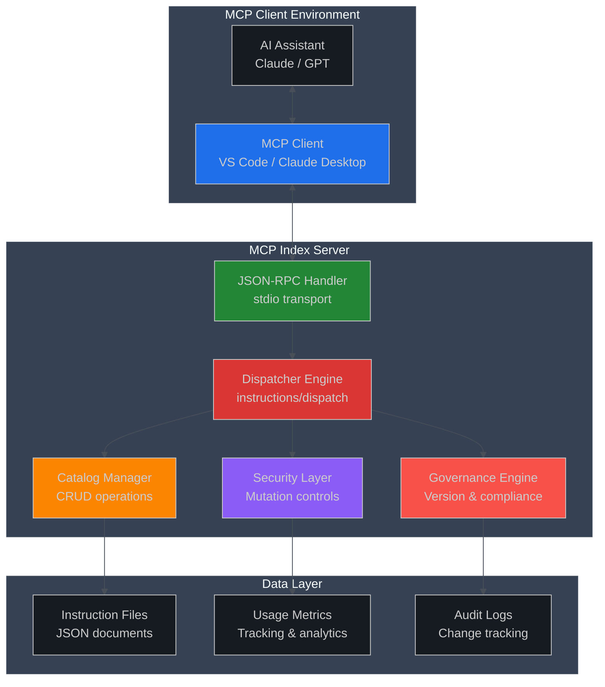
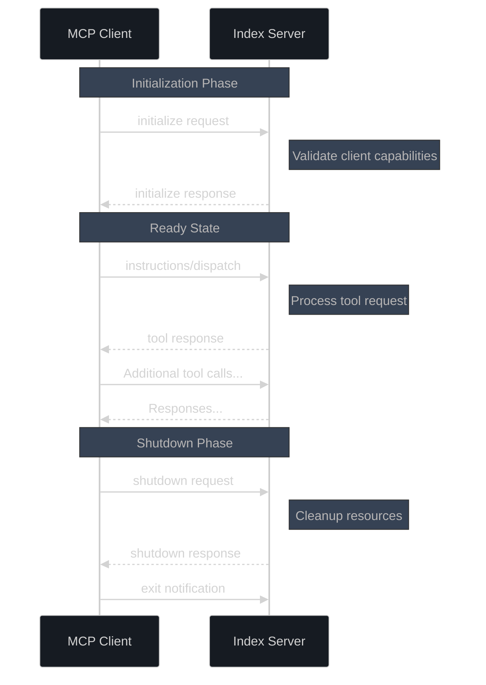
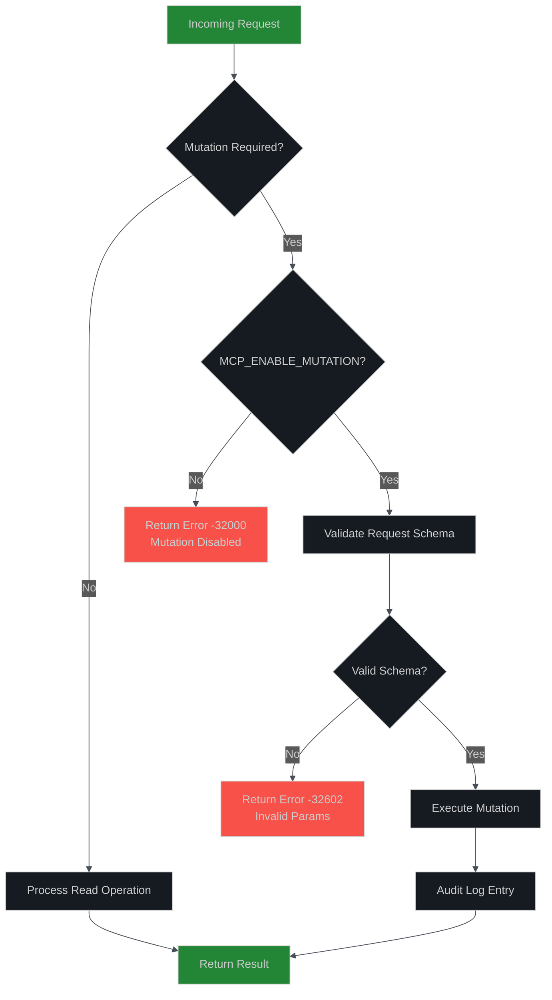
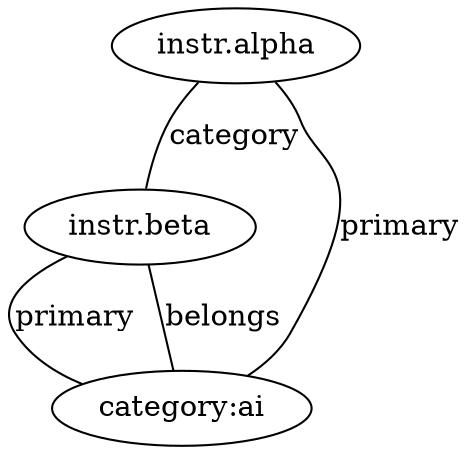
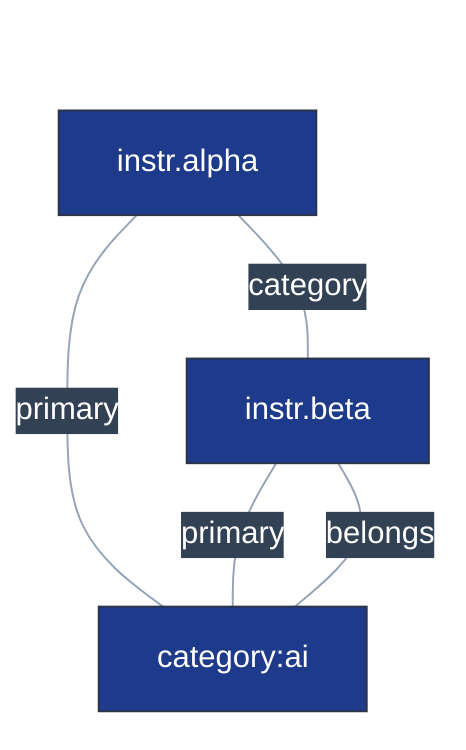

# MCP Index Server - Tools API Reference

**Version:** 1.1.2 (MCP Protocol Compliant)  
**Protocol:** Model Context Protocol (MCP) v1.0+  
**Transport:** JSON-RPC 2.0 over stdio  
**Last Updated:** August 31, 2025

## 📖 Overview

The MCP Index Server provides a comprehensive instruction catalog management system through the Model Context Protocol. This document serves as the complete API reference for all available tools, following enterprise standards for security, reliability, and ease of integration.

### 🎯 Key Features

* **Protocol Compliance**: Full MCP SDK v1.0+ compatibility
* **Enterprise Security**: Mutation controls and audit logging
* **High Performance**: Optimized for <120ms P95 response times
* **Governance Ready**: Built-in versioning and change tracking
* **Developer Friendly**: Comprehensive error handling and diagnostics
* **Feedback Subsystem**: 6 MCP tools for structured client feedback (submit/list/get/update/stats/health)
* **Structured Tracing (1.1.2+)**: Rotated JSONL trace lines `[trace:category[:sub]] { json }` for reliable test parsing
* **Schema-Aided Add Failures**: Inline JSON Schema returned on early structural `instructions/add` errors (1.1.0+)

### 🤖 Agent Graph Strategy Reference

For guidance on how autonomous / LLM agents should efficiently consume `graph/export` (progressive edge expansion, caching, scoring heuristics, and anomaly reporting), see `AGENT-GRAPH-INSTRUCTIONS.md`. That document defines the sparse→expand retrieval model recommended for large catalogs and should be followed instead of ad‑hoc full graph pulls.

## 🏗️ Architecture Overview



## 🔧 Transport & Protocol

### JSON-RPC 2.0 Specification

The MCP Index Server implements JSON-RPC 2.0 strictly following the [MCP Protocol Specification](https://spec.modelcontextprotocol.io/).

#### Request Format

```typescript
interface MCPRequest {
  jsonrpc: "2.0"
  method: string
  params?: object
  id: string | number
}
```

#### Response Format

```typescript
interface MCPResponse {
  jsonrpc: "2.0"
  id: string | number
  result?: any
  error?: {
    code: number
    message: string
    data?: any
  }
}
```

### 🚀 Connection Lifecycle



### 🔒 Security & Environment Controls

#### Environment Variables

| Variable | Type | Default | Description |
|----------|------|---------|-------------|
| `MCP_ENABLE_MUTATION` | Boolean | `false` | Enable write operations (add, remove, update) |
| `MCP_LOG_VERBOSE` | Boolean | `false` | Enable detailed logging to stderr |
| `MCP_LOG_MUTATION` | Boolean | `false` | Log only mutation operations |
| `MCP_LOG_FILE` | Path | - | Enable file logging to specified path (dual stderr/file output) |
| `GOV_HASH_TRAILING_NEWLINE` | Boolean | `false` | Governance hash compatibility mode |

#### Security Model



## 🛠️ Tools Reference

### Primary Tool: `instructions/dispatch`

The main entry point for all instruction catalog operations. This unified dispatcher replaces legacy individual methods and provides comprehensive functionality through action-based routing.

#### Base Request Structure

```typescript
interface DispatchRequest {
  method: "instructions/dispatch"
  params: {
    action: string
    // Action-specific parameters
    [key: string]: any
  }
}
```

### 📖 Read Operations (No Authentication Required)

#### `list` - List Instructions

**Purpose**: Retrieve all instructions with optional filtering  
**Mutation**: No  
**Performance**: O(1) with in-memory indexing

```typescript
// Request
{
  "action": "list",
  "category"?: string,
  "limit"?: number,
  "offset"?: number
}

// Response
{
  "hash": string,        // Catalog integrity hash
  "count": number,       // Total matching items
  "items": InstructionEntry[]
}
```

**Example:**
```json
{
  "jsonrpc": "2.0",
  "id": 1,
  "method": "instructions/dispatch",
  "params": {
    "action": "list",
    "category": "ai_code_nav",
    "limit": 10
  }
}
```

#### `get` - Retrieve Single Instruction

**Purpose**: Fetch a specific instruction by ID  
**Mutation**: No  
**Performance**: O(1) hash table lookup

```typescript
// Request
{
  "action": "get",
  "id": string
}

// Response
{
  "hash": string,
  "item": InstructionEntry | null
} | {
  "notFound": true,
  "id": string
}
```

#### `search` - Text Search

**Purpose**: Full-text search across instruction titles and bodies  
**Mutation**: No  
**Performance**: O(n) with optimization for common patterns

```typescript
// Request
{
  "action": "search",
  "q": string,           // Search query
  "limit"?: number,
  "highlight"?: boolean  // Return highlighted snippets
}

// Response
{
  "hash": string,
  "count": number,
  "items": InstructionEntry[],
  "query": string,
  "highlights"?: SearchHighlight[]
}
```

#### `query` - Advanced Filtering

**Purpose**: Complex multi-field filtering with cursor-based pagination  
**Mutation**: No  
**Performance**: Optimized with indexing strategies

```typescript
// Request
{
  "action": "query",
  "filters": {
    "categories"?: string[],
    "priorityTiers"?: ("P1" | "P2" | "P3" | "P4")[],
    "status"?: ("draft" | "review" | "approved" | "deprecated")[],
    "owners"?: string[],
    "classification"?: ("public" | "internal" | "restricted")[],
    "workspaceId"?: string,
    "userId"?: string,
    "teamIds"?: string[],
    "createdAfter"?: string,  // ISO 8601
    "updatedAfter"?: string,
    "text"?: string
  },
  "sort"?: {
    "field": "createdAt" | "updatedAt" | "priority" | "title",
    "direction": "asc" | "desc"
  },
  "limit"?: number,
  "cursor"?: string
}

// Response
{
  "items": InstructionEntry[],
  "total": number,
  "returned": number,
  "nextCursor"?: string,
  "appliedFilters": object,
  "performanceMs": number
}
```

#### `categories` - Category Analytics

**Purpose**: Get category distribution statistics  
**Mutation**: No

```typescript
// Request
{
  "action": "categories"
}

// Response
{
  "categories": Array<{
    "name": string,
    "count": number,
    "lastUpdated": string
  }>,
  "totalDistinct": number,
  "catalogHash": string
}
```

#### `diff` - Incremental Synchronization

**Purpose**: Efficient catalog synchronization for clients  
**Mutation**: No  
**Use Case**: Cache invalidation and incremental updates

```typescript
// Request
{
  "action": "diff",
  "clientHash"?: string,
  "known"?: Array<{
    "id": string,
    "sourceHash": string
  }>
}

// Response - Up to date
{
  "upToDate": true,
  "hash": string
} |
// Response - Changes detected
{
  "hash": string,
  "added": InstructionEntry[],
  "updated": InstructionEntry[],
  "removed": string[]  // IDs
}
```

#### `graph/export` - Instruction Relationship Graph

Exports a structural or enriched graph representation of the instruction catalog. Backward-compatible dual-schema design:

* Schema v1 (default): Minimal nodes `{ id }`, edge types `primary`, `category`.
* Schema v2 (opt-in via `enrich:true`): Enriched instruction nodes with metadata + optional category nodes and `belongs` edges.

**Stability**: Stable (read-only).  
**Caching**: Small per-env signature cache map for default (schema v1) invocation with no params. Explicit env overrides disable caching for determinism. Enriched or formatted (dot/mermaid) invocations uncached.  
**Determinism**: Node list and edges are lexicographically ordered; filters and truncation applied post-deterministic ordering.

**Parameters (all optional):**

| Param | Type | Default | Description |
|-------|------|---------|-------------|
| `includeEdgeTypes` | string[] (subset of `primary`,`category`,`belongs`) | all | Edge type allowlist (filter applied before truncation) |
| `maxEdges` | number >=0 | unlimited | Truncate edge list (stable slice) |
| `format` | `json` \| `dot` \| `mermaid` | `json` | Output format (DOT & Mermaid visualizations). Mermaid now emits a `flowchart TB` block (top-bottom); edges use `---` (no arrows) so the layout appears undirected. |
| `enrich` | boolean | false | Enable schema v2 enrichment (metadata + optional new edge type) |
| `includeCategoryNodes` | boolean | false | Materialize explicit category nodes `category:<name>` (enriched only) |
| `includeUsage` | boolean | false | Attach real `usageCount` (falls back to 0 if absent) |

**Environment Knobs:**

| Env | Effect |
|-----|--------|
| `GRAPH_INCLUDE_PRIMARY_EDGES=0` | Suppress `primary` edges entirely |
| `GRAPH_LARGE_CATEGORY_CAP=<N>` | Skip generating pairwise category edges when member size > N (note added to `meta.notes`) |

**JSON Schema (Input):** (excerpt – note `mermaid` now included)

```json
{
  "type": "object",
  "additionalProperties": false,
  "properties": {
    "includeEdgeTypes": {"type": "array", "items": {"type": "string", "enum": ["primary","category","belongs"]}, "maxItems": 3},
    "maxEdges": {"type": "number", "minimum": 0},
  "format": {"type": "string", "enum": ["json","dot","mermaid"]},
    "enrich": {"type": "boolean"},
    "includeCategoryNodes": {"type": "boolean"},
    "includeUsage": {"type": "boolean"}
  }
}
```

**Zod Schema (Internal Validation):** (excerpt – `mermaid` added)

```ts
const GraphExportParams = z.object({
  includeEdgeTypes: z.array(z.enum(['primary','category','belongs'])).max(3).optional(),
  maxEdges: z.number().int().min(0).optional(),
  format: z.enum(['json','dot','mermaid']).optional(),
  enrich: z.boolean().optional(),
  includeCategoryNodes: z.boolean().optional(),
  includeUsage: z.boolean().optional()
}).strict();
```

**Response (Schema v1 minimal):**

```json
{
  "meta": {"graphSchemaVersion":1,"nodeCount":number,"edgeCount":number,"truncated"?:boolean,"notes"?:string[]},
  "nodes": [{"id":"string"}],
  "edges": [{"from":"id","to":"categoryOrCatId","type":"primary|category"}]
}
```

**Response (Schema v2 enriched example)** (see full JSON Schema: `schemas/graph-export-v2.schema.json`):

```json
{
  "meta": {"graphSchemaVersion":2,"nodeCount":3,"edgeCount":4},
  "nodes": [
    {"id":"instr.alpha","nodeType":"instruction","categories":["ai"],"primaryCategory":"ai","priority":10,"owner":"team-x","status":"approved","createdAt":"2025-09-01T12:00:00Z"},
    {"id":"instr.beta","nodeType":"instruction","categories":["ai","code"],"primaryCategory":"ai"},
    {"id":"category:ai","nodeType":"category"}
  ],
  "edges": [
    {"from":"instr.alpha","to":"category:ai","type":"primary","weight":1},
    {"from":"instr.alpha","to":"instr.beta","type":"category","weight":1},
    {"from":"instr.beta","to":"category:ai","type":"primary","weight":1},
    {"from":"instr.beta","to":"category:ai","type":"belongs","weight":1}
  ]
}
```

**DOT Output Example:**


**Mermaid Output Example (with YAML frontmatter & themeVariables)**  
The server now emits a YAML frontmatter block as the first segment of Mermaid output. This block is authoritative for theming (including `themeVariables`) and high‑level metadata. The actual `flowchart TB` line appears *after* the terminating `---` marker. Tests and downstream tooling should not assume the first line starts with `flowchart` anymore—always scan for the `flowchart` directive after frontmatter.



Frontmatter / Theming Notes:

* Exactly one frontmatter block is emitted—clients should preserve it when copying or re‑rendering.
* `config.themeVariables` is the canonical place to customize colors; server may evolve defaults without breaking consumer parsing.
* Additional keys (e.g., `meta`) may appear; consumers should ignore unknown keys for forward compatibility.
* If you need to modify only visuals client‑side, prefer appending a second (non‑YAML) comment section rather than rewriting frontmatter to avoid drift.
* The graph body (nodes & edges) intentionally has no leading indentation beyond two spaces for readability and regex stability.

**Client Usage Examples:**

```ts
// Minimal (schema v1)
await client.callTool('graph/export', {});

// Enriched schema v2 with category nodes and only belongs edges
await client.callTool('graph/export', { enrich: true, includeCategoryNodes: true, includeEdgeTypes: ['belongs'] });

// Limit edges and request DOT format
await client.callTool('graph/export', { maxEdges: 25, format: 'dot' });

// Mermaid output (schema v2 enriched)
await client.callTool('graph/export', { enrich: true, includeCategoryNodes: true, format: 'mermaid' });

// Minimal mermaid (schema v1) – omit enrichment & category nodes
await client.callTool('graph/export', { format: 'mermaid' });

// Filter to only primary edges in mermaid
await client.callTool('graph/export', { format: 'mermaid', includeEdgeTypes: ['primary'] });
```

**Admin Dashboard Integration:**

When the dashboard is enabled (`MCP_DASHBOARD=1`), a live visualization panel uses the endpoint:

`GET /api/graph/mermaid`

Query parameters mirror tool params (subset):

| Param | Type | Notes |
|-------|------|-------|
| `enrich` | boolean | Enables schema v2 enrichment |
| `includeCategoryNodes` | boolean | Adds explicit `category:<name>` nodes |
| `includeEdgeTypes` | csv string | e.g. `primary,belongs` |
| `maxEdges` | number | Optional truncation |
| `includeUsage` | boolean | Adds usageCount (when present) |

Response shape:

```jsonc
{
  "success": true,
  "meta": { "graphSchemaVersion": 1|2, "nodeCount": n, "edgeCount": m, "truncated"?: true },
  "mermaid": "flowchart TB\n  ..."
}
```

The dashboard provides:

* Raw / rendered toggle (inline mermaid -> SVG)
* Copy source button
* Enrichment & category node toggles
* Edge type multi-select + usage overlay toggle


**Evolution & Compatibility:**

* Schema v1 behavior unchanged when `enrich` absent/false.
* Additional edge type `belongs` only appears when `enrich:true` & `includeCategoryNodes:true` or when filtered explicitly.
* Future planned additions: weighted edges from real usage metrics (`includeUsage` will switch placeholder to actual counts).
* Enriched & formatted responses intentionally excluded from current cache to prevent stale metadata propagation while schema evolves.
* `usageCount` now reflects live catalog usage counters (monotonic) when `includeUsage:true`.

### 🔐 Administrative Operations

#### `capabilities` - Server Discovery

**Purpose**: Client feature detection and compatibility checking  
**Mutation**: No

```typescript
// Request
{
  "action": "capabilities"
}

// Response
{
  "version": string,
  "protocolVersion": string,
  "supportedActions": string[],
  "mutationEnabled": boolean,
  "features": {
    "advancedQuery": boolean,
    "bulkOperations": boolean,
    "governanceTracking": boolean,
    "usageAnalytics": boolean
  },
  "limits": {
    "maxBatchSize": number,
    "maxQueryResults": number,
    "maxFileSize": number
  }
}
```

#### `health` - System Health Check

**Purpose**: Monitor system status and performance metrics  
**Mutation**: No

```typescript
// Request
{
  "action": "health"
}

// Response
{
  "status": "healthy" | "degraded" | "unhealthy",
  "version": string,
  "uptime": number,        // seconds
  "catalogStats": {
    "totalInstructions": number,
    "totalCategories": number,
    "lastModified": string,
    "integrityHash": string
  },
  "performance": {
    "avgResponseTime": number,  // ms
    "requestCount": number,
    "errorRate": number
  },
  "diskUsage": {
    "totalSize": number,    // bytes
    "availableSpace": number
  }
}
```

### ✏️ Mutation Operations (Requires `MCP_ENABLE_MUTATION=1`)

#### `add` - Create New Instruction

**Purpose**: Add a single instruction to the catalog  
**Mutation**: Yes  
**Validation**: Full schema validation with optional lax mode

```typescript
// Request (via instructions/dispatch)
{
  "action": "add",
  "entry": InstructionEntryInput,  // REQUIRED: instruction wrapped in entry field
  "overwrite"?: boolean,           // Allow ID conflicts
  "lax"?: boolean                  // Auto-fill missing fields
}

// Direct tool call (instructions/add)
{
  "entry": InstructionEntryInput,  // REQUIRED: must wrap instruction object
  "overwrite"?: boolean,
  "lax"?: boolean
}

// Response
{
  "id": string,
  "hash": string,
  "created": boolean,     // Only true if successfully persisted and readable
  "overwritten": boolean,
  "skipped": boolean,
  "verified": boolean,    // Read-back validation passed
  "sourceHash": string,
  "governanceHash": string
}

// Common Error Response
{
  "created": false,
  "error": "missing entry",           // Machine-readable error code
  "feedbackHint": string,             // User guidance
  "reproEntry": object                // Debugging info
}
```

##### Governance Notes (since 1.3.1)

The `instructions/add` pathway now enforces additional server-side governance:

* Strict SemVer validation on create: `entry.version` MUST match `/^\d+\.\d+\.\d+$/` (no pre-release/build metadata). Non‑conforming versions are rejected with `error: "invalid_semver"`.
* Auto Patch Bump (implicit): If the body text changes for an existing ID (detected via content hash comparison) and `overwrite` is true, the server will internally bump patch when caller supplies the previous version unchanged. Client may still proactively increment; duplicate increments are normalized by repair logic.
* Metadata-Only Overwrite Hydration: When `overwrite: true` and the caller intentionally omits `entry.body` (or `title`), the server hydrates the persisted values prior to validation so that minor metadata adjustments (e.g., tags) do not require resending full content. Omit ONLY when you intend no body/title change.
* Overwritten Flag Accuracy: `overwritten: true` only when an existing persisted instruction was actually replaced (metadata-only hydrations without a semantic version change still set `overwritten: true` because the on-disk record is rewritten after governance normalization).
* ChangeLog Repair: A malformed or missing ChangeLog entry for the ID is silently synthesized/normalized to keep governance hashes stable.

Developer Tips:

```text
DO  supply a full SemVer (e.g., 2.4.7) on first creation.
DO  omit body ONLY with overwrite for metadata-only edits; server reuses stored body.
DO  increment patch when body changes if you want explicit client control.
DON'T send non-standard versions like 1.0, v1.0.0, 1.0.0-beta, or 2024.09.01.
DON'T rely on side effects of hydration to alter content; body changes require explicit body field.
```

Error Codes Added:

| code            | Condition                                    | Guidance                                          |
|-----------------|-----------------------------------------------|---------------------------------------------------|
| invalid_semver  | Version not MAJOR.MINOR.PATCH                 | Supply strict SemVer or let server assign default |
| hydration_mismatch | Body omitted but internal read failed     | Retry or resubmit with explicit body              |

These behaviors are fully described in `VERSIONING.md` (Governance Enhancements 1.3.1) and surfaced here for quick implementer reference.

#### `import` - Bulk Import

**Purpose**: Import multiple instructions efficiently  
**Mutation**: Yes  
**Performance**: Optimized for large datasets

```typescript
// Request
{
  "action": "import",
  "entries": InstructionEntryInput[],
  "mode": "skip" | "overwrite" | "merge",
  "validate"?: boolean,   // Skip validation for trusted sources
  "batchSize"?: number   // Control memory usage
}

// Response
{
  "hash": string,
  "imported": number,
  "skipped": number,
  "overwritten": number,
  "total": number,
  "errors": Array<{
    "index": number,
    "id"?: string,
    "error": string,
    "code": string
  }>,
  "processingTimeMs": number
}
```

#### `remove` - Delete Instructions

**Purpose**: Permanently delete instructions by ID  
**Mutation**: Yes  
**Safety**: Requires explicit confirmation for bulk operations

```typescript
// Request
{
  "action": "remove",
  "ids": string[],
  "confirm"?: boolean,    // Required for >10 items
  "cascade"?: boolean     // Remove dependent items
}

// Response
{
  "removed": number,
  "removedIds": string[],
  "missing": string[],
  "errorCount": number,
  "errors": Array<{
    "id": string,
    "error": string,
    "code": string
  }>,
  "cascadeRemovals"?: string[]
}
```

#### `groom` - Catalog Maintenance

**Purpose**: Automated catalog cleanup and optimization  
**Mutation**: Yes (conditional)  
**Safety**: Supports dry-run mode

```typescript
// Request
{
  "action": "groom",
  "mode": {
    "dryRun"?: boolean,
    "mergeDuplicates"?: boolean,
    "removeDeprecated"?: boolean,
    "normalizeCategories"?: boolean,
    "purgeLegacyScopes"?: boolean,
    "updateHashes"?: boolean
  }
}

// Response
{
  "previousHash": string,
  "hash": string,
  "scanned": number,
  "repairedHashes": number,
  "normalizedCategories": number,
  "deprecatedRemoved": number,
  "duplicatesMerged": number,
  "usagePruned": number,
  "filesRewritten": number,
  "purgedScopes": number,
  "dryRun": boolean,
  "notes": string[],
  "performanceMs": number
}
```

### 🛠️ **Common Troubleshooting**

#### Parameter Format Issues

#### Incorrect: Sending instruction object directly

```typescript
// This FAILS with "missing entry" error
{
  "method": "tools/call",
  "params": {
    "name": "instructions/add",
    "arguments": {
      "id": "my-instruction",
      "body": "Content..."
    }
  }
}
```

#### Correct: Wrap in entry field

```typescript
{
  "method": "tools/call",
  "params": {
    "name": "instructions/add",
    "arguments": {
      "entry": {                 // ← Required wrapper
        "id": "my-instruction",
        "body": "Content..."
      },
      "lax": true
    }
  }
}
```

#### Backup Restoration

#### Incorrect: Sending backup file directly

```typescript
// Backup files often contain arrays or metadata
{
  "entries": [
    {"id": "...", "body": "..."},
    {"id": "...", "body": "..."}
  ],
  "timestamp": "...",
  "version": "..."
}
```

#### Correct: Extract individual objects

```typescript
// Use instructions/import for multiple entries
{
  "action": "import", 
  "entries": [
    {"id": "...", "body": "..."},  // Individual instruction objects
    {"id": "...", "body": "..."}
  ],
  "mode": "skip"
}
```

#### Error Response Handling

### 🛠️ Index Visibility / Catalog Recovery Guide

Use this when an instruction file exists on disk but one or more MCP operations (typically `instructions/list`) fail to show it, or when catalog hash/count drift is suspected. The server now self‑heals many cases automatically; these steps document observability and manual recovery levers.

#### 1. Quick Triage Decision Tree

| Symptom | Fast Check | Expected Auto‑Repair? | Next Step |
|---------|------------|-----------------------|-----------|
| `get` works, `list` missing id | Call `instructions/list` with `expectId` | Yes (targeted reload + late materialize) | If still absent, step 2 |
| Both `get` and `list` miss id but file present on disk | Call `instructions/getEnhanced` | Yes (invalidate + late materialize) | If not repaired, step 3 |
| Hash/count mismatch after bulk adds | Re‑invoke `list` with `expectId` for a missing representative id | Yes | If mismatch persists, step 4 |
| Many files absent / widespread drift | Check trace flags (`repairedVisibility`, `lateMaterialized`) | Partial (may be iterative) | Step 4 (full reload) |
| Corrupt JSON (parse error) | Manual open file; validate JSON | No (rejected) | Fix file or remove |
| Need clean forensic baseline | Confirm backups/ | n/a | Step 5 (reset modes) |

#### 2. Verify Auto‑Repair Flags

Enable trace (set env `MCP_CATALOG_DIAG=1` or use existing verbose harness). Invoke:

```json
{ "name": "instructions/list", "arguments": { "expectId": "your-id" } }
```

Trace line `[trace:list]` includes:

* `repairedVisibility: true` → entry surfaced via reload or late materialization
* `lateMaterialized: true` → file parsed & injected without full reload
* `attemptedReload/attemptedLate` → repair paths tried (even if final repair failed)

If `expectOnDisk:true` and `expectInCatalog:false` AND no repair flags turned true, proceed to step 3.

#### 3. Target a Single ID Repair

Call enhanced getter (exposes repair):

```json
{ "name": "instructions/getEnhanced", "arguments": { "id": "your-id" } }
```

Outcomes:

* Returns `{ item }` → repaired
* Returns `{ notFound:true }` but file exists → likely validation failure (check file JSON + required fields)

If repaired, re‑run `list` (no restart needed). If not, inspect file integrity:

1. Confirm `.json` extension & UTF‑8 encoding
2. Ensure `id` inside file matches filename
3. Validate mandatory fields: `id`, `body`

#### 4. Full Catalog Reload / Sanity Sweep

If multiple items missing:

1. Force reload via dispatch (if exposed) or temporarily rename `.catalog-version` then invoke any list/get (will repopulate)
2. Optionally trigger a groom (if enabled) for hash recomputation & normalization.
3. Re‑run a hash integrity test (`governanceHashIntegrity.spec.ts` pattern) in a diagnostic environment.

#### 5. Reset / Seed Strategies

Use deployment script flags (PowerShell examples):

* Preserve & upgrade only:  
  `pwsh scripts/deploy-local.ps1 -Overwrite -TargetDir <prod>`
* Empty index (keep templates) for forensic isolation:  
  `pwsh scripts/deploy-local.ps1 -Overwrite -EmptyIndex -TargetDir <prod>`
* Force known seed set (replace current):  
  `pwsh scripts/deploy-local.ps1 -Overwrite -ForceSeed -TargetDir <prod>`
* Full wipe then seed:  
  `pwsh scripts/deploy-local.ps1 -Overwrite -EmptyIndex -ForceSeed -TargetDir <prod>`

Always capture backup first (script does this automatically into `backups/`). For manual emergency: copy `instructions/` elsewhere before resetting.

#### 6. Bulk Validation After Recovery

After any repair/reset:

1. `instructions/list` → record `count` & `hash`
2. Spot check 2–3 representative IDs with `get`
3. Run quick portable client smoke (`createReadSmoke.spec.ts` or harness) against same directory (set `INSTRUCTIONS_DIR`)
4. Check traces for unexpected high frequency of `lateMaterializeRejected` (indicates malformed files)

#### 7. When to Escalate

Open an issue if ANY occurs:

* Repeated absence requiring >1 repair per same id per hour
* `lateMaterializeRejected` increments for properly formatted files
* Catalog hash oscillates between >3 distinct values without mutations

Include in report: recent `[trace:list]` payload, file stat (mtime/size), and whether `invalidate` was manually triggered.

#### 8. Preventive Practices

* Avoid out‑of‑band writes that keep file open (write atomically: temp file + rename)
* Keep filenames stable; changing internal `id` without renaming breaks validation
* Run periodic groom in maintenance windows for normalization & hash check
* Use overwrite flag for planned corrections instead of editing large batches manually

---

> This section documents the new self‑healing visibility feature (expectId‑driven targeted reload + late materialization) added in version 1.1.2.


All mutation operations now return enhanced error information:

```typescript
{
  "created": false,
  "error": "mandatory/critical require owner",  // Machine-readable
  "feedbackHint": "Submit feedback/submit with reproEntry",
  "reproEntry": {                               // Debugging context
    "id": "problem-id",
    "bodyPreview": "First 200 chars..."
  }
}
```

### �📊 Analytics & Governance

#### `governanceHash` - Integrity Verification

**Purpose**: Generate stable governance hash for compliance  
**Mutation**: No  
**Use Case**: Change detection and compliance auditing

```typescript
// Request
{
  "action": "governanceHash",
  "includeItems"?: boolean
}

// Response
{
  "count": number,
  "governanceHash": string,
  "algorithm": string,
  "items"?: Array<{
    "id": string,
    "governance": object,
    "hash": string
  }>
}
```

#### `usage/track` - Usage Analytics

**Purpose**: Record instruction usage for analytics  
**Mutation**: Yes (tracking data)

```typescript
// Request
{
  "method": "usage/track",
  "params": {
    "instructionId": string,
    "context": {
      "userId"?: string,
      "workspaceId"?: string,
      "sessionId"?: string,
      "timestamp": string
    },
    "metrics": {
      "executionTime"?: number,
      "success": boolean,
      "errorCode"?: string
    }
  }
}

// Response
{
  "tracked": boolean,
  "sessionId": string,
  "aggregatedCount": number
}
```

### 🔍 Diagnostic Operations

#### `inspect` - Deep Inspection

**Purpose**: Detailed diagnostic information for debugging  
**Mutation**: No  
**Use Case**: Development and troubleshooting

```typescript
// Request
{
  "action": "inspect",
  "id"?: string,          // Specific instruction
  "scope": "catalog" | "instruction" | "governance" | "usage"
}

// Response
{
  "timestamp": string,
  "scope": string,
  "data": {
    // Scope-specific detailed information
    "raw": object,
    "normalized": object,
    "validation": object,
    "metadata": object,
    "filesystem": object
  }
}
```

## 📈 Performance Characteristics

### Response Time SLOs

| Operation Type | P50 Target | P95 Target | P99 Target |
|----------------|------------|------------|------------|
| Read Operations | <50ms | <120ms | <300ms |
| Simple Mutations | <100ms | <250ms | <500ms |
| Bulk Operations | <500ms | <2s | <5s |
| Analytics | <200ms | <500ms | <1s |

### Throughput Targets

* **Read Operations**: >1000 RPS sustained
* **Write Operations**: >100 RPS sustained
* **Concurrent Connections**: 50+ simultaneous clients
* **Memory Usage**: <512MB under normal load

## 🚨 Error Handling

### Standard JSON-RPC Error Codes

| Code | Name | Description | Resolution |
|------|------|-------------|------------|
| -32700 | Parse Error | Invalid JSON received | Check request format |
| -32600 | Invalid Request | Invalid JSON-RPC format | Verify protocol compliance |
| -32601 | Method Not Found | Unknown method/action | Check available actions |
| -32602 | Invalid Params | Parameter validation failed | Review parameter schema |
| -32603 | Internal Error | Server-side error | Check logs and report |

### Custom Error Codes

| Code | Name | Description |
|------|------|-------------|
| -32000 | Mutation Disabled | Write operation attempted without `MCP_ENABLE_MUTATION=1` |
| -32001 | Resource Limit | Operation exceeds configured limits |
| -32002 | Validation Error | Schema validation failed with details |
| -32003 | Integrity Error | Catalog integrity check failed |
| -32004 | Permission Denied | Insufficient permissions for operation |

### Error Response Format

```typescript
interface ErrorResponse {
  jsonrpc: "2.0"
  id: string | number
  error: {
    code: number
    message: string
    data?: {
      action?: string
      validation?: object
      suggestion?: string
      documentation?: string
    }
  }
}
```

## 🔧 Integration Examples

### PowerShell Client

```powershell
# Start server with mutation enabled
$env:MCP_ENABLE_MUTATION = "1"
$env:MCP_LOG_VERBOSE = "1"

# Launch server process
$serverProcess = Start-Process -FilePath "node" -ArgumentList "dist/server/index.js" -PassThru -NoNewWindow

# Example request via stdin/stdout
$request = @{
    jsonrpc = "2.0"
    id = 1
    method = "instructions/dispatch"
    params = @{
        action = "list"
        limit = 10
    }
} | ConvertTo-Json -Depth 4

# Send to server (implementation-specific transport)
```

### Node.js Client

```typescript
import { spawn } from 'child_process'

class MCPIndexClient {
  private server: ChildProcess
  private requestId = 0

  async start() {
    this.server = spawn('node', ['dist/server/index.js'], {
      stdio: ['pipe', 'pipe', 'pipe'],
      env: { ...process.env, MCP_ENABLE_MUTATION: '1' }
    })
    
    // Handle server initialization
    await this.initialize()
  }

  async dispatch(action: string, params: object = {}) {
    const request = {
      jsonrpc: '2.0',
      id: ++this.requestId,
      method: 'instructions/dispatch',
      params: { action, ...params }
    }

    return this.sendRequest(request)
  }

  async listInstructions(category?: string) {
    return this.dispatch('list', { category })
  }

  async addInstruction(entry: InstructionEntry, lax = true) {
    return this.dispatch('add', { entry, lax })
  }
}
```

### VS Code Extension Integration

```typescript
// MCP client for VS Code extension
import { MCPClient } from '@modelcontextprotocol/client'

export class IndexServerClient extends MCPClient {
  async initializeIndexServer() {
    await this.initialize({
      protocolVersion: '1.0.0',
      capabilities: {
        tools: true,
        logging: true
      }
    })
  }

  async searchInstructions(query: string): Promise<InstructionEntry[]> {
    const response = await this.callTool('instructions/dispatch', {
      action: 'search',
      q: query,
      limit: 50
    })
    
    return response.items || []
  }
}
```

## 📚 Schema Reference

### Environment Variables (Runtime Behavior)

| Variable | Purpose | Default |
|----------|---------|---------|
| `MCP_ENABLE_MUTATION` | Enables mutation tools (add/remove/update). | `0` |
| `INSTRUCTIONS_DIR` | Override instruction storage directory. | `instructions/` |
| `MCP_INSTRUCTIONS_STRICT_CREATE` | Enforce strict create (no implicit upsert). | `0` |
| `MCP_INSTRUCTIONS_STRICT_REMOVE` | Enforce strict remove (must exist). | `0` |
| `MCP_CANONICAL_DISABLE` | Disable source hash canonicalization on write. | `0` |
| `MCP_READ_RETRIES` | Read retry attempts for IO transient errors. | `3` |
| `MCP_READ_BACKOFF_MS` | Base backoff ms for read retries. | `8` |
| `MCP_ATOMIC_WRITE_RETRIES` | Atomic write retry attempts. | `3` |
| `MCP_ATOMIC_WRITE_BACKOFF_MS` | Base backoff ms for atomic writes. | `8` |
| `MCP_CATALOG_MEMOIZE` | Cache catalog in-memory to reduce file IO. | disabled |
| `MCP_CATALOG_DIAG` | Verbose catalog diagnostics to stderr. | `0` |
| `MCP_CATALOG_FILE_TRACE` | Trace file load sequence. | `0` |
| `MCP_DISABLE_USAGE_RATE_LIMIT` | Disable usage rate limiter. | `0` |
| `MCP_DISABLE_USAGE_CLAMP` | Disable clamp of usage increments. | `0` |
| `MCP_USAGE_FLUSH_MS` | Delay (ms) for batching usage snapshot writes. | `75` |
| `INDEX_FEATURES` | Feature flags (comma list) e.g. `usage`. | none |
| `MCP_LOG_VERBOSE` | Verbose RPC / transport logging. | `0` |
| `MCP_LOG_DIAG` | Diagnostic handshake / buffer logging. | `0` |
| `MCP_LOG_FILE` | File to append structured logs. | unset |
| `MCP_DISABLE_EARLY_STDIN_BUFFER` | Disable early stdin buffer before handshake. | `0` |
| `MCP_IDLE_KEEPALIVE_MS` | Keepalive echo interval for idle transports. | `30000` |
| `MCP_SHARED_SERVER_SENTINEL` | Multi-client shared server sentinel. | unset |
| `MCP_HANDSHAKE_TRACE` | Detailed handshake stage tracing. | `0` |
| `MCP_HANDSHAKE_FALLBACKS` | Enable handshake fallback logic. | `0` |
| `MCP_INIT_FALLBACK_ALLOW` | Allow init fallback override path. | `0` |
| `MCP_INIT_FRAME_DIAG` | Output handshake frame diagnostics. | `0` |
| `MCP_HEALTH_MIXED_DIAG` | Mixed transport health diagnostics. | `0` |
| `MCP_DISABLE_INIT_SNIFF` | Disable initial stdout sniff logic. | `0` |
| `MCP_LOG_ROTATE_BYTES` | Max logger file size before rotation. | `524288` |
| `MCP_TRACE_DIR` | Directory for trace JSONL emissions. | `traces/` |
| `MCP_TRACE_MAX_BYTES` | Max bytes per trace file before rotate. | `65536` |
| `MCP_TRACE_SESSION` | Force trace session id. | random |
| `MCP_TRACE_FILTER` | Category allowlist (comma list). | all |
| `MCP_TRACE_FILTER_DENY` | Category denylist (comma list). | none |
| `MCP_AGENT_ID` | Identifier of agent performing mutations. | unset |
| `MCP_DASHBOARD` | Enable admin dashboard (0=disable, 1=enable). | `0` |
| `MCP_DASHBOARD_PORT` | Dashboard HTTP port. | `8787` |
| `MCP_DASHBOARD_HOST` | Dashboard bind address. | `127.0.0.1` |
| `MCP_DASHBOARD_TRIES` | Max port retry attempts for dashboard. | `10` |
| `WORKSPACE_ID` / `INSTRUCTIONS_WORKSPACE` | Source workspace for new instruction. | unset |
| `DIST_WAIT_MS` | Override dist readiness wait in tests. | dynamic |
| `EXTEND_DIST_WAIT` | Extend default dist wait budget. | `0` |
| `DIST_WAIT_DEBUG` | Verbose dist wait debug logging. | `0` |
| `SKIP_PROD_DEPLOY` | Skip prod deploy in test harness. | dynamic |
| `MCP_HANDSHAKE_FALLBACKS` | Enable handshake fallback stages. | `0` |
| `MCP_INIT_FRAME_DIAG` | Frame-level init diagnostics. | `0` |
| `MULTICLIENT_TRACE` | Multi-client orchestration trace. | `0` |
| `MCP_FORCE_REBUILD` | Force rebuild on startup (tests). | `0` |
| `MCP_HEALTH_MIXED_DIAG` | Mixed health diagnostics. | `0` |
| `MCP_SHARED_SERVER_SENTINEL` | Shared server id (test harness). | unset |
| `MCP_ATOMIC_WRITE_RETRIES` | Override atomic write retries. | `3` |
| `MCP_ATOMIC_WRITE_BACKOFF_MS` | Override atomic write backoff. | `8` |

Additional specialized env vars may appear in test-only contexts; production runtime should rely on documented set above.


### Core Data Types

#### InstructionEntry

```typescript
interface InstructionEntry {
  // Identity
  id: string                    // Unique identifier
  title?: string                // Human-readable title
  body: string                  // Instruction content
  
  // Classification
  categories: string[]          // Topical tags
  priority: number              // 1-10 priority scale
  requirement: 'mandatory' | 'critical' | 'recommended' | 'optional' | 'deprecated'
  
  // Governance
  version: string               // Semantic version
  status: 'draft' | 'review' | 'approved' | 'deprecated'
  owner: string                 // Responsible party
  classification: 'public' | 'internal' | 'restricted'
  
  // Lifecycle
  createdAt: string            // ISO 8601 timestamp
  updatedAt: string            // ISO 8601 timestamp
  reviewIntervalDays?: number  // Review frequency
  
  // Scoping
  workspaceId?: string         // Workspace association
  userId?: string              // User association  
  teamIds?: string[]           // Team associations
  
  // Computed
  sourceHash: string           // Content integrity hash
  governanceHash: string       // Governance metadata hash
  priorityTier: 'P1' | 'P2' | 'P3' | 'P4'  // Derived priority tier
  
  // Optional
  description?: string         // Detailed description
  examples?: string[]          // Usage examples
  tags?: string[]             // Additional tags
  dependencies?: string[]      // Instruction dependencies
  deprecatedBy?: string       // Replacement instruction ID
}
```

## 🏷️ Version History

| Version | Date | Changes |
|---------|------|---------|
| 1.0.0 | 2024-12-28 | Complete MCP protocol compliance, unified dispatcher |
| 0.9.0 | 2024-11-15 | Schema v2 migration, dispatcher consolidation |
| 0.8.0 | 2024-10-01 | Governance features, security hardening |
| 0.7.0 | 2024-09-15 | Usage analytics, performance optimization |

---

## 📞 Support & Resources

* **Documentation**: [PROJECT_PRD.md](./PROJECT_PRD.md)
* **Architecture**: [ARCHITECTURE.md](./ARCHITECTURE.md)
* **Security**: [SECURITY.md](../SECURITY.md)
* **Contributing**: [CONTRIBUTING.md](../CONTRIBUTING.md)

**Contact Information:**

* Technical Issues: Create GitHub issue with `[tools-api]` label
* Security Concerns: Follow responsible disclosure in SECURITY.md
* Feature Requests: Use RFC process documented in CONTRIBUTING.md

---

*This document represents the complete API specification for the MCP Index Server tools interface. All integrations must conform to these specifications to ensure compatibility and enterprise-grade reliability.*

| batch | { operations:[ { action,... }, ... ] } | { results:[ ... ] } | Per-op isolation; continues after failures |

Mutation actions (require MCP_ENABLE_MUTATION=1):

| Action | Params | Result (primary fields) | Notes |
|--------|--------|------------------------|-------|
| add | { entry, overwrite?, lax? } | { id, hash, created, overwritten, skipped } | Lax fills defaults |
| import | { entries, mode:"skip"\|"overwrite" } | { hash, imported, skipped, overwritten, total, errors } | Bulk add/update |
| remove | { ids } | { removed, removedIds, missing, errorCount, errors } | Permanent delete |
| reload | none | { reloaded:true, hash, count } | Clears and reloads |
| groom | { mode? } | { previousHash, hash, scanned, repairedHashes, normalizedCategories, deprecatedRemoved, duplicatesMerged, usagePruned, filesRewritten, purgedScopes, dryRun, notes } | Normalization, duplicate merge |
| repair | { clientHash?, known? } | diff-like OR { repaired, updated:[id] } | Fix stored sourceHash mismatches |
| enrich | none | { enriched, updated } | Persist missing governance fields |
| governanceUpdate | { id, patch, bump? } | { id, previousVersion, newVersion } | Controlled governance metadata edit |

Batch example:

```json
{
  "jsonrpc":"2.0","id":9,
  "method":"instructions/dispatch",
  "params":{
    "action":"batch",
    "operations":[
      { "action":"get", "id":"alpha" },
      { "action":"list" },
      { "action":"add", "entry": { "id":"temp", "body":"x" }, "lax": true }
    ]
  }
}
```

Capabilities example:

```json
{ "jsonrpc":"2.0","id":5,"method":"instructions/dispatch","params": { "action":"capabilities" } }
```

Error semantics: Unknown `action` returns -32601 with `data.action` provided for diagnostics. Schema validation errors return -32602 with Ajv detail.

Legacy per-method names were removed; clients must call the dispatcher and supply `action`.


Params: { entries: InstructionEntryInput[], mode: "skip" | "overwrite" }
Result: { hash, imported, skipped, overwritten, total, errors: [] }
Notes: Automatically computes sourceHash; timestamps set to now.

### instructions/repair (mutation when rewriting)

Params: { clientHash?: string, known?: [{ id, sourceHash }] }
Result: Either incremental sync object (same as diff) OR { repaired, updated: [id] } when performing on-disk hash repairs.

### instructions/reload (mutation)

Params: none
Result: { reloaded: true, hash, count }
Effect: Clears in-memory cache and reloads from disk.

### instructions/remove (mutation)

Params: { ids: string[] }
Result: { removed, removedIds: string[], missing: string[], errorCount, errors: [{ id, error }] }
Notes: Permanently deletes matching instruction JSON files from disk. Missing ids are reported; operation still succeeds unless all fail. Requires MCP_ENABLE_MUTATION=1.

### instructions/groom (mutation)

Params: { mode?: { dryRun?: boolean, mergeDuplicates?: boolean, removeDeprecated?: boolean, purgeLegacyScopes?: boolean } }
Result: { previousHash, hash, scanned, repairedHashes, normalizedCategories, deprecatedRemoved, duplicatesMerged, usagePruned, filesRewritten, purgedScopes, dryRun, notes: string[] }
Notes:

* dryRun reports planned changes without modifying files (hash remains the same).
* repairedHashes: number of entries whose stored sourceHash was corrected.
* normalizedCategories: entries whose categories were lowercased/deduped/sorted.
* duplicatesMerged: number of duplicate entry merges (non-primary members processed).
* deprecatedRemoved: number of deprecated entries physically removed (when removeDeprecated true and their deprecatedBy target exists).
* purgedScopes: legacy scope:* category tokens removed from disk when purgeLegacyScopes enabled.
* mergeDuplicates selects a primary per identical body hash (prefers earliest createdAt then lexicographically smallest id) and merges categories, priority (min), riskScore (max).
* filesRewritten counts actual JSON files updated on disk (0 in dryRun).
* usagePruned counts usage snapshot entries removed due to removed instructions.
* notes array contains lightweight action hints (e.g., would-rewrite:N in dryRun).

