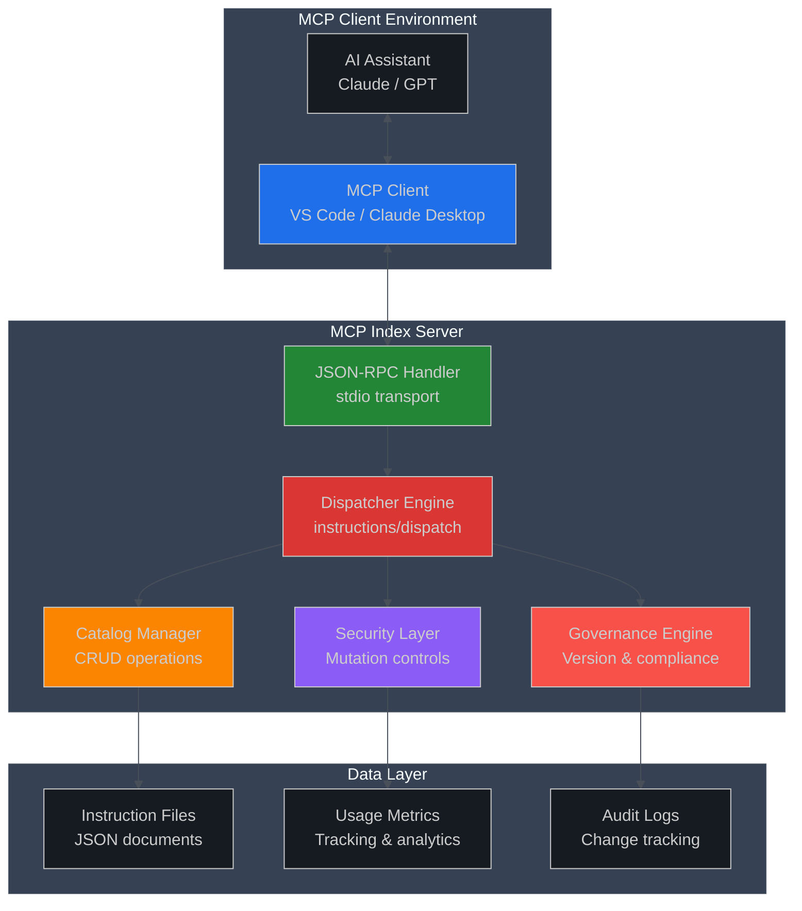
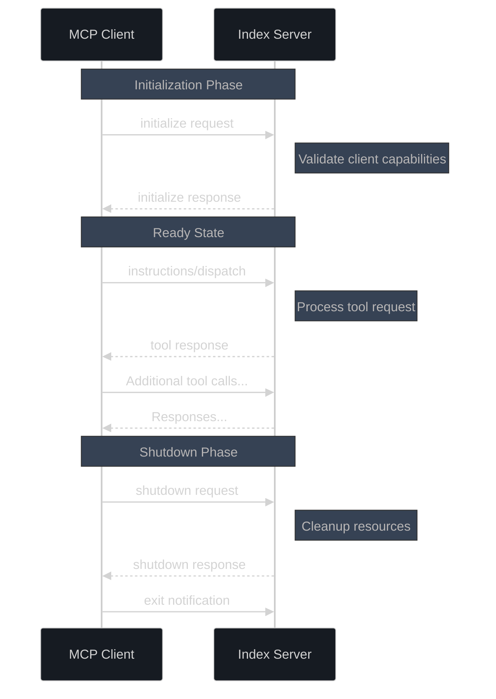
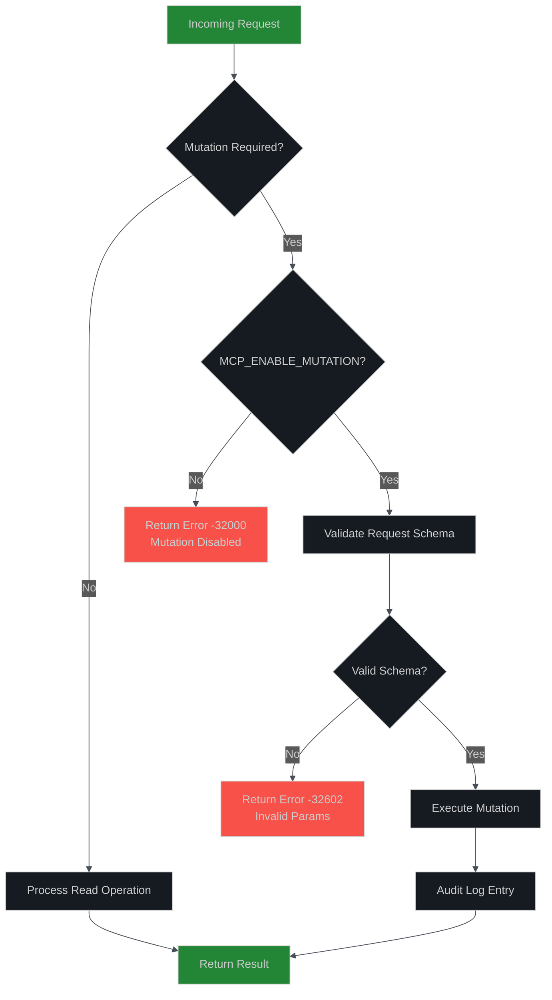

# MCP Index Server - Tools API Reference

**Version:** 1.1.2 (MCP Protocol Compliant)  
**Protocol:** Model Context Protocol (MCP) v1.0+  
**Transport:** JSON-RPC 2.0 over stdio  
**Last Updated:** August 31, 2025

## 📖 Overview

The MCP Index Server provides a comprehensive instruction catalog management system through the Model Context Protocol. This document serves as the complete API reference for all available tools, following enterprise standards for security, reliability, and ease of integration.

### 🎯 Key Features

* **Protocol Compliance**: Full MCP SDK v1.0+ compatibility
* **Enterprise Security**: Mutation controls and audit logging
* **High Performance**: Optimized for <120ms P95 response times
* **Governance Ready**: Built-in versioning and change tracking
* **Developer Friendly**: Comprehensive error handling and diagnostics
* **Feedback Subsystem**: 6 MCP tools for structured client feedback (submit/list/get/update/stats/health)
* **Structured Tracing (1.1.2+)**: Rotated JSONL trace lines `[trace:category[:sub]] { json }` for reliable test parsing
* **Schema-Aided Add Failures**: Inline JSON Schema returned on early structural `instructions/add` errors (1.1.0+)

## 🏗️ Architecture Overview



## 🔧 Transport & Protocol

### JSON-RPC 2.0 Specification

The MCP Index Server implements JSON-RPC 2.0 strictly following the [MCP Protocol Specification](https://spec.modelcontextprotocol.io/).

#### Request Format

```typescript
interface MCPRequest {
  jsonrpc: "2.0"
  method: string
  params?: object
  id: string | number
}
```

#### Response Format

```typescript
interface MCPResponse {
  jsonrpc: "2.0"
  id: string | number
  result?: any
  error?: {
    code: number
    message: string
    data?: any
  }
}
```

### 🚀 Connection Lifecycle



### 🔒 Security & Environment Controls

#### Environment Variables

| Variable | Type | Default | Description |
|----------|------|---------|-------------|
| `MCP_ENABLE_MUTATION` | Boolean | `false` | Enable write operations (add, remove, update) |
| `MCP_LOG_VERBOSE` | Boolean | `false` | Enable detailed logging to stderr |
| `MCP_LOG_MUTATION` | Boolean | `false` | Log only mutation operations |
| `MCP_LOG_FILE` | Path | - | Enable file logging to specified path (dual stderr/file output) |
| `GOV_HASH_TRAILING_NEWLINE` | Boolean | `false` | Governance hash compatibility mode |

#### Security Model



## 🛠️ Tools Reference

### Primary Tool: `instructions/dispatch`

The main entry point for all instruction catalog operations. This unified dispatcher replaces legacy individual methods and provides comprehensive functionality through action-based routing.

#### Base Request Structure

```typescript
interface DispatchRequest {
  method: "instructions/dispatch"
  params: {
    action: string
    // Action-specific parameters
    [key: string]: any
  }
}
```

### 📖 Read Operations (No Authentication Required)

#### `list` - List Instructions

**Purpose**: Retrieve all instructions with optional filtering  
**Mutation**: No  
**Performance**: O(1) with in-memory indexing

```typescript
// Request
{
  "action": "list",
  "category"?: string,
  "limit"?: number,
  "offset"?: number
}

// Response
{
  "hash": string,        // Catalog integrity hash
  "count": number,       // Total matching items
  "items": InstructionEntry[]
}
```

**Example:**
```json
{
  "jsonrpc": "2.0",
  "id": 1,
  "method": "instructions/dispatch",
  "params": {
    "action": "list",
    "category": "ai_code_nav",
    "limit": 10
  }
}
```

#### `get` - Retrieve Single Instruction

**Purpose**: Fetch a specific instruction by ID  
**Mutation**: No  
**Performance**: O(1) hash table lookup

```typescript
// Request
{
  "action": "get",
  "id": string
}

// Response
{
  "hash": string,
  "item": InstructionEntry | null
} | {
  "notFound": true,
  "id": string
}
```

#### `search` - Text Search

**Purpose**: Full-text search across instruction titles and bodies  
**Mutation**: No  
**Performance**: O(n) with optimization for common patterns

```typescript
// Request
{
  "action": "search",
  "q": string,           // Search query
  "limit"?: number,
  "highlight"?: boolean  // Return highlighted snippets
}

// Response
{
  "hash": string,
  "count": number,
  "items": InstructionEntry[],
  "query": string,
  "highlights"?: SearchHighlight[]
}
```

#### `query` - Advanced Filtering

**Purpose**: Complex multi-field filtering with cursor-based pagination  
**Mutation**: No  
**Performance**: Optimized with indexing strategies

```typescript
// Request
{
  "action": "query",
  "filters": {
    "categories"?: string[],
    "priorityTiers"?: ("P1" | "P2" | "P3" | "P4")[],
    "status"?: ("draft" | "review" | "approved" | "deprecated")[],
    "owners"?: string[],
    "classification"?: ("public" | "internal" | "restricted")[],
    "workspaceId"?: string,
    "userId"?: string,
    "teamIds"?: string[],
    "createdAfter"?: string,  // ISO 8601
    "updatedAfter"?: string,
    "text"?: string
  },
  "sort"?: {
    "field": "createdAt" | "updatedAt" | "priority" | "title",
    "direction": "asc" | "desc"
  },
  "limit"?: number,
  "cursor"?: string
}

// Response
{
  "items": InstructionEntry[],
  "total": number,
  "returned": number,
  "nextCursor"?: string,
  "appliedFilters": object,
  "performanceMs": number
}
```

#### `categories` - Category Analytics

**Purpose**: Get category distribution statistics  
**Mutation**: No

```typescript
// Request
{
  "action": "categories"
}

// Response
{
  "categories": Array<{
    "name": string,
    "count": number,
    "lastUpdated": string
  }>,
  "totalDistinct": number,
  "catalogHash": string
}
```

#### `diff` - Incremental Synchronization

**Purpose**: Efficient catalog synchronization for clients  
**Mutation**: No  
**Use Case**: Cache invalidation and incremental updates

```typescript
// Request
{
  "action": "diff",
  "clientHash"?: string,
  "known"?: Array<{
    "id": string,
    "sourceHash": string
  }>
}

// Response - Up to date
{
  "upToDate": true,
  "hash": string
} |
// Response - Changes detected
{
  "hash": string,
  "added": InstructionEntry[],
  "updated": InstructionEntry[],
  "removed": string[]  // IDs
}
```

### 🔐 Administrative Operations

#### `capabilities` - Server Discovery

**Purpose**: Client feature detection and compatibility checking  
**Mutation**: No

```typescript
// Request
{
  "action": "capabilities"
}

// Response
{
  "version": string,
  "protocolVersion": string,
  "supportedActions": string[],
  "mutationEnabled": boolean,
  "features": {
    "advancedQuery": boolean,
    "bulkOperations": boolean,
    "governanceTracking": boolean,
    "usageAnalytics": boolean
  },
  "limits": {
    "maxBatchSize": number,
    "maxQueryResults": number,
    "maxFileSize": number
  }
}
```

#### `health` - System Health Check

**Purpose**: Monitor system status and performance metrics  
**Mutation**: No

```typescript
// Request
{
  "action": "health"
}

// Response
{
  "status": "healthy" | "degraded" | "unhealthy",
  "version": string,
  "uptime": number,        // seconds
  "catalogStats": {
    "totalInstructions": number,
    "totalCategories": number,
    "lastModified": string,
    "integrityHash": string
  },
  "performance": {
    "avgResponseTime": number,  // ms
    "requestCount": number,
    "errorRate": number
  },
  "diskUsage": {
    "totalSize": number,    // bytes
    "availableSpace": number
  }
}
```

### ✏️ Mutation Operations (Requires `MCP_ENABLE_MUTATION=1`)

#### `add` - Create New Instruction

**Purpose**: Add a single instruction to the catalog  
**Mutation**: Yes  
**Validation**: Full schema validation with optional lax mode

```typescript
// Request (via instructions/dispatch)
{
  "action": "add",
  "entry": InstructionEntryInput,  // REQUIRED: instruction wrapped in entry field
  "overwrite"?: boolean,           // Allow ID conflicts
  "lax"?: boolean                  // Auto-fill missing fields
}

// Direct tool call (instructions/add)
{
  "entry": InstructionEntryInput,  // REQUIRED: must wrap instruction object
  "overwrite"?: boolean,
  "lax"?: boolean
}

// Response
{
  "id": string,
  "hash": string,
  "created": boolean,     // Only true if successfully persisted and readable
  "overwritten": boolean,
  "skipped": boolean,
  "verified": boolean,    // Read-back validation passed
  "sourceHash": string,
  "governanceHash": string
}

// Common Error Response
{
  "created": false,
  "error": "missing entry",           // Machine-readable error code
  "feedbackHint": string,             // User guidance
  "reproEntry": object                // Debugging info
}
```

#### `import` - Bulk Import

**Purpose**: Import multiple instructions efficiently  
**Mutation**: Yes  
**Performance**: Optimized for large datasets

```typescript
// Request
{
  "action": "import",
  "entries": InstructionEntryInput[],
  "mode": "skip" | "overwrite" | "merge",
  "validate"?: boolean,   // Skip validation for trusted sources
  "batchSize"?: number   // Control memory usage
}

// Response
{
  "hash": string,
  "imported": number,
  "skipped": number,
  "overwritten": number,
  "total": number,
  "errors": Array<{
    "index": number,
    "id"?: string,
    "error": string,
    "code": string
  }>,
  "processingTimeMs": number
}
```

#### `remove` - Delete Instructions

**Purpose**: Permanently delete instructions by ID  
**Mutation**: Yes  
**Safety**: Requires explicit confirmation for bulk operations

```typescript
// Request
{
  "action": "remove",
  "ids": string[],
  "confirm"?: boolean,    // Required for >10 items
  "cascade"?: boolean     // Remove dependent items
}

// Response
{
  "removed": number,
  "removedIds": string[],
  "missing": string[],
  "errorCount": number,
  "errors": Array<{
    "id": string,
    "error": string,
    "code": string
  }>,
  "cascadeRemovals"?: string[]
}
```

#### `groom` - Catalog Maintenance

**Purpose**: Automated catalog cleanup and optimization  
**Mutation**: Yes (conditional)  
**Safety**: Supports dry-run mode

```typescript
// Request
{
  "action": "groom",
  "mode": {
    "dryRun"?: boolean,
    "mergeDuplicates"?: boolean,
    "removeDeprecated"?: boolean,
    "normalizeCategories"?: boolean,
    "purgeLegacyScopes"?: boolean,
    "updateHashes"?: boolean
  }
}

// Response
{
  "previousHash": string,
  "hash": string,
  "scanned": number,
  "repairedHashes": number,
  "normalizedCategories": number,
  "deprecatedRemoved": number,
  "duplicatesMerged": number,
  "usagePruned": number,
  "filesRewritten": number,
  "purgedScopes": number,
  "dryRun": boolean,
  "notes": string[],
  "performanceMs": number
}
```

### � **Common Troubleshooting**

#### Parameter Format Issues

**❌ Incorrect: Sending instruction object directly**
```typescript
// This FAILS with "missing entry" error
{
  "method": "tools/call",
  "params": {
    "name": "instructions/add",
    "arguments": {
      "id": "my-instruction",
      "body": "Content..."
    }
  }
}
```

**✅ Correct: Wrap in entry field**
```typescript
{
  "method": "tools/call",
  "params": {
    "name": "instructions/add",
    "arguments": {
      "entry": {                 // ← Required wrapper
        "id": "my-instruction",
        "body": "Content..."
      },
      "lax": true
    }
  }
}
```

#### Backup Restoration

**❌ Incorrect: Sending backup file directly**
```typescript
// Backup files often contain arrays or metadata
{
  "entries": [
    {"id": "...", "body": "..."},
    {"id": "...", "body": "..."}
  ],
  "timestamp": "...",
  "version": "..."
}
```

**✅ Correct: Extract individual objects**
```typescript
// Use instructions/import for multiple entries
{
  "action": "import", 
  "entries": [
    {"id": "...", "body": "..."},  // Individual instruction objects
    {"id": "...", "body": "..."}
  ],
  "mode": "skip"
}
```

#### Error Response Handling

### 🛠️ Index Visibility / Catalog Recovery Guide

Use this when an instruction file exists on disk but one or more MCP operations (typically `instructions/list`) fail to show it, or when catalog hash/count drift is suspected. The server now self‑heals many cases automatically; these steps document observability and manual recovery levers.

#### 1. Quick Triage Decision Tree

| Symptom | Fast Check | Expected Auto‑Repair? | Next Step |
|---------|------------|-----------------------|-----------|
| `get` works, `list` missing id | Call `instructions/list` with `expectId` | Yes (targeted reload + late materialize) | If still absent, step 2 |
| Both `get` and `list` miss id but file present on disk | Call `instructions/getEnhanced` | Yes (invalidate + late materialize) | If not repaired, step 3 |
| Hash/count mismatch after bulk adds | Re‑invoke `list` with `expectId` for a missing representative id | Yes | If mismatch persists, step 4 |
| Many files absent / widespread drift | Check trace flags (`repairedVisibility`, `lateMaterialized`) | Partial (may be iterative) | Step 4 (full reload) |
| Corrupt JSON (parse error) | Manual open file; validate JSON | No (rejected) | Fix file or remove |
| Need clean forensic baseline | Confirm backups/ | n/a | Step 5 (reset modes) |

#### 2. Verify Auto‑Repair Flags

Enable trace (set env `MCP_CATALOG_DIAG=1` or use existing verbose harness). Invoke:

```json
{ "name": "instructions/list", "arguments": { "expectId": "your-id" } }
```

Trace line `[trace:list]` includes:

* `repairedVisibility: true` → entry surfaced via reload or late materialization
* `lateMaterialized: true` → file parsed & injected without full reload
* `attemptedReload/attemptedLate` → repair paths tried (even if final repair failed)

If `expectOnDisk:true` and `expectInCatalog:false` AND no repair flags turned true, proceed to step 3.

#### 3. Target a Single ID Repair

Call enhanced getter (exposes repair):

```json
{ "name": "instructions/getEnhanced", "arguments": { "id": "your-id" } }
```

Outcomes:

* Returns `{ item }` → repaired
* Returns `{ notFound:true }` but file exists → likely validation failure (check file JSON + required fields)

If repaired, re‑run `list` (no restart needed). If not, inspect file integrity:

1. Confirm `.json` extension & UTF‑8 encoding
2. Ensure `id` inside file matches filename
3. Validate mandatory fields: `id`, `body`

#### 4. Full Catalog Reload / Sanity Sweep

If multiple items missing:

1. Force reload via dispatch (if exposed) or temporarily rename `.catalog-version` then invoke any list/get (will repopulate)
2. Optionally trigger a groom (if enabled) for hash recomputation & normalization.
3. Re‑run a hash integrity test (`governanceHashIntegrity.spec.ts` pattern) in a diagnostic environment.

#### 5. Reset / Seed Strategies

Use deployment script flags (PowerShell examples):

* Preserve & upgrade only:  
  `pwsh scripts/deploy-local.ps1 -Overwrite -TargetDir <prod>`
* Empty index (keep templates) for forensic isolation:  
  `pwsh scripts/deploy-local.ps1 -Overwrite -EmptyIndex -TargetDir <prod>`
* Force known seed set (replace current):  
  `pwsh scripts/deploy-local.ps1 -Overwrite -ForceSeed -TargetDir <prod>`
* Full wipe then seed:  
  `pwsh scripts/deploy-local.ps1 -Overwrite -EmptyIndex -ForceSeed -TargetDir <prod>`

Always capture backup first (script does this automatically into `backups/`). For manual emergency: copy `instructions/` elsewhere before resetting.

#### 6. Bulk Validation After Recovery

After any repair/reset:

1. `instructions/list` → record `count` & `hash`
2. Spot check 2–3 representative IDs with `get`
3. Run quick portable client smoke (`createReadSmoke.spec.ts` or harness) against same directory (set `INSTRUCTIONS_DIR`)
4. Check traces for unexpected high frequency of `lateMaterializeRejected` (indicates malformed files)

#### 7. When to Escalate

Open an issue if ANY occurs:

* Repeated absence requiring >1 repair per same id per hour
* `lateMaterializeRejected` increments for properly formatted files
* Catalog hash oscillates between >3 distinct values without mutations

Include in report: recent `[trace:list]` payload, file stat (mtime/size), and whether `invalidate` was manually triggered.

#### 8. Preventive Practices

* Avoid out‑of‑band writes that keep file open (write atomically: temp file + rename)
* Keep filenames stable; changing internal `id` without renaming breaks validation
* Run periodic groom in maintenance windows for normalization & hash check
* Use overwrite flag for planned corrections instead of editing large batches manually

---

> This section documents the new self‑healing visibility feature (expectId‑driven targeted reload + late materialization) added in version 1.1.2.


All mutation operations now return enhanced error information:

```typescript
{
  "created": false,
  "error": "mandatory/critical require owner",  // Machine-readable
  "feedbackHint": "Submit feedback/submit with reproEntry",
  "reproEntry": {                               // Debugging context
    "id": "problem-id",
    "bodyPreview": "First 200 chars..."
  }
}
```

### �📊 Analytics & Governance

#### `governanceHash` - Integrity Verification

**Purpose**: Generate stable governance hash for compliance  
**Mutation**: No  
**Use Case**: Change detection and compliance auditing

```typescript
// Request
{
  "action": "governanceHash",
  "includeItems"?: boolean
}

// Response
{
  "count": number,
  "governanceHash": string,
  "algorithm": string,
  "items"?: Array<{
    "id": string,
    "governance": object,
    "hash": string
  }>
}
```

#### `usage/track` - Usage Analytics

**Purpose**: Record instruction usage for analytics  
**Mutation**: Yes (tracking data)

```typescript
// Request
{
  "method": "usage/track",
  "params": {
    "instructionId": string,
    "context": {
      "userId"?: string,
      "workspaceId"?: string,
      "sessionId"?: string,
      "timestamp": string
    },
    "metrics": {
      "executionTime"?: number,
      "success": boolean,
      "errorCode"?: string
    }
  }
}

// Response
{
  "tracked": boolean,
  "sessionId": string,
  "aggregatedCount": number
}
```

### 🔍 Diagnostic Operations

#### `inspect` - Deep Inspection

**Purpose**: Detailed diagnostic information for debugging  
**Mutation**: No  
**Use Case**: Development and troubleshooting

```typescript
// Request
{
  "action": "inspect",
  "id"?: string,          // Specific instruction
  "scope": "catalog" | "instruction" | "governance" | "usage"
}

// Response
{
  "timestamp": string,
  "scope": string,
  "data": {
    // Scope-specific detailed information
    "raw": object,
    "normalized": object,
    "validation": object,
    "metadata": object,
    "filesystem": object
  }
}
```

## 📈 Performance Characteristics

### Response Time SLOs

| Operation Type | P50 Target | P95 Target | P99 Target |
|----------------|------------|------------|------------|
| Read Operations | <50ms | <120ms | <300ms |
| Simple Mutations | <100ms | <250ms | <500ms |
| Bulk Operations | <500ms | <2s | <5s |
| Analytics | <200ms | <500ms | <1s |

### Throughput Targets

* **Read Operations**: >1000 RPS sustained
* **Write Operations**: >100 RPS sustained
* **Concurrent Connections**: 50+ simultaneous clients
* **Memory Usage**: <512MB under normal load

## 🚨 Error Handling

### Standard JSON-RPC Error Codes

| Code | Name | Description | Resolution |
|------|------|-------------|------------|
| -32700 | Parse Error | Invalid JSON received | Check request format |
| -32600 | Invalid Request | Invalid JSON-RPC format | Verify protocol compliance |
| -32601 | Method Not Found | Unknown method/action | Check available actions |
| -32602 | Invalid Params | Parameter validation failed | Review parameter schema |
| -32603 | Internal Error | Server-side error | Check logs and report |

### Custom Error Codes

| Code | Name | Description |
|------|------|-------------|
| -32000 | Mutation Disabled | Write operation attempted without `MCP_ENABLE_MUTATION=1` |
| -32001 | Resource Limit | Operation exceeds configured limits |
| -32002 | Validation Error | Schema validation failed with details |
| -32003 | Integrity Error | Catalog integrity check failed |
| -32004 | Permission Denied | Insufficient permissions for operation |

### Error Response Format

```typescript
interface ErrorResponse {
  jsonrpc: "2.0"
  id: string | number
  error: {
    code: number
    message: string
    data?: {
      action?: string
      validation?: object
      suggestion?: string
      documentation?: string
    }
  }
}
```

## 🔧 Integration Examples

### PowerShell Client

```powershell
# Start server with mutation enabled
$env:MCP_ENABLE_MUTATION = "1"
$env:MCP_LOG_VERBOSE = "1"

# Launch server process
$serverProcess = Start-Process -FilePath "node" -ArgumentList "dist/server/index.js" -PassThru -NoNewWindow

# Example request via stdin/stdout
$request = @{
    jsonrpc = "2.0"
    id = 1
    method = "instructions/dispatch"
    params = @{
        action = "list"
        limit = 10
    }
} | ConvertTo-Json -Depth 4

# Send to server (implementation-specific transport)
```

### Node.js Client

```typescript
import { spawn } from 'child_process'

class MCPIndexClient {
  private server: ChildProcess
  private requestId = 0

  async start() {
    this.server = spawn('node', ['dist/server/index.js'], {
      stdio: ['pipe', 'pipe', 'pipe'],
      env: { ...process.env, MCP_ENABLE_MUTATION: '1' }
    })
    
    // Handle server initialization
    await this.initialize()
  }

  async dispatch(action: string, params: object = {}) {
    const request = {
      jsonrpc: '2.0',
      id: ++this.requestId,
      method: 'instructions/dispatch',
      params: { action, ...params }
    }

    return this.sendRequest(request)
  }

  async listInstructions(category?: string) {
    return this.dispatch('list', { category })
  }

  async addInstruction(entry: InstructionEntry, lax = true) {
    return this.dispatch('add', { entry, lax })
  }
}
```

### VS Code Extension Integration

```typescript
// MCP client for VS Code extension
import { MCPClient } from '@modelcontextprotocol/client'

export class IndexServerClient extends MCPClient {
  async initializeIndexServer() {
    await this.initialize({
      protocolVersion: '1.0.0',
      capabilities: {
        tools: true,
        logging: true
      }
    })
  }

  async searchInstructions(query: string): Promise<InstructionEntry[]> {
    const response = await this.callTool('instructions/dispatch', {
      action: 'search',
      q: query,
      limit: 50
    })
    
    return response.items || []
  }
}
```

## 📚 Schema Reference

### Environment Variables (Runtime Behavior)

| Variable | Purpose | Default |
|----------|---------|---------|
| `MCP_ENABLE_MUTATION` | Enables mutation tools (add/remove/update). | `0` |
| `INSTRUCTIONS_DIR` | Override instruction storage directory. | `instructions/` |
| `MCP_INSTRUCTIONS_STRICT_CREATE` | Enforce strict create (no implicit upsert). | `0` |
| `MCP_INSTRUCTIONS_STRICT_REMOVE` | Enforce strict remove (must exist). | `0` |
| `MCP_CANONICAL_DISABLE` | Disable source hash canonicalization on write. | `0` |
| `MCP_READ_RETRIES` | Read retry attempts for IO transient errors. | `3` |
| `MCP_READ_BACKOFF_MS` | Base backoff ms for read retries. | `8` |
| `MCP_ATOMIC_WRITE_RETRIES` | Atomic write retry attempts. | `3` |
| `MCP_ATOMIC_WRITE_BACKOFF_MS` | Base backoff ms for atomic writes. | `8` |
| `MCP_CATALOG_MEMOIZE` | Cache catalog in-memory to reduce file IO. | disabled |
| `MCP_CATALOG_DIAG` | Verbose catalog diagnostics to stderr. | `0` |
| `MCP_CATALOG_FILE_TRACE` | Trace file load sequence. | `0` |
| `MCP_DISABLE_USAGE_RATE_LIMIT` | Disable usage rate limiter. | `0` |
| `MCP_DISABLE_USAGE_CLAMP` | Disable clamp of usage increments. | `0` |
| `MCP_USAGE_FLUSH_MS` | Delay (ms) for batching usage snapshot writes. | `75` |
| `INDEX_FEATURES` | Feature flags (comma list) e.g. `usage`. | none |
| `MCP_LOG_VERBOSE` | Verbose RPC / transport logging. | `0` |
| `MCP_LOG_DIAG` | Diagnostic handshake / buffer logging. | `0` |
| `MCP_LOG_FILE` | File to append structured logs. | unset |
| `MCP_DISABLE_EARLY_STDIN_BUFFER` | Disable early stdin buffer before handshake. | `0` |
| `MCP_IDLE_KEEPALIVE_MS` | Keepalive echo interval for idle transports. | `30000` |
| `MCP_SHARED_SERVER_SENTINEL` | Multi-client shared server sentinel. | unset |
| `MCP_HANDSHAKE_TRACE` | Detailed handshake stage tracing. | `0` |
| `MCP_HANDSHAKE_FALLBACKS` | Enable handshake fallback logic. | `0` |
| `MCP_INIT_FALLBACK_ALLOW` | Allow init fallback override path. | `0` |
| `MCP_INIT_FRAME_DIAG` | Output handshake frame diagnostics. | `0` |
| `MCP_HEALTH_MIXED_DIAG` | Mixed transport health diagnostics. | `0` |
| `MCP_DISABLE_INIT_SNIFF` | Disable initial stdout sniff logic. | `0` |
| `MCP_LOG_ROTATE_BYTES` | Max logger file size before rotation. | `524288` |
| `MCP_TRACE_DIR` | Directory for trace JSONL emissions. | `traces/` |
| `MCP_TRACE_MAX_BYTES` | Max bytes per trace file before rotate. | `65536` |
| `MCP_TRACE_SESSION` | Force trace session id. | random |
| `MCP_TRACE_FILTER` | Category allowlist (comma list). | all |
| `MCP_TRACE_FILTER_DENY` | Category denylist (comma list). | none |
| `MCP_AGENT_ID` | Identifier of agent performing mutations. | unset |
| `WORKSPACE_ID` / `INSTRUCTIONS_WORKSPACE` | Source workspace for new instruction. | unset |
| `DIST_WAIT_MS` | Override dist readiness wait in tests. | dynamic |
| `EXTEND_DIST_WAIT` | Extend default dist wait budget. | `0` |
| `DIST_WAIT_DEBUG` | Verbose dist wait debug logging. | `0` |
| `SKIP_PROD_DEPLOY` | Skip prod deploy in test harness. | dynamic |
| `MCP_HANDSHAKE_FALLBACKS` | Enable handshake fallback stages. | `0` |
| `MCP_INIT_FRAME_DIAG` | Frame-level init diagnostics. | `0` |
| `MULTICLIENT_TRACE` | Multi-client orchestration trace. | `0` |
| `MCP_FORCE_REBUILD` | Force rebuild on startup (tests). | `0` |
| `MCP_HEALTH_MIXED_DIAG` | Mixed health diagnostics. | `0` |
| `MCP_SHARED_SERVER_SENTINEL` | Shared server id (test harness). | unset |
| `MCP_ATOMIC_WRITE_RETRIES` | Override atomic write retries. | `3` |
| `MCP_ATOMIC_WRITE_BACKOFF_MS` | Override atomic write backoff. | `8` |

Additional specialized env vars may appear in test-only contexts; production runtime should rely on documented set above.


### Core Data Types

#### InstructionEntry

```typescript
interface InstructionEntry {
  // Identity
  id: string                    // Unique identifier
  title?: string                // Human-readable title
  body: string                  // Instruction content
  
  // Classification
  categories: string[]          // Topical tags
  priority: number              // 1-10 priority scale
  requirement: 'mandatory' | 'critical' | 'recommended' | 'optional' | 'deprecated'
  
  // Governance
  version: string               // Semantic version
  status: 'draft' | 'review' | 'approved' | 'deprecated'
  owner: string                 // Responsible party
  classification: 'public' | 'internal' | 'restricted'
  
  // Lifecycle
  createdAt: string            // ISO 8601 timestamp
  updatedAt: string            // ISO 8601 timestamp
  reviewIntervalDays?: number  // Review frequency
  
  // Scoping
  workspaceId?: string         // Workspace association
  userId?: string              // User association  
  teamIds?: string[]           // Team associations
  
  // Computed
  sourceHash: string           // Content integrity hash
  governanceHash: string       // Governance metadata hash
  priorityTier: 'P1' | 'P2' | 'P3' | 'P4'  // Derived priority tier
  
  // Optional
  description?: string         // Detailed description
  examples?: string[]          // Usage examples
  tags?: string[]             // Additional tags
  dependencies?: string[]      // Instruction dependencies
  deprecatedBy?: string       // Replacement instruction ID
}
```

## 🏷️ Version History

| Version | Date | Changes |
|---------|------|---------|
| 1.0.0 | 2024-12-28 | Complete MCP protocol compliance, unified dispatcher |
| 0.9.0 | 2024-11-15 | Schema v2 migration, dispatcher consolidation |
| 0.8.0 | 2024-10-01 | Governance features, security hardening |
| 0.7.0 | 2024-09-15 | Usage analytics, performance optimization |

---

## 📞 Support & Resources

* **Documentation**: [PROJECT_PRD.md](./PROJECT_PRD.md)
* **Architecture**: [ARCHITECTURE.md](./ARCHITECTURE.md)
* **Security**: [SECURITY.md](../SECURITY.md)
* **Contributing**: [CONTRIBUTING.md](../CONTRIBUTING.md)

**Contact Information:**
* Technical Issues: Create GitHub issue with `[tools-api]` label
* Security Concerns: Follow responsible disclosure in SECURITY.md
* Feature Requests: Use RFC process documented in CONTRIBUTING.md

---

*This document represents the complete API specification for the MCP Index Server tools interface. All integrations must conform to these specifications to ensure compatibility and enterprise-grade reliability.*
| batch | { operations:[ { action,... }, ... ] } | { results:[ ... ] } | Per-op isolation; continues after failures |

Mutation actions (require MCP_ENABLE_MUTATION=1):

| Action | Params | Result (primary fields) | Notes |
|--------|--------|------------------------|-------|
| add | { entry, overwrite?, lax? } | { id, hash, created, overwritten, skipped } | Lax fills defaults |
| import | { entries, mode:"skip"\|"overwrite" } | { hash, imported, skipped, overwritten, total, errors } | Bulk add/update |
| remove | { ids } | { removed, removedIds, missing, errorCount, errors } | Permanent delete |
| reload | none | { reloaded:true, hash, count } | Clears and reloads |
| groom | { mode? } | { previousHash, hash, scanned, repairedHashes, normalizedCategories, deprecatedRemoved, duplicatesMerged, usagePruned, filesRewritten, purgedScopes, dryRun, notes } | Normalization, duplicate merge |
| repair | { clientHash?, known? } | diff-like OR { repaired, updated:[id] } | Fix stored sourceHash mismatches |
| enrich | none | { enriched, updated } | Persist missing governance fields |
| governanceUpdate | { id, patch, bump? } | { id, previousVersion, newVersion } | Controlled governance metadata edit |

Batch example:

```json
{
  "jsonrpc":"2.0","id":9,
  "method":"instructions/dispatch",
  "params":{
    "action":"batch",
    "operations":[
      { "action":"get", "id":"alpha" },
      { "action":"list" },
      { "action":"add", "entry": { "id":"temp", "body":"x" }, "lax": true }
    ]
  }
}
```

Capabilities example:

```json
{ "jsonrpc":"2.0","id":5,"method":"instructions/dispatch","params": { "action":"capabilities" } }
```

Error semantics: Unknown `action` returns -32601 with `data.action` provided for diagnostics. Schema validation errors return -32602 with Ajv detail.

Legacy per-method names were removed; clients must call the dispatcher and supply `action`.


Params: { entries: InstructionEntryInput[], mode: "skip" | "overwrite" }
Result: { hash, imported, skipped, overwritten, total, errors: [] }
Notes: Automatically computes sourceHash; timestamps set to now.

### instructions/repair (mutation when rewriting)

Params: { clientHash?: string, known?: [{ id, sourceHash }] }
Result: Either incremental sync object (same as diff) OR { repaired, updated: [id] } when performing on-disk hash repairs.

### instructions/reload (mutation)

Params: none
Result: { reloaded: true, hash, count }
Effect: Clears in-memory cache and reloads from disk.

### instructions/remove (mutation)

Params: { ids: string[] }
Result: { removed, removedIds: string[], missing: string[], errorCount, errors: [{ id, error }] }
Notes: Permanently deletes matching instruction JSON files from disk. Missing ids are reported; operation still succeeds unless all fail. Requires MCP_ENABLE_MUTATION=1.

### instructions/groom (mutation)

Params: { mode?: { dryRun?: boolean, mergeDuplicates?: boolean, removeDeprecated?: boolean, purgeLegacyScopes?: boolean } }
Result: { previousHash, hash, scanned, repairedHashes, normalizedCategories, deprecatedRemoved, duplicatesMerged, usagePruned, filesRewritten, purgedScopes, dryRun, notes: string[] }
Notes:

* dryRun reports planned changes without modifying files (hash remains the same).
* repairedHashes: number of entries whose stored sourceHash was corrected.
* normalizedCategories: entries whose categories were lowercased/deduped/sorted.
* duplicatesMerged: number of duplicate entry merges (non-primary members processed).
* deprecatedRemoved: number of deprecated entries physically removed (when removeDeprecated true and their deprecatedBy target exists).
* purgedScopes: legacy scope:* category tokens removed from disk when purgeLegacyScopes enabled.
* mergeDuplicates selects a primary per identical body hash (prefers earliest createdAt then lexicographically smallest id) and merges categories, priority (min), riskScore (max).
* filesRewritten counts actual JSON files updated on disk (0 in dryRun).
* usagePruned counts usage snapshot entries removed due to removed instructions.
* notes array contains lightweight action hints (e.g., would-rewrite:N in dryRun).
 
 
### Structured Scoping Fields

Each InstructionEntry may now include:

- workspaceId?: string
- userId?: string
* teamIds?: string[]

Derivation: If raw categories contain legacy tokens prefixed with scope:workspace:, scope:user:, or scope:team:, the classifier migrates them into structured fields and removes those tokens from categories. This keeps categories focused on topical / functional tagging while enabling precise scoping logic.

### Governance & Lifecycle Fields (0.7.0)

Each instruction now supports governance metadata:

- version (semantic) – initial default 1.0.0
- status: draft | review | approved | deprecated
- owner: responsible party (user/team slug)
- priorityTier: P1..P4 (derived from priority + requirement)
- classification: public | internal | restricted (default internal)
- lastReviewedAt / nextReviewDue – review cadence auto-derived by tier
- changeLog[] – array of { version, changedAt, summary }
* supersedes – id of instruction it replaces

Grooming / normalization auto-populates defaults on load; future versions will enforce presence at creation.

### prompt/review

### instructions/governanceHash

Params: none
Result: `{ count, governanceHash, items: GovernanceProjection[] }`

`GovernanceProjection` fields (stable, order-insensitive across files; items sorted by `id` before hashing):

```json
{ id, title, version, owner, priorityTier, nextReviewDue, semanticSummarySha256, changeLogLength }
```

Deterministic hash algorithm:

1. Load all instructions (enrichment ensures placeholders filled once on disk).
2. Sort by `id` ascending.
3. Map to projection JSON, stringify each projection.
4. Join with `\n` separators.
5. If `GOV_HASH_TRAILING_NEWLINE=1`, append a final `\n` (empty string join entry) for backward compatibility stabilization.
6. SHA-256 hex digest of the resulting UTF-8 buffer is `governanceHash`.

Invariance: Body-only edits (title & governance fields unchanged) do not alter governance hash; per-field governance edits must change it (validated by tests). Use this tool to detect governance metadata drift independent of content body churn.

Use cases:

- CI snapshot gating (reject unintended governance changes).
- Cross-process restart stability checks.
* Fast diff precursor: if governance hash unchanged, skip deeper governance audits.

Params: { prompt: string }
Result: { issues: [...], summary: { counts, highestSeverity? } }
Limits: 10KB max input; null bytes stripped.

### integrity/verify

Params: none
Result: { hash, count, issues: [{ id, expected, actual }], issueCount }

### gates/evaluate

Params: none (reads instructions/gates.json)
Result: { generatedAt, results: [{ id, passed, count, op, value, severity }], summary: { errors, warnings, total } }

### usage/track

Params: { id }
Result: { id, usageCount, lastUsedAt } | { notFound: true }

### usage/hotset

Params: { limit?: number (default 10, max 100) }
Result: { hash, count, limit, items: [{ id, usageCount, lastUsedAt }] }

### usage/flush (mutation)

Params: none
Result: { flushed: true }
Persists in-memory usage snapshot immediately.

### metrics/snapshot

Params: none
Result: { generatedAt, methods: [{ method, count, avgMs, maxMs }], features: { features: [..], counters: { .. }, env: [] } }

### feature/status

Params: none
Result: { features: [ 'usage', ... ], counters: { featureActivated:usage, propertyUpdate:usage, usage:gated }, env: ['usage', ...] }
Notes: Exposes active INDEX_FEATURES flags and internal counters. Use to verify feature gate state without side effects.

### meta/tools

Params: none
Result: Legacy + structured response:

```json
{
  tools: [ { method, stable, mutation, disabled? } ],
  stable: { tools: [ { method, stable, mutation } ] },
  dynamic: { generatedAt, mutationEnabled, disabled: [ { method } ] },
  mcp: {
  registryVersion: "2025-08-25",
    tools: [ {
      name,                // method name
      description,         // human readable summary
      stable,              // deterministic read-only
      mutation,            // requires MCP_ENABLE_MUTATION for side effects
      inputSchema,         // JSON Schema for params
      outputSchema?        // JSON Schema for result (when defined in server)
    } ]
  }
}
```

The `mcp` block is the new machine-consumable registry enabling client-side validation & discovery. Legacy fields remain for backward compatibility.

### Input Validation

The server performs pre-dispatch JSON Schema validation of `params` using the registry `inputSchema`.

#### Hybrid Validation (Zod + Ajv) – 2025-09-03

Beginning with the Zod enhancement (commit `feat(validation): introduce Zod-enhanced tool registry`), the runtime now
maintains a dual-layer validation pipeline:

1. Zod (preferred when a `zodSchema` is attached to a tool registry entry) – provides richer developer ergonomics,
   type inference, and precise issue localization.
2. Ajv JSON Schema (fallback and always retained for protocol / tooling parity) – authoritative external contract
   backing generated documentation and client-side validation.

Behavioral Guarantees:

* Error Semantics: Validation failures (whether raised by Zod or Ajv) surface uniformly as JSON-RPC `-32602` with an Ajv-shaped `errors` array (fields: `instancePath`, `keyword`, `message`, `schemaPath`, `params`). Zod issues are mapped into this structure for transport consistency.
* Backward Compatibility: No existing tool schemas were removed or relaxed; Zod adds a parallel, not replacement, validator. Tools without a Zod attachment still validate exclusively via Ajv.
* Incremental Rollout: Only a subset of tools (core catalog ops, feedback suite, usage tracking) currently have Zod coverage. Additional tools will be layered in with future commits.

Operational Notes:

* Adding Zod to a tool: augment `toolRegistry.zod.ts` `zodMap` with a schema keyed by the tool name.
* Removal / Disable Path: If a Zod schema throws unexpectedly, the fallback Ajv path continues to function; no feature flags required yet. (A future `MCP_VALIDATION_MODE` env flag may allow forcing `ajv`, `zod`, or `auto`.)
* Meta-Schema TLS: The switch of `$schema` URLs to `https://` required explicit registration of the draft-07 meta-schema (with and without trailing `#`) in both the validation service and catalog loader to avoid Ajv compile errors.

Planned Enhancements:

* Automated Type Export: Derive TypeScript parameter types from attached Zod schemas to eliminate manual interface drift.
* Coverage Metrics: Emit optional diagnostics summarizing how many incoming requests used Zod vs Ajv for observability.
* Feature Flag: `MCP_VALIDATION_MODE` to toggle behavior during large refactors.

If you observe any divergence between Zod and JSON Schema acceptance, file an issue with a minimal repro payload.

Failure:

```json
{ "jsonrpc":"2.0", "id":7, "error": { "code": -32602, "message": "Invalid params", "data": { "method":"instructions/get", "errors": [ /* Ajv errors */ ] } } }
```

Guidelines:


* Omit `params` or use `{}` for methods with no required fields.
* Respect `additionalProperties:false` where specified.
* Surface `error.data.errors` for actionable diagnostics.

## Data Model

interface InstructionEntry {
  id: string;
  title: string;
  body: string;
  rationale?: string;
  priority: number; // 1 (highest)..100 (lowest)
  audience: 'individual' | 'group' | 'all';
  requirement: 'mandatory' | 'critical' | 'recommended' | 'optional' | 'deprecated';
  categories: string[]; // normalized lowercase unique
  sourceHash: string;   // sha256(body)
  schemaVersion: string;
  deprecatedBy?: string;
  createdAt: string;
  updatedAt: string;
  usageCount?: number;
  lastUsedAt?: string;
  riskScore?: number;
  workspaceId?: string; // structured scope (derived if legacy category prefix scope:workspace:VALUE present)
  userId?: string;      // structured scope (derived if legacy category prefix scope:user:VALUE present)
  teamIds?: string[];   // structured scope (derived if legacy category prefixes scope:team:VALUE present)
}

## Persistence

Usage counts stored in data/usage-snapshot.json (debounced ~500ms + flush on shutdown signals). Force write with usage/flush.

## Error Codes

* -32601 Method not found
* -32600 Invalid Request
* -32700 Parse error
* -32603 Internal error (error.data.message contains detail)

## Security & Safety

* Read-only by default; enable mutation explicitly.
* prompt/review uses simple, bounded pattern checks (no catastrophic regex).
* integrity/verify & instructions/diff aid tamper detection.
* Logging segregated to stderr to avoid protocol corruption.

## CLI Flags

--dashboard              Enable read-only dashboard (HTML + /tools.json) (default off)
--dashboard-port=PORT    Desired dashboard port (default 8787)
--dashboard-host=HOST    Host/interface (default 127.0.0.1)
--dashboard-tries=N      Additional incremental ports to try (default 10)
--no-dashboard           Disable dashboard
-h, --help               Show help

Example: node dist/server/index.js --dashboard --dashboard-port=9000

Dashboard URL is written to stderr when available.

## VS Code Integration

For comprehensive MCP configuration guidance, see the **[MCP Configuration Guide](./MCP-CONFIGURATION.md)** which covers:

* **Enterprise deployment patterns** (production, staging, development)
* **Security configurations** (read-only, mutation controls, audit compliance)
* **Performance optimization** (large datasets, memory management)
* **Multi-environment setups** (global configurations with multiple servers)
* **Troubleshooting and monitoring** (diagnostics, performance metrics)

### Quick Start Example

```json
{
  "mcpServers": {
    "instructionIndex": {
      "description": "MCP Index Server for instruction catalog management",
      "command": "node",
      "args": ["C:/github/jagilber/mcp-index-server/dist/server/index.js"],
      "transport": "stdio",
      "cwd": "C:/github/jagilber/mcp-index-server",
      "env": {
        "INSTRUCTIONS_DIR": "C:/github/jagilber/mcp-index-server/instructions",
        "MCP_ENABLE_MUTATION": "1"
      },
      "restart": "onExit",
      "tags": ["instruction-catalog", "mcp-index"]
    }
  }
}
```

**Important Notes:**

- Ensure build completion: `npm run build`
- Create instructions/ directory before launch

* Use absolute paths for enterprise deployments
* Enable mutation only when write access is required

For additional configuration options and environment variables, refer to the complete [MCP Configuration Guide](./MCP-CONFIGURATION.md).

## Versioning & Stability

Stability tags (stable | experimental) surfaced via meta/tools. Any change to a stable contract triggers a semver minor (additive) or major (breaking) bump and TOOLS.md update.

Promotion roadmap (tentative, dispatcher model):

1. instructions/dispatch core read actions (list, diff, export, categories, governanceHash)
2. prompt/review (after adding remediation/category fields)
3. Advanced query + batch stability + capabilities version negotiation

## Change Log

- 0.9.0: BREAKING unify instruction catalog under `instructions/dispatch`; add actions batch, capabilities, governanceUpdate, enrich; remove legacy `instructions/*` read methods from registry; update docs & migration guidance.
- 0.7.0: Added `instructions/governanceHash` stable tool, governance projection & deterministic hash, enrichment persistence pass, stabilization of usage tracking (atomic firstSeenTs + synchronous first flush), added governance lifecycle fields documentation, optional `GOV_HASH_TRAILING_NEWLINE` flag.
- 0.6.0: Added structured scoping fields (workspaceId, userId, teamIds), new listScoped tool (now action), groom purgeLegacyScopes + purgedScopes metric.
- 0.5.1: Added remove mutation tool (now action); updated schemas, registry, docs.
- 0.5.0: Migrated to official @modelcontextprotocol/sdk; added ping, server/ready notification, initialize guidance, standardized error codes/data.
- 0.4.0: Added lifecycle (initialize/shutdown/exit) handling + richer method-not-found diagnostics, consolidated docs, clarified mutation tool list, improved usage persistence & flush gating.
- 0.3.0: Introduced environment gating (MCP_ENABLE_MUTATION), logging flags (MCP_LOG_VERBOSE, MCP_LOG_MUTATION), meta/tools mutation & disabled flags.

* 0.2.0: Added integrity/verify, usage/*, metrics/snapshot, gates/evaluate, incremental diff, schemas & performance benchmark.
* 0.1.0: Initial instruction tools + prompt/review + health.

## Future (Roadmap)

* Optional checksum streaming diff endpoint for very large catalogs.
* Batched usage/track variant.

* Semantic search extension (vector index) behind feature flag.
* Policy gate expressions with logical combinators.

## Disclaimer

## MCP Client Discovery & Learning Best Practices

This section provides normative guidance for MCP clients integrating with the Instruction Index server to ensure safe, deterministic feature discovery and adaptive learning without compromising integrity.

### A. Startup Sequence (Recommended Order)
 
1. Open transport (stdio) and send `initialize` (standard JSON-RPC handshake).
2. Wait for (optional) `server/ready` notification (if emitted) or small timeout fallback.
3. Call `meta/tools` and cache tool registry (method names, stability, mutation flags, schemas).
4. If mutation operations are planned, verify `mutationEnabled` OR surface controlled UI to enable `MCP_ENABLE_MUTATION`.
5. Fetch `instructions/governanceHash` (record `governanceHash`, `count`).
6. (Optional) Fetch `metrics/snapshot` and `feature/status` to condition UI features.
7. Perform targeted dispatcher calls (`{ action:"list" }` or `{ action:"diff" }` with cached hash) rather than bulk re-download.

### B. Conditional Sync Strategy
 
* Maintain last known `hash` from dispatcher `{ action:"list" }` (catalog hash) and `governanceHash` separately; only refetch full entries when either changes.

* Use dispatcher diff `{ action:"diff", clientHash }` to minimize payload for incremental updates.
* If diff reports unknown ids or structural mismatch, fall back to a clean `{ action:"list" }`.

### C. Tool Schema Validation
 
* Always validate outbound `params` client-side against `meta/tools.mcp.tools[n].inputSchema` before sending.

* Reject or correct user input early; surface Ajv-style feedback inline.
* Tolerate missing `outputSchema` (some tools may not yet declare result schema) by applying defensive parsing.

### D. Governance & Integrity Loop
 
* On each session start: compare new `governanceHash` vs stored; if drift and no local edits expected, surface warning and optionally run `integrity/verify`.
* After any local mutation (add/import/groom/remove): refetch `instructions/governanceHash` to update baseline.
* Cache governance projections only if your client needs offline inspection; otherwise rely on hash.

### E. Usage Tracking Etiquette
 
* Avoid spamming `usage/track`; only call at meaningful interaction points (tool invocation, successful suggestion application).
* Batch (future) or debounce client-side for rapid-fire events; current server debounces persistence but counts all calls.

### F. Feature Flag Adaptation
 
- Use `feature/status` to confirm `usage` feature before rendering usage dashboards.
- If feature absent, degrade UI silently (do not emit errors to end user).

### G. Mutation Safety Controls
 
* Before invoking any mutation tool, confirm environment gating: if `mutationEnabled` false, either disable mutation UI or prompt to restart with `MCP_ENABLE_MUTATION=1`.
* After mutation, prefer dispatcher diff `{ action:"diff" }` rather than full reload unless you modified many entries (>5% of catalog).

### H. Resilience & Fallbacks
 
* On JSON-RPC method not found (-32601), re-request `meta/tools` in case of dynamic server upgrade.
* On parse or internal error for a read tool, implement exponential backoff (e.g., 250ms, 500ms, 1s) before retry; log correlation id (request id) for debugging.
* If `integrity/verify` returns issues unexpectedly, flag local cache invalid and perform full reload cycle.

### I. Multi-Source Precedence Integration
 
* If combining multiple instruction sources, apply precedence BEFORE hashing for governance; this server’s local instructions should sit at precedence tier 0.
* Tag external entries (e.g., categories `source:external`) so downstream filtering remains explicit.
* Do not allow external sources to overwrite local ids silently—emit a warning and skip or require explicit user approval.

### J. Learning / Adaptive Ranking (Client-Side)
 
* Use `usage/hotset` to bootstrap ranking of frequently used instructions; combine with recency (lastUsedAt) decay for personalization.
* Never feed raw body text externally without user consent; treat instruction content as potentially sensitive IP.
* Track success metrics (acceptance, modification, rejection) out-of-band from this protocol if you need advanced learning.

### K. Caching Guidelines
 
* Persist only: last `hash`, last `governanceHash`, and (optionally) `meta/tools` snapshot; revalidate hashes each new session.
* Avoid persisting entire instruction bodies unless offline mode required; prefer on-demand `instructions/get` or incremental diffs.

### L. Security Hygiene
 
* Treat all textual instruction data as untrusted until validated; never execute embedded code segments.
* Enforce a max body length client-side (mirror server expectations) to prevent UI performance degradation.
* Strip or escape any instruction-provided HTML before rendering in rich clients.

### M. Telemetry (Ethical Use)
 
* Aggregate usage counts; avoid sending per-instruction body content in telemetry.
* Respect user / workspace privacy; provide opt-outs for analytics layers built above usage tracking.

### N. Version Awareness
 
- Monitor `schemaVersion` on list/diff results; if encountering a future version unknown to client, degrade to read-only mode until client updated.

### O. Prompt Review Integration
 
- Use `prompt/review` pre-deployment for generated or edited instructions; fail CI if severity meets threshold (e.g., error > 0).
- Display summarized counts in UI; link to detailed issues panel.

---

## 📢 **Feedback/Emit System**

The server provides a comprehensive feedback system enabling clients to submit structured feedback, status reports, security issues, and feature requests to server administrators or monitoring systems.

### Available Feedback Tools

#### `feedback/submit`

Submit structured feedback entries with rich metadata and context.

> **Data Fidelity Policy (MANDATORY)**: When a feedback entry alleges a defect or provides reproduction data (IDs, markdown bodies, operation sequences), ALL subsequent analysis, red tests, and fixes MUST reuse the provided payload verbatim. No synthetic IDs, trimming, or markdown reflow is permitted unless an inline `DATA-FIDELITY-WAIVER` comment documents explicit reporter approval. This mirrors and reinforces the policies in `FEEDBACK-DEFECT-LIFECYCLE.md` and `TESTING-STRATEGY.md`.

**Input Schema:**

```json
{
  "type": "object",
  "properties": {
    "type": {
      "type": "string",
      "enum": ["issue", "bug-report", "feature-request", "security", "documentation", "performance", "usability", "other"]
    },
    "severity": {
      "type": "string", 
      "enum": ["low", "medium", "high", "critical"]
    },
    "title": {
      "type": "string",
      "minLength": 3,
      "maxLength": 200
    },
    "description": {
      "type": "string",
      "minLength": 10,
      "maxLength": 5000
    },
    "context": {
      "type": "object",
      "properties": {
        "clientInfo": {
          "type": "object",
          "properties": {
            "name": {"type": "string"},
            "version": {"type": "string"}
          }
        },
        "serverVersion": {"type": "string"},
        "environment": {"type": "object"},
        "sessionId": {"type": "string"},
        "toolName": {"type": "string"},
        "requestId": {"type": "string"}
      }
    },
    "tags": {
      "type": "array",
      "items": {"type": "string"},
      "maxItems": 10
    }
  },
  "required": ["type", "severity", "title", "description"]
}
```

**Response:**

```json
{
  "feedbackId": "string",
  "status": "submitted",
  "timestamp": "ISO8601 timestamp"
}
```

#### `feedback/list`

Retrieve feedback entries with filtering and pagination support.

**Input Schema:**

```json
{
  "type": "object",
  "properties": {
    "type": {"type": "string"},
    "severity": {"type": "string"},
    "status": {"type": "string"},
    "since": {"type": "string", "format": "date-time"},
    "until": {"type": "string", "format": "date-time"},
    "tags": {
      "type": "array",
      "items": {"type": "string"}
    },
    "limit": {"type": "number", "minimum": 1, "maximum": 200, "default": 50},
    "offset": {"type": "number", "minimum": 0, "default": 0}
  }
}
```

#### `feedback/get`

Retrieve a specific feedback entry by ID.

**Input:** `{"id": "string"}`

#### `feedback/update`

Update feedback entry status (admin function).

**Input Schema:**

```json
{
  "type": "object", 
  "properties": {
    "id": {"type": "string"},
    "status": {
      "type": "string",
      "enum": ["new", "acknowledged", "in-progress", "resolved", "closed"]
    },
    "adminNotes": {"type": "string", "maxLength": 1000}
  },
  "required": ["id", "status"]
}
```

#### `feedback/stats`

Get feedback statistics and summaries.

**Input:** `{"since": "optional ISO8601 date"}`

**Response:**

```json
{
  "stats": {
    "total": "number",
    "byType": {"issue": 5, "security": 2, "...": "..."},
    "bySeverity": {"critical": 1, "high": 3, "...": "..."},
    "byStatus": {"new": 8, "resolved": 2, "...": "..."}
  },
  "recentActivity": "array of recent entries"
}
```

#### `feedback/health`

Get feedback system health and operational status.

**Response:**

```json
{
  "status": "operational",
  "storageInfo": {
    "totalEntries": "number",
    "lastUpdated": "ISO8601 timestamp",
    "diskUsage": "string"
  },
  "config": {
    "maxEntries": "number",
    "feedbackDir": "string"
  }
}
```

### Usage Patterns

**Basic Issue Submission:**

```javascript
// Submit a bug report
await client.callTool("feedback/submit", {
  type: "bug-report",
  severity: "medium", 
  title: "Search function not working",
  description: "The search tool returns empty results even with valid queries",
  context: {
    clientInfo: {name: "VS Code", version: "1.85.0"},
    toolName: "instructions/search"
  },
  tags: ["search", "ui"]
});
```

**Security Issue Reporting:**

```javascript
// Submit critical security issue (automatically logged)
await client.callTool("feedback/submit", {
  type: "security",
  severity: "critical",
  title: "Potential data exposure",
  description: "Sensitive data may be logged in debug mode",
  context: {sessionId: "sess_123"},
  tags: ["security", "logging", "privacy"]
});
```

### Enterprise Features

* **Audit Trail**: All submissions logged with timestamps and context
* **Security Alerting**: Critical/security items trigger special logging
* **Persistence**: Feedback stored in `feedback/feedback-entries.json`
* **Data Rotation**: Automatic cleanup when exceeding configurable limits
* **Status Workflow**: Full lifecycle from submission to resolution
* **Rich Filtering**: Query by type, severity, status, date ranges, tags

### Configuration

Set environment variables to customize:

* `FEEDBACK_DIR`: Storage directory (default: `./feedback`)
* `FEEDBACK_MAX_ENTRIES`: Maximum entries before rotation (default: 1000)

